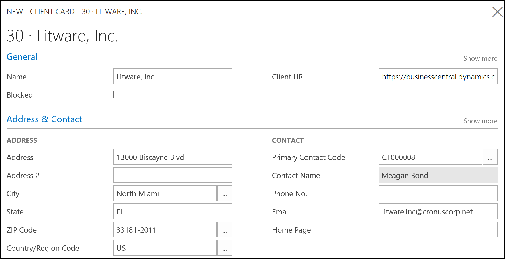

# Add clients to your dashboard in [!INCLUDE [d365acc_long](includes/d365acc_long_md.md)]
[!INCLUDE [d365fin_early_release](includes/d365fin_early_release.md.md)]

You can add a client by using the **Clients** page, which you can open by choosing the **Manage Clients** action in the ribbon. Simply choose **New** and then fill in the fields.  

> [!div class="mx-imgBorder"]
> 

The data in the card for each client is specified by you, and you can change it as needed. However, the **Client URL** field is critical - this is how you can access each client's [!INCLUDE [d365fin](includes/d365fin_md.md)]. Use the **Validate Client URL** action in the ribbon to test that you entered the right link. The URL that you must enter points at the client's [!INCLUDE [d365fin](includes/d365fin_md.md)] and includes their domain address. For example, if they have specified a domain such as MyBusiness.com, then the link to their [!INCLUDE [d365fin](includes/d365fin_md.md)] is *https://businesscentral.dynamics.com/mybusiness.com?redirectedfromsignup=1*.  

> [!NOTE]
>  Before the May 2018 update, the URL that you specified had a different format with the client's company name at the beginning. In the current version of [!INCLUDE [d365fin](includes/d365fin_md.md)], the format is ```https://businesscentral.dynamics.com/clientdomain?redirectedfromsignup=1```, where ```clientdomain``` represents the domain of your client.  

The client URL is used when you choose the **Go To Company** menu item in the [!INCLUDE [d365acc](includes/d365acc_md.md)] dashboard.  

### Get invited to a client's [!INCLUDE [d365fin_long](includes/d365fin_long_md.md)]
A company who use [!INCLUDE [d365fin](includes/d365fin_md.md)] can invite you to [!INCLUDE [d365fin](includes/d365fin_md.md)] as their external accountant. To get invited, you must give them the email that you use with [!INCLUDE [d365acc](includes/d365acc_md.md)], such as <em>me@accountant.com</em>. Your client's administrator can then add you to their system by running the **Invite External Accountant** wizard.  

As a result, you will receive email from your client with links to their [!INCLUDE [d365fin](includes/d365fin_md.md)]. The first link is an invitation to get access to their company - open the link and accept the steps that adds you to your client's [!INCLUDE [d365fin](includes/d365fin_md.md)]. The second link is for adding this client to your dashboard in [!INCLUDE [d365acc](includes/d365acc_md.md)] as described above.  

When you have accepted the invitation, you are logged in and can access the client's financial data from the **Accountant** Role Center. For more information, see [Accountant Experiences in [!INCLUDE[d365fin](includes/d365fin_md.md)]](/dynamics365/business-central/finance-accounting?toc=/dynamics365/accountants/toc.json).  

## See Also
[Get Started with [!INCLUDE[d365acc](includes/d365acc_md.md)]](get-started.md)  
[Troubleshooting [!INCLUDE[d365acc](includes/d365acc_md.md)]](troubleshooting.md)  
