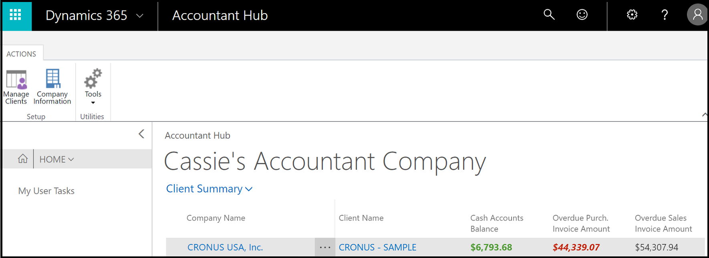
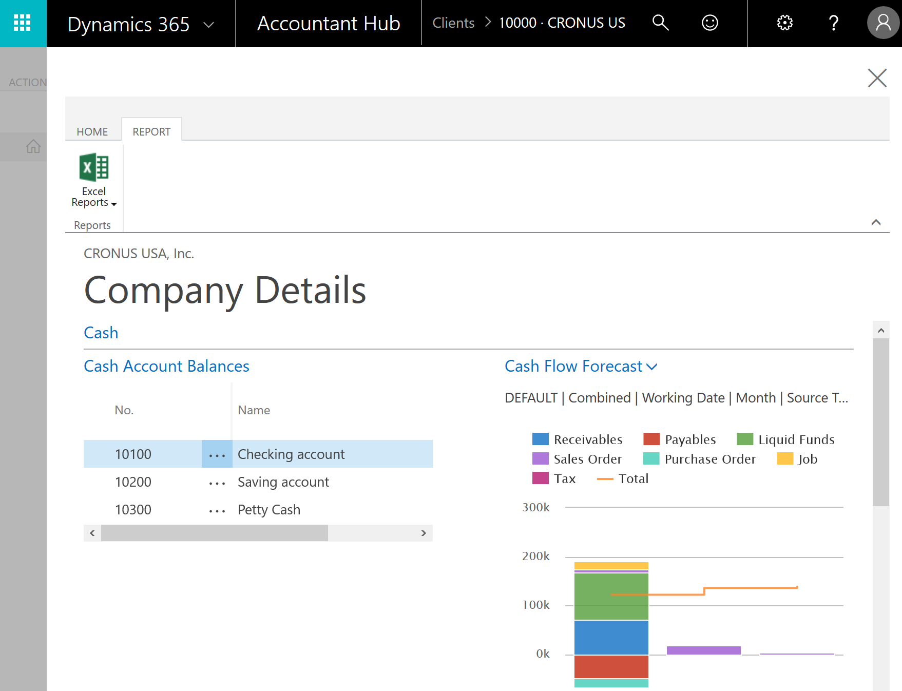
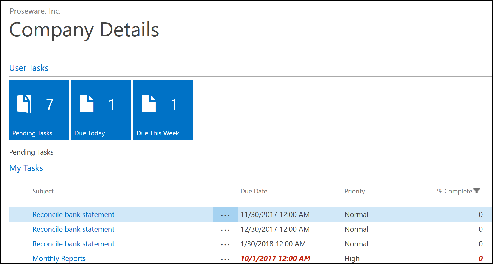
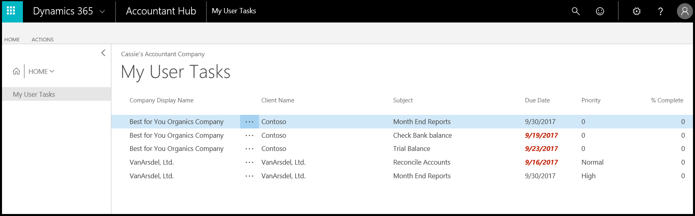

# Get started with [!INCLUDE [d365acc_long](includes/d365acc_long_md.md)]
[!INCLUDE [d365fin_early_release](includes/d365fin_early_release.md.md)]

Any business must do its books and sign off on the accounting. Some businesses employ an external accountant, and others have an accountant on staff. If you are an accountant with several clients, you can use [!INCLUDE [d365acc](includes/d365acc_md.md)] as your dashboard for a better overview of your clients.  

You can get access to [!INCLUDE [d365acc](includes/d365acc_md.md)] by signing up from [Dynamics 365 — Accountant Hub on Microsoft.com](https://www.microsoft.com/en-us/dynamics365/financial-insights-for-accountants).  

> [!TIP]
>  When you sign up for [!INCLUDE [d365acc](includes/d365acc_md.md)], you must specify your work email address, such as <em>me@accountant.com</em>. We recommend that you use the same email address when you work in your clients' [!INCLUDE [d365fin_long](includes/d365fin_long_md.md)], so that you can easily switch between clients. The email address must be a work address that is based on Active Directory.

## Working with individual clients
The dashboard shows the most important information about each client.  

> [!div class="mx-imgBorder"]
> 

The **Client Name** column shows the names of your clients, and the **Company Name** column lists all companies if the client has more than one company in [!INCLUDE [d365fin_long](includes/d365fin_long_md.md)]. There are also fields to show you tasks that are assigned to you in your client's company, including overdue tasks.  

You can customize the dashboard to show the data points that you want to see by adding or removing columns. For example, you might want to see taxes that are due, how many open sales documents each client has, or the number of purchase invoices that are due next week. You can configure the view to suit your needs. If you have many clients, you can use filters to sort your view.  

Next to the client name, the three dots reveal a short menu:

- Refresh the current company and get fresh data for the client  
- Go to the client's [!INCLUDE [d365fin](includes/d365fin_md.md)]  
- Select more clients  

Similarly, you can use the **Client Summary** drop-down menu to refresh all companies, for example.  

> [!TIP]
>  To access a client's [!INCLUDE [d365fin](includes/d365fin_md.md)], choose the **Go To Client** menu item - you are logged in automatically.

## Company details
You can see more information about your clients' data by choosing the name of the company that you want to learn more about. This opens the **Company Details** pane, where you can see additional information, such as the following:  

* Cash account balances  
* Cash flow forecast  
* Overdue purchase invoices  
* Overdue sales invoices  

> [!div class="mx-imgBorder"]
> 

Technically, you have now logged into your client's [!INCLUDE [d365fin](includes/d365fin_md.md)], and data you see is live data. If you want to take a closer look at the data, such as an overdue purchase invoice, choose the link, and you are taken to the client company.  

> [!TIP]
> You can launch predefined Excel workbooks from the **Reports** tab in the ribbon. These Excel workbooks are designed as ready-to-print key financial statements and reports, but you can also modify them to fit your needs. For more information, see [Analyzing Financial Statements in Microsoft Excel](/dynamics365/business-central/finance-analyze-excel?toc=/dynamics365/accountants/toc.json) in the Help for [!INCLUDE [d365fin](includes/d365fin_md.md)].  

Otherwise, close the details pane and continue to the next client.  

## Assigned tasks
In your client's [!INCLUDE [d365fin](includes/d365fin_md.md)], you can assign tasks to yourself and others, and others can assign tasks to you. Your dashboard in [!INCLUDE [d365acc](includes/d365acc_md.md)] gives you an overview of assigned tasks for each client, and you can also access a list of all assigned tasks by choosing **My User Tasks** on the **Home** page.  

In the client company, you also have cues that call out tasks assigned to you in this particular client.

> [!div class="mx-imgBorder"]
> 

### My user tasks
The **My User Tasks** list in [!INCLUDE [d365acc](includes/d365acc_md.md)] helps you prioritize your day by showing more information about tasks assigned to you across all your clients.  

> [!div class="mx-imgBorder"]
> 

You can sort by due date, for example, or any other type of data that helps you prioritize your day. By default, the list shows all tasks that are assigned to you, but you can set up filters to only show tasks that are marked as high priority, for example.

To pick up a task, simply choose it from the list of pending user tasks. In the ribbon, the link **Go to Task Item** opens the page where you can do the work.  

When you have completed a task, simply mark it as completed.  

## See Also

[Add Clients to Your Dashboard in [!INCLUDE[d365acc](includes/d365acc_md.md)]](add-client.md)  
[Welcome to [!INCLUDE[d365acc_long](includes/d365acc_long_md.md)]](index.md)  
[Analyzing Financial Statements in Microsoft Excel](/dynamics365/business-central/finance-analyze-excel?toc=/dynamics365/accountants/toc.json)  
[Accountant Experiences in [!INCLUDE[d365fin](includes/d365fin_md.md)]](/dynamics365/business-central/finance-accounting?toc=/dynamics365/accountants/toc.json)  
[Dynamics 365 — Accountant Hub on Microsoft.com](https://www.microsoft.com/en-us/dynamics365/financial-insights-for-accountants)  
