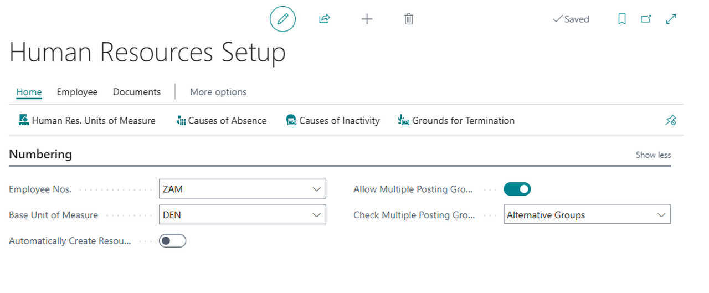
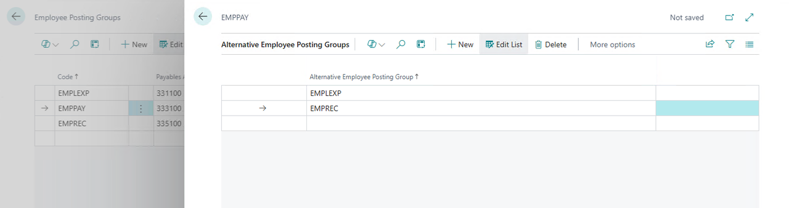
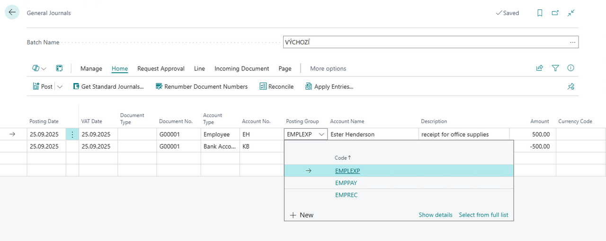

# Alternative posting groups for Employees in the Czech version

Sometimes businesses want to post payable and receivable transactions to a different general ledger (G/L) account than the one that's specified on the employee posting group. This can include scenarios where employee travel expenses need to be post to a different financial account than the one used for regular payroll transactions. Controllers can define policies for posting these transactions, and accountants can change them during posting.

## Setup of Alternative posting groups for Employees

You can allow users to change the default employee posting groups by turning on the **Allow Multiple Posting Groups** toggle on the **Human Resources Setup** page.

For setup, follow these steps:
1. Choose the , enter **Human Resources Setup**, and then choose the related link.
2. On the **Human Resources Setup** page, in the **Numbering** tab, turn on the **Allow Multiple Posting Groups** toggle.
3. After setup, close the page.

On the **Employee Posting Group** page, you can specify the posting groups to allow people to use as substitutes by selecting the Alternative Groups action. Alternative posting groups can replace the default employee posting group specified for an employee.

1. Choose the , enter **Employee Posting Groups**, and then choose the related link.
2. On the **Employee Posting Groups** page, select the employee posting group for which you want to define alternative posting groups.
3. On the **Employee Posting Group** page, choose the **Alternative Groups** action.
4. On the **Alternative Employee Posting Groups** page, use the **New** action to create a new line.
5. In the **Alternative Employee Posting Group** field, select the posting group you want to use as an alternative.
6. After setup, close the page.

After you set this up, you can choose alternative posting groups and change the employee posting group when you post journals. [!INCLUDE [d365fin](../../includes/d365fin_md.md)] copies the alternative employee posting group to posted journals, and posts payable or receivable G/L entries to the G/L accounts specified for the alternative groups.  

**To allow only specific people to change posting groups**, you can also **turn on the Allow Multiple Posting Groups toggle** for individual employees **on the Employee Card** page.

## Use of Alternative posting groups for Employees

When all conditions are met, [!INCLUDE [d365fin](../../includes/d365fin_md.md)] allows you to change the posting group on journals and ensures that transactions post to the payables or receivables account specified at the time of posting.

If different employee posting groups are used in a general journal or payment document, the G/L entries are automatically reallocated among the accounts of each posting group when employee entries are applied.

The standard posting method for applying entries increased turnover on both the debit and credit sides by the same amount. **In the Czech version** of this functionality, the balancing is posted as a correction, which means that **postings are made to only one side** - either the debit or the credit account. This approach **prevents turnover from increasing on balance sheet accounts** and ensures that values remain accurate in analysis.

## Related information

- [Czech Local Functionality](czech-local-functionality.md)  
- [Finance](../../finance.md)

[!INCLUDE[footer-include](../../includes/footer-banner.md)]
