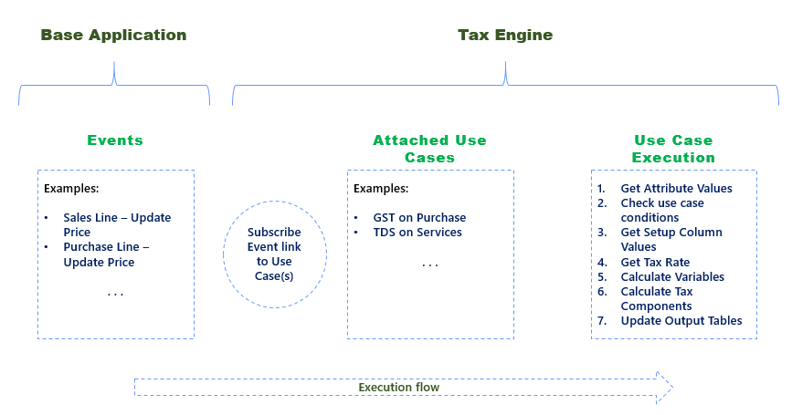

# Tax Engine - Design Consideration

This section contains the factors that shall be considered while configuring Taxes using tax engine.

## Tax type

A new tax type should be created if it has unique attributes which are used in definition of conditions and computation logic. For example, GST and TDS are defined as different tax types. 

## Tax attributes
 - When to create an Attribute as Generic?
 
   Generic attributes are used in the same way as item attributes are managed in Business Central. If the attribute is not linked to a field in an existing table then it is generic in nature.
 - When to map a tax attribute with a table field?
 
   In case field is already available in the table which is being mapped then it can be linked to that attribute. This means that field data will be used as attribute value. 

## Generic tax rate setup
- Rate Setup for Different Tax Type
  
  Tax Rate Setup of each tax type is configured separately but the User Interface is same. Fields in tax rate setup are dynamic and based on the tax rate column setup. User can define what columns are needed for a tax rate setup. For example ‘GST' tax type would require ‘HSN Code’ where as 'TDS' tax type is not dependent on HSN code.

- Generic Table for Tax Rate Setup
  
  Use generic table for tax rate setup for all Tax types. It enables to handling any new components introduced by government related to the tax rate.
  
  Example: If there is a regulatory change in which ‘Threshold Limit’ is removed then it can be managed by removing it from the tax rate column setup.

## Generic metadata
- Tax Transaction Values
  Data pertaining to tax calculation regarding a said transaction is stored in a common table. If the transaction record is deleted then related tax transaction value also gets deleted.
  
  Example: If transaction involves ‘Purchase Line’ then all information related to tax calculation will be stored in tax transaction value. If purchase line is deleted, then tax transaction value record related to that purchase line will also be deleted.
  
  Information stored in ‘tax transaction value’ is shown in the ‘tax information’ and ‘tax component’ fact boxes related to that transaction. Attributes which have “visible on interface” as true will be visible in the fact box.

 - Tax Rate Configuration Value
 
  This table contains information of tax rate setup. Tax engine uses common tax rate setup for different types of taxes.

## Use case execution

- Only Child Use Cases are Executed for output

  There can be a parent child relation between use cases. Parent use cases are used for defining attribute mapping which is common for one or more use cases.
  
  A child use case is mapped in the use case tree. Before execution of the use case, conditions of use case tree should be passed.
  
- Sequencing of Use Case Execution

  The sequence of use case execution depends on the sequencing defined in the use case tree.

- Execution of multiple Use Cases for a tax type

  If there are more than one use cases for a tax type, then execution will be done sequentially which means that second use case will execute only after completion of first use case.

- Execution Flow of Tax Engine

  

## Deployment

- Configuration Files
 
  Every use case configured in tax engine is a Json file which can be exported and imported from a Business Central tenant. These configurations are deployed individually for each company.

- Deployment of Configuration

  Default configurations that are provided in the system will be available as part of demo data. In case if a new production company is created then the configuration can be imported from assisted setup, where system will pick the json based on the function of a codeunit. Json for standard configuration is available in a translation file for there related extensions like GST, TDS and TCS which are updated when the codeunit function is called. In case users have changed any standard configuration or created a new configuration then they can use the export and import function available on tax types and use cases page.

- Change in Configuration

  If any update is done on a use case then the version of the use case will be higher than the one which is already deployed. System will archive the old one and update the new use case based on the jeson.

   
- Change in Configuration by user

  In case of any change done in any use case to fix a bug or handle regulatory change, the updated configuration should be imported again in each company individually.

- Version Management

  In case of any change done in any use case the current active version of the use case is archived and new use case version becomes active.

## Enabling and disabling configuration

- Enable or Disable Use Case

  By default, a Use case is enabled. If a use case is not applicable, then it can be disabled and that use case will not get executed.

## Related information
[Overview](TaxEngine-001-Overview.md)

[!INCLUDE[footer-include](../../includes/footer-banner.md)]
