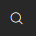

# How to: View Posted Entries on a Fixed Asset Charge

You can view all posted fixed asset entries for each fixed asset charge code. The following procedure shows how to view the posted entries.

## To view a posted entry on a fixed asset charge

- Choose the  icon, enter **FA Ledger Entries**, and then choose the related link.

## See Also

[How to: Create a Fixed Asset Charge](How-to-Create-a-Fixed-Asset-Charge.md)  
