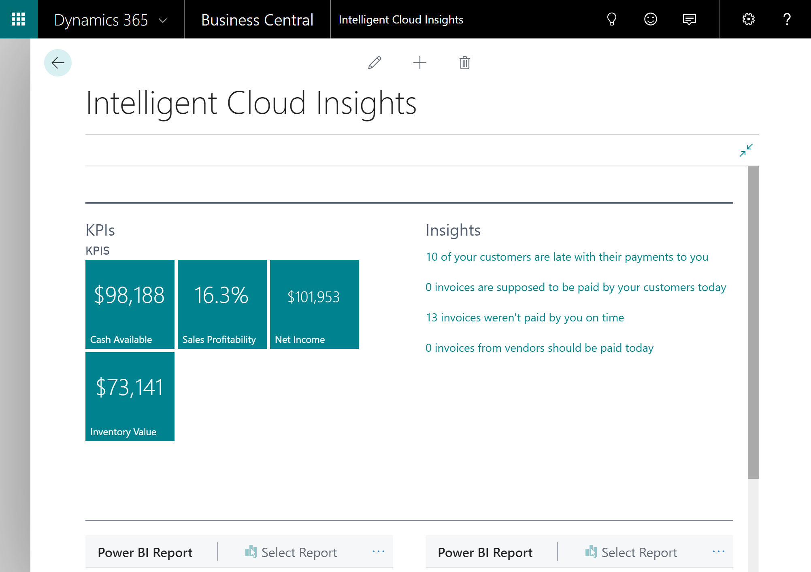

# Your Access to the Intelligent Cloud with [!INCLUDE[prodshort](includes/prodshort.md)]

As a user of [!INCLUDE[prodshort](includes/prodshort.md)] online, you have full access to scenarios that are based on the intelligent cloud, such as editing data in Excel and pushing changes back to [!INCLUDE[prodshort](includes/prodshort.md)], or when you view your data in Power BI. However, while [!INCLUDE[prodshort](includes/prodshort.md)] is a cloud-first service, also those customers who need to run their workloads fully on-premises or on the intelligent edge connected to the cloud can do so.  

If you are interested in [!INCLUDE[prodshort](includes/prodshort.md)], you can sign up for a free trial of the default, cloud deployment solution, or you can choose to work with a partner to deploy [!INCLUDE[prodshort](includes/prodshort.md)] locally to your own choice of hardware. You can then decide to connect to the cloud through your tenant in the cloud. As a result, the data from your locally deployed [!INCLUDE[prodshort](includes/prodshort.md)] will be replicated to the cloud for intelligent cloud scenarios.  

Connecting to the intelligent cloud from an on-premises solution requires your administrator to specify information about your database. For more information, see [Connect to the Intelligent Cloud](/dynamics365/business-central/dev-itpro/administration/about-intelligent-edge) in the ITPro content for [!INCLUDE[prodshort](includes/prodshort.md)].  

## Viewing Intelligent Cloud Insights in [!INCLUDE[prodshort](includes/prodshort.md)] Online

In your [!INCLUDE[prodshort](includes/prodshort.md)] online company, the **Intelligent Cloud Insights** page shows four key points of interest for most businesses:

- Cash availability
- Sales profitability
- Net income
- Inventory value

Next to the KPI charts, you get insights into potential areas of concern, including overdue payments. Choose each insight to drill into the data.  

> [!div class="mx-imgBorder"]
> 

The page also connects to Power BI for even more insights.

## Viewing Intelligent Cloud Insights On-Premises

When your Dynamics 365 reselling partner has acquired the right license for your on-premises solution to connect to the cloud through [!INCLUDE[prodshort](includes/prodshort.md)], your administrator can set up the connection. Once that is done, you can view the same insights from the cloud in your on-premises application. Depending on the on-premises solution, the **Intelligent Cloud Insights** page can be embedded in the Home page or be a separate page as in [!INCLUDE[prodshort](includes/prodshort.md)] online and on-premises.  

## See Also

[Welcome to Business Central](index.md)  
[Business Central Intelligent Cloud extension](ui-extensions-intelligent-cloud.md)  
[Data Replication extension](ui-extensions-data-replication.md)  
[Connect to the Intelligent Cloud](/dynamics365/business-central/dev-itpro/administration/about-intelligent-edge)  
