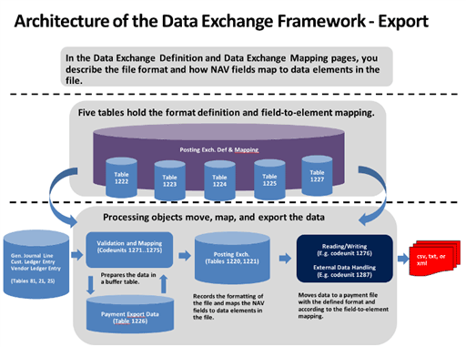

# About the Data Exchange Framework
You can use the Data Exchange Framework to manage the exchange of business documents, bank files, currency exchange rates, and any other data files with your business partners.

As an administrator or Microsoft partner, you can use the framework in new integration features by setting up which data to exchange and how. For example, the format of files for exchange of data in bank files, electronic documents, currency exchange rates, and other with ERP systems vary depending on the provider of the data file or stream and on the country/region. [!INCLUDE[d365fin](includes/d365fin_md.md)] supports various bank file formats and data service standards. To provide support for other electronic document formats, you use the data exchange framework.

 The following diagrams show the architecture of the data exchange framework.  

   

   

 ## Electronic Documents
 As an alternative to emailing as file attachments, you can send and receive business documents electronically. By electronic document is meant a standard-compliant file representing a business document, such as an invoice from a vendor that you can receive and convert to a purchase invoice in [!INCLUDE[d365fin](includes/d365fin_md.md)] . The exchange of electronic documents between two trading partners is performed by an external provider of document exchange services. The generic version of [!INCLUDE[d365fin](includes/d365fin_md.md)]  supports sending and receiving electronic invoices and credit memos in the PEPPOL format, which is supported by the largest providers of document exchange services. A major provider of document exchange services is preconfigured and ready to be set up for your company. To provide support for other electronic document formats, you must create new date exchange definitions using the Data Exchange Framework.  

 From PDF or image files representing incoming documents, you can have an external OCR service (Optical Character Recognition) create electronic documents that you can then convert to document records in [!INCLUDE[d365fin](includes/d365fin_md.md)], like for electronic PEPPOL documents. For example, when you receive an invoice in PDF format from your vendor, you can send it to the OCR service from the **Incoming Documents** page. After a few seconds, you receive the file back as an electronic invoice that can be converted to a purchase invoice for the vendor. If you send the file to the OCR service by email, then a new incoming document record is automatically created when you receive the electronic document back.  

 To send, for example, a sales invoice as an electronic PEPPOL document, you select the **Electronic Document** option in the **Post and Send** dialog box. From here, you can also set up the customer’s default document sending profile. First, you must set up various master data, such as company information, customers, items, and units of measure. These are used to identify the business partners and items when you convert data in fields in [!INCLUDE[d365fin](includes/d365fin_md.md)]  to elements in the outgoing document file. The data conversion and sending of the PEPPOL sales invoice are performed by dedicated codeunits and XMLports, represented by the **PEPPOL** electronic document format.  

 To receive, for example, an invoice from a vendor as an electronic PEPPOL document, you process the document on the **Incoming Documents** page to convert it to a purchase invoice in [!INCLUDE[d365fin](includes/d365fin_md.md)]. You can either set up the Job Queue feature to process such files regularly or you can start the process manually. First, you must set up various master data, such as company information, vendors, items, and units of measure. These are used to identify the business partners and items when you convert data in elements in the incoming document file to fields in [!INCLUDE[d365fin](includes/d365fin_md.md)]. The receiving and data conversion of PEPPOL invoices are performed by the Data Exchange Framework, represented by the **PEPPOL - Invoice** data exchange definition.  

  To receive, for example, an invoice as an electronic OCR document, you process it as when you receive an electronic PEPPOL document. The receiving and conversion of electronic documents from OCR are performed by the Data Exchange Framework, represented by the **OCR – Invoice** data exchange definition.  

 ## Bank Files  
 The formats of files for exchanging bank data with ERP systems vary depending on the supplier of the file and the country or region. [!INCLUDE[d365fin](includes/d365fin_md.md)] supports import and export of SEPA bank files (Single Euro Payments Area) and the AMC Banking 365 Fundamentals extension lets you connect to a AMC Banking 365 Fundamentals extension provided by external provider, AMC Consult. To provide support for other electronic document formats, you use the Data Exchange Framework.  

 To export SEPA credit transfers, you choose **Export Payments to File** button on the **Payment Journal** page and then upload the file to process the payments in your bank. First you must set up various master data, such as bank account, vendors, and payment methods. The data conversion and export of SEPA bank data is performed by a dedicated codeunit and XMLport, represented by the **SEPA Credit Transfer** bank export/import setup. Alternatively, you can set up the AMC Banking 365 Fundamentals extension to perform the export, represented by the **AMC Banking 365 Fundamentals extension - Credit Transfer** data exchange definition.  

 To export SEPA direct debit instructions, you choose the **Export Direct Debit File** button on the **Direct Debit Collections** page and then send to your bank to automatically collect the involved customer payments. First you must set up bank accounts, customers, direct-debit mandates, and payment methods. The data conversion and export of SEPA bank data is performed by dedicated a codeunit and XMLport, represented by the **SEPA Direct Debit** bank export/import setup.  

 To import SEPA bank statements, you choose the Import Bank Statement button in the **Payment Reconciliation Journal** and **Bank Acc. Reconciliation** pages and then you proceed to apply each bank statement entry to payments or bank ledger entries, manually or automatically. First you must set up bank accounts. The import and data conversion of SEPA bank data is performed by the Data Exchange Framework, represented by the **SEPA CAMT** data exchange definition. Alternatively, you can set up the AMC Banking 365 Fundamentals extension to perform the import, represented by the **AMC Banking 365 Fundamentals extension – Bank Statement** data exchange definition.  

 In addition, the local versions of [!INCLUDE[d365fin](includes/d365fin_md.md)] support various other file formats for importing and exporting bank data, payroll transactions, and other data. For more information, see the “Local Functionality” Help section in your country version of [!INCLUDE[d365fin](includes/d365fin_md.md)].

  ## Currency Exchange Rates  
 You can set up an external service to keep your for currency exchange rates up to date. The service that provides updated currency exchange rates is enabled by a data exchange definition. Accordingly, the **Exch. Rate Update Setup Card** page is a condensed view of the **Data Exchange Definition** page for the data exchange definition in question.  

 For all exchanges of data in XML files, you can prepare the data exchange setup by loading the related XML schema file on the **XML Schema Viewer** page. Here you select the data elements that you want to exchange with [!INCLUDE[d365fin](includes/d365fin_md.md)]  and then you either initialize a data exchange definition or generate an XMLport.

## See Also  
[Exchanging Data Electronically](across-data-exchange.md)  
[Use XML Schemas to Prepare Data Exchange Definitions](across-how-to-use-xml-schemas-to-prepare-data-exchange-definitions.md)  
[Setting Up Data Exchange](across-set-up-data-exchange.md)  
[Incoming Documents](across-income-documents.md)  
[General Business Functionality](ui-across-business-areas.md)  
