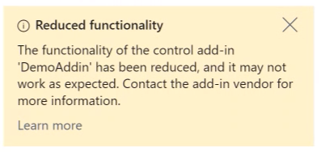
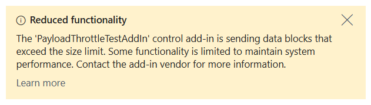

# Control add-in resiliency in Business Central

Control add-ins that are unhealthy or perform slowly are automatically detected and a reduced functionality warning similar to the following example appears.

## Busy control add-in

An unhealthy control add-in might affect your Business Central experience and cause the page you're working on to start slowly. It has no impact on data and your changes are always saved. You can hide the warning, but it might come back. If the problem persists, contact your administrator or control add-in vendor.

## Payload handling

If a control add-in sends a large payload in a single call, the [!INCLUDE[web_client](includes/web_client.md)] might display a warning that communication is being limited, for example:

In this case, the web client might upload the request as a temporary file. If the data exceeds the maximum upload size, the call is rejected. The control add-in receives an error, but the page continues to function normally.

The maximum upload size is controlled by the `ClientServicesMaxUploadSize` setting on the [!INCLUDE[server](includes/server.md)]. Learn more about this setting in [Configure Business Central server: Client settings](/dynamics365/business-central/dev-itpro/administration/configure-server-instance#ClientServices).

## Related information

[Control add-in performance best practices](/dynamics365/business-central/dev-itpro/developer/devenv-control-addin-bestpractices)  
