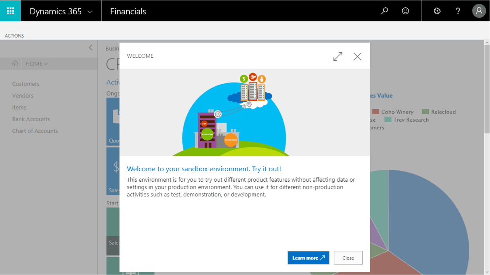
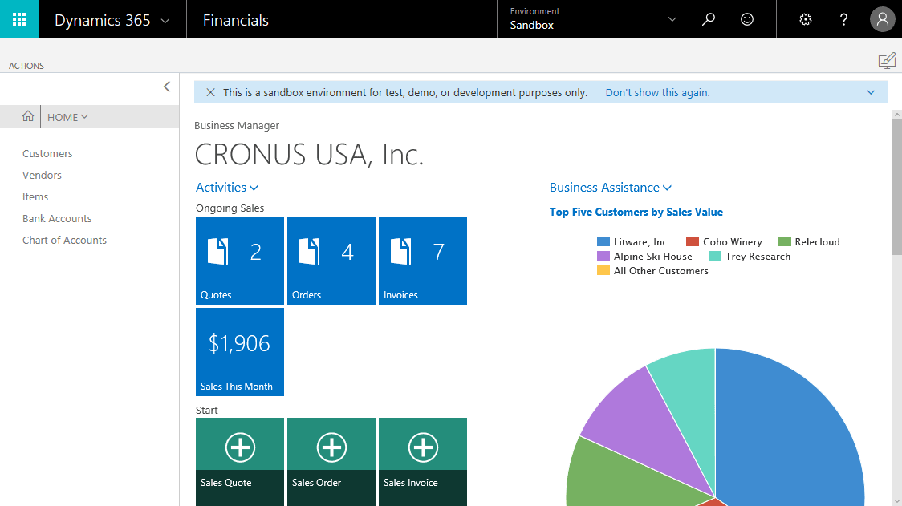
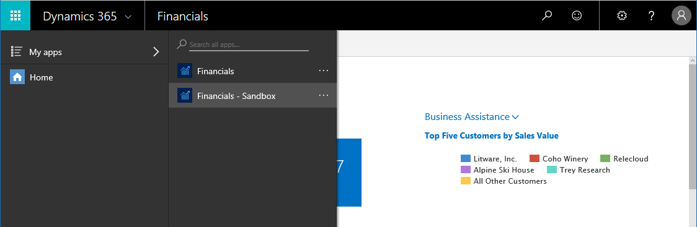
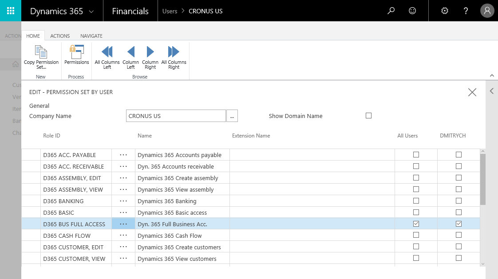

# Creating a Sandbox Environment in [!INCLUDE[prod_short](includes/prod_short.md)]

With [!INCLUDE[prod_short](includes/prod_short.md)], you can easily create a safe environment where you can test, train, or troubleshoot without disturbing your company's work processes or business data. Such a non-production environment is called a *sandbox*. Isolated from production, a sandbox environment is the place to safely explore, learn, demo, develop, and test the service without the risk of affecting the data and settings of your production environment.  

Your administrator can create sandbox environments in the [administration center](/dynamics365/business-central/dev-itpro/administration/tenant-admin-center-environments?toc=/dynamics365/business-central/toc.json), but if you want to quickly test something, you can create a sandbox environment from inside [!INCLUDE[prod_short](includes/prod_short.md)].  

> [!NOTE]
> Technically, sandbox environments are very different from production environments, even if your administrator creates a sandbox that includes production data. You cannot use a sandbox for benchmarking, and you cannot request a database export, for example. If you want to create a sandbox for benchmarking, your administrator can create a dedicated production environment in the administration center. For more information, see [Types of environments](/dynamics365/business-central/dev-itpro/administration/tenant-admin-center-environments#types-of-environments).

## To create a sandbox environment in your [!INCLUDE[prod_short](includes/prod_short.md)]

1. Sign in to your production instance of [!INCLUDE[prod_short](includes/prod_short.md)].

2. Choose the  icon, enter **Sandbox Environment**, and then choose the related link.
    <!--  -->
3. Choose the **Create** button.  

    Another tab with [!INCLUDE[prod_short](includes/prod_short.md)] opens where you can finish the setup of your sandbox environment.

    > [!NOTE]  
    >  If you have pop-up blocker enabled in your browser, change it to allow URLs from the *.businesscentral.dynamics.com address.

When the sandbox environment is ready, you will be redirected to sandbox environment's Welcome wizard.
<!--  -->

You can choose the **Learn more** button to read about developer scenarios that you can try in a sandbox environment or choose the **Close** button to continue to the Role Center of your [!INCLUDE[prod_short](includes/prod_short.md)] sandbox instance.

At the top of the Role Center, a notification appears to inform you that this is a sandbox environment. You can also see the type of the environment in the title bar of the client.
    <!--  -->

> [!NOTE]
> A sandbox environment created in this way only contains the default demonstration data for the CRONUS company. No data is copied or otherwise transferred from the production environment.  
> You can also create a sandbox environment containing the production data. You must do this through the administration center. For more information, see [Managing Environments](/dynamics365/business-central/dev-itpro/administration/tenant-admin-center-environments) in the Developer and IT-Pro help.  

<!--To switch between your production and sandbox environments, you can use the Business Central app launcher.
     -->

An administrator can limit or even block access for some users to the sandbox environment. This can be done by using the standard security features of the product, such as the User card, user groups, and permission sets. For more information, see [Assign Permissions to Users and Groups](ui-define-granular-permissions.md).  

<!--  -->

## Advanced Functionality in the Sandbox Environment

The sandbox environment is not least useful because it includes a couple of handy features.

### To enable the advanced user experience

It is possible to enable and try the full functionality of the standard version of [!INCLUDE[prod_short](includes/prod_short.md)] in a sandbox tenant by setting the **Experience** field on the **Company Information** page to *Premium*. Find the **Company Information** page in the :::image type="content" source="media/ui-experience/settings_icon_small.png" alt-text="Settings icon"::: menu.  

After you have enabled the *Premium* user experience, you get access to all the standard profiles (roles) and Role Centers in the standard version. You can also create an evaluation company that is fully set up, including demonstration data and access to the advanced areas of the product. Alternatively, contact a reselling partner for a demonstration of the capabilities. For more information, see [How do I find a reselling partner?](across-faq.md#findpartner).  

### To enable complete sample data

In the sandbox environment, you can also create a new company with the **Advanced Evaluation - Complete Sample Data** option so that you can take training or step through walkthroughs that require additional sample data, such as [Walkthrough: Receiving and Putting Away in Basic Warehouse Configurations](walkthrough-receiving-and-putting-away-in-basic-warehousing.md).  

#### To create a company with complete sample data in a sandbox

1. Choose the  icon, enter **Companies**, and then choose the related link.  
2. Choose the **New** action, and then choose **Create New Company**.  
3. In the **Assisted Setup for Creating a Company** page, choose **Next**.  
4. Specify a name for the new company, and then, in the **Select the data and setup to get started** field, choose **Advanced Evaluation - Complete Sample Data**.  
5. Complete the rest of the assisted setup guide.  

When the assisted setup guide completes, you can start exploring the new company with the complete sample data. For more information, see [Creating New Companies in [!INCLUDE[prod_short](includes/prod_short.md)]](about-new-company.md).  

### Designer

In a sandbox environment, you will find the **Designer** enabled. You can activate Designer by selecting the design icon  on a page, or by choosing the **Design** menu item in the  Settings menu.

<!--  -->

## See Also

[Working with [!INCLUDE[prod_short](includes/prod_short.md)]](ui-work-product.md)  
[[!INCLUDE[prod_long](includes/prod_long.md)] Trials and Subscriptions](across-preview.md)  
[Managing Environments in the Business Central administration center](/dynamics365/business-central/dev-itpro/administration/tenant-admin-center-environments)  

[!INCLUDE[footer-include](includes/footer-banner.md)]