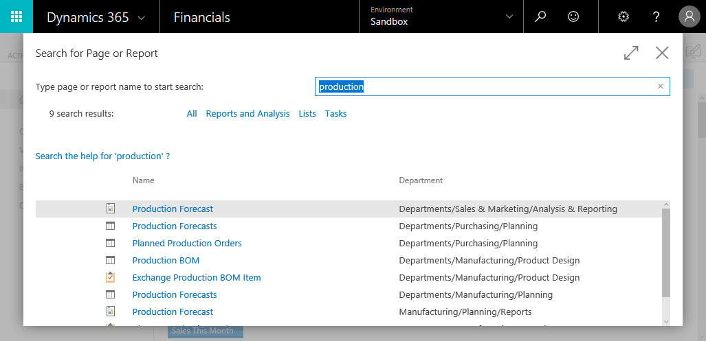
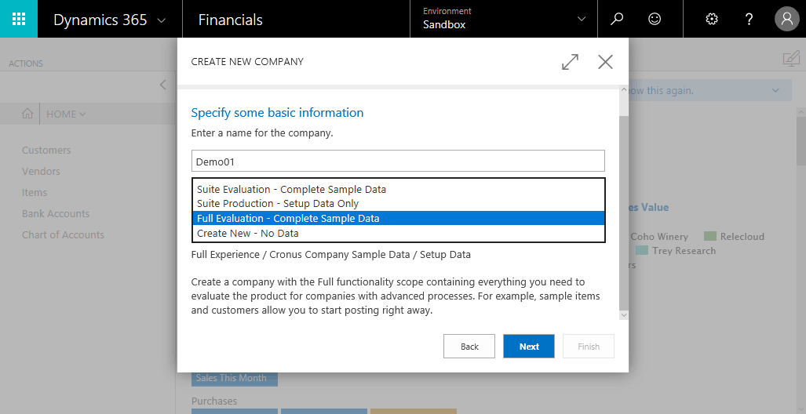

[!INCLUDE[d365fin_early_release](includes/d365fin_early_release.md.md)]

# Create a Sandbox Environment
A sandbox environment (Preview) is a non-production instance of [!INCLUDE[d365fin](includes/d365fin_md.md)]. Isolated from production, a sandbox environment is the place to safely explore, learn, demo, develop, and test the service without the risk of affecting the data and settings of your production environment.

## To create a sandbox environment
You must have a subscription to [!INCLUDE[d365fin](includes/d365fin_md.md)] to be able to create a sandbox environment. There can only be one sandbox environment per subscription.

1. Sign in to your production instance of the [!INCLUDE[d365fin](includes/d365fin_md.md)] service.
2. Choose the  icon, enter **Sandbox Environment**, and then choose the related link.

3. Select **Create**.  
  Another tab in your browser will open for finishing the setup of your sandbox environment.
> [!NOTE]  
>  If you have pop-up blocker enabled in your browser, change it to allow URLs from the *.financials.dynamics.com address.   

4. When the sandbox environment is ready, you will be redirected to sandbox environment's Welcome wizard.

5. Choose **Learn more** to read about scenarios that you can try in a sandbox environment. Or, choose **Close** to continue to the Role Center of your [!INCLUDE[d365fin](includes/d365fin_md.md)] sandbox instance.
6. At the top of the Role Center, a notification appears to inform you that this is a sandbox environment. You can also see the type of the environment in the title bar of the client.
  
In the sandbox environment, a brand-new tenant has been created. This tenant is loaded with default demonstration data for the CRONUS company. No data is copied or otherwise transferred from the production environment during the sandbox creation.
7.	At any time, you can return to the **Sandbox Environment** page, and reset the sandbox environment.
> [!NOTE]  
>  Resetting the sandbox environment will remove it completely, and then create it again with the default demonstration data.  

8.	To switch between your production and sandbox environments, you can use the Business Central app launcher.

9.	It is possible for an administrator or another user to limit or even block access for some users to the sandbox environment. This can be done by using the standard security features of the product, such as the User card, User Groups, and Permission Sets.

## Advanced functionality in the sandbox environment
### The in-client designer
In a sandbox environment, you will find the in-client designer feature enabled, which you can activate by selecting the design icon  on a page.

### Enable the advanced user experience
It is possible to enable and try the advanced (full) functionality of [!INCLUDE[d365fin](includes/d365fin_md.md)] in a sandbox tenant by setting the **Experience** field on the **Company Information** page.

After you’ve enabled the advanced functionality in a sandbox tenant, you get access to all the standard Profiles and Role Centers. You can also create an evaluation company that is fully set up, including demonstration data and access to the advanced areas of the product.

## See Also
[Working with [!INCLUDE[d365fin](includes/d365fin_md.md)]](ui-work-product.md)  
