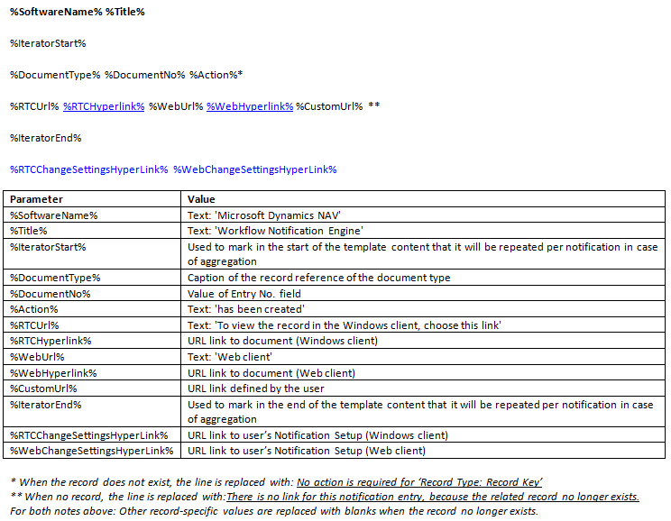
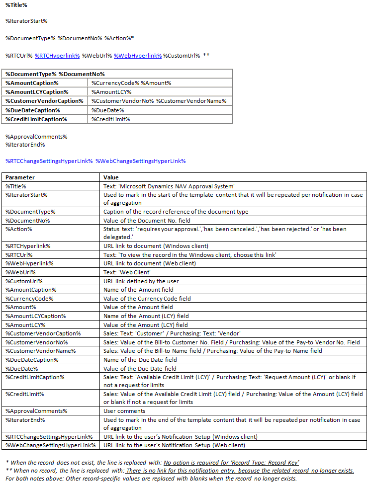
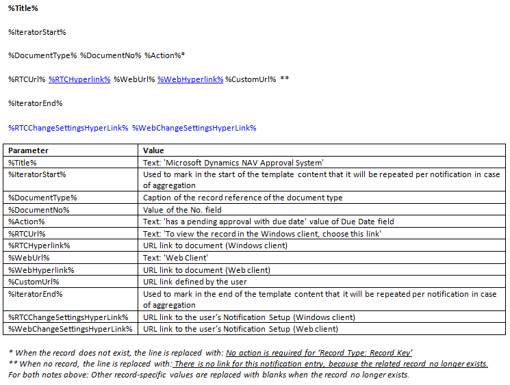

# Manage Notification Templates
Notifications are sent to workflow users to notify them about steps they must make or to inform them about the status of workflow steps. You set up who receives notification and when by setting up approval users, the users’ notification schedule, and the involved workflow responses to define the notification recipient. For more information, see [Setting Up Workflow Notifications](across-setting-up-workflow-notifications.md).  

 Notifications are based on templates that define the content and layout of the notification. You can export the content of a notification template, edit it, and then import into the same or a new notification template. This is described in the following procedures.  

 The generic version of [!INCLUDE[d365fin](includes/d365fin_md.md)] contains three notification templates, one for notifying about approval requests, one for notifying about new records, and one for notifying about overdue approval requests. The three predefined notification templates support **Email** and **Note** as notification method. To view the content of the three notification templates, see the “Content of the Notification Templates” section in this topic.

## To create a new notification template  
1.  Choose the  icon, enter **Notification Templates**, and then choose the related link.  
2.  In the **Notification Templates** window, choose the **New** action.  
3.  Fill the fields as described in the following table.  

    |Field|Description|  
    |---------------------------------|---------------------------------------|  
    |**Code**|Identify the notification template.|  
    |**Description**|Describe the notification template.|  
    |**Notification Method**|Specify if the notification is sent as an email or as a note.|  
    |**Type**|Specify the business process that the notification will be used for.   Select one of the following types:   -   **Approval** specifies that the template is used to notify users in approval workflows. -   **New Record** specifies that the template is to notify approvers when a new record, such as a customer card, needs their approval. -   **Overdue** specifies that the template is used to notify users about overdue approval requests.|  
    |**Default**|Specify if the notification template will be used by default.|  

## To modify a notification template  
1.  Choose the  icon, enter **Notification Templates**, and then choose the related link.  
2.  In the **Notification Templates** window, select the notification template that you want to modify.  
3.  Choose the **Export Template Content** action.  
4.  In the **Export File** window, choose the **Save** button, and then name and save the HTML file in an appropriate location.  
5.  Right-click the file, choose **Open with**, and then choose the relevant program.  

    > [!NOTE]  
    >  Content for notification templates of type Email are in HTML format. Content for notification templates of type Note are in TXT format.  
6.  Edit the content of the notification template by adding, changing, or removing parameter variables to define the content that you want, and then save it. For more information, see the “Content of the Notification Templates” section.  

    Proceed to import the modified content back into the same or a new notification template.  
7.  To modify the notification template that you exported, in the **Notification Templates** window, select the template that you selected in step 2.  

    Alternatively, to import the modified template content into a new notification template, follow the “To create a new notification template” procedure, and then select the new notification template.  
8.  Choose the **Import Template Content** action.  
9. If you are modifying an existing notification template, choose the **Yes** button on the message about overwriting the existing template.  
10. In the **Select a file to import** window, choose the HTML file that you modified in step 6, and then choose the **Open** button.  

The existing or new notification template in the **Notification Templates** window is now updated with the modified content.  

### Content of the Notification Templates  
The three notification template types, **New Record**, **Approval**, and **Overdue**, have different content.  

Parameter values are automatically inserted in notifications according to the notification template type.  

#### New Record  
   

#### Approval  
   

#### Overdue  
   

## See Also  
 [Setting Up Workflow Notifications](across-setting-up-workflow-notifications.md)   
 [Set up Email](admin-how-setup-email.md)   
 [Set Up Workflow Users](across-how-to-set-up-workflow-users.md)   
 [Set Up Approval Users](across-how-to-set-up-approval-users.md)   
 [Create Workflows](across-how-to-create-workflows.md)   
 [Use Job Queues to Schedule Tasks](admin-job-queues-schedule-tasks.md)   
 [Workflow](across-workflow.md)   
