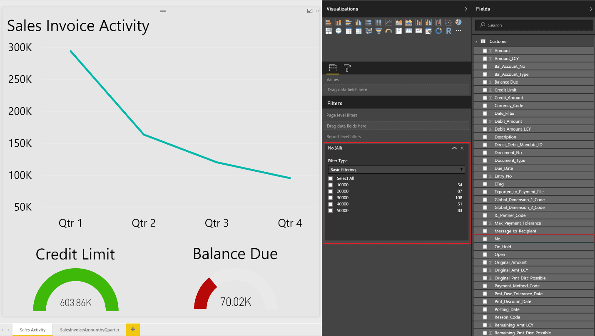

# Viewing List Data in Power BI Reports in Business Central

[!INCLUDE[prodlong](includes/prodlong.md)] includes a FactBox control element on a number of key list pages that provides additional insight into the data in the list. As you move between rows in the list, the report is updated and filtered for the selected entry. You can create custom reports to display in this control, but there are a few rules to follow when creating the reports to ensure they provide the desired behavior.  

> [!NOTE]  
> You must have a valid account with [!INCLUDE[prodshort](includes/prodshort.md)] and with Power BI. Also, to build custom reports, you must download [Power BI Desktop](https://powerbi.microsoft.com/desktop/). For more information, see [Using [!INCLUDE[d365fin](includes/d365fin_md.md)] as a Power BI Data Source](across-how-use-financials-data-source-powerbi.md).  

## Report Data Set
When you create the report in Power BI Desktop, specify the data source or web service that contains the data related to the list that you want to associate the report with. For example, if you want to create a report for the Sales List, ensure that the data set contains information related to sales.  

To filter data on the reports based upon the record selected from the list page, the primary key must be used as a report filter. The primary keys will need to be part of your data set in order for the reports to filter correctly. In most cases, the primary key for a list is the **No.** field.  

## Defining the Report Filter
The report is required to have a basic report filter (not a page or visual filter and not advanced filter) to filter correctly in the Power BI Fact Box Control. The filter that is passed to the Power BI report from each list page will be based on the primary key as described in the previous section.  

To define a filter for the report, select the primary key from the list of available fields, and then drag and drop that field into the **Report Filter** section.  

## Report Size and color
The size of the report must be set to 325 pixels by 310 pixels. This is required for the proper scaling of the report in the available space allowed by the Power BI Fact Box control. To define the size of the report, place focus outside of the report layout area, and then choose the paint roller icon.

You can change the width and height of the report by choosing **Custom** in the **Type** field.

Similarly, if you want to have the background of the report blend into the background color of the Power BI Fact Box control, define a custom report background color of *E5E5E5*. This is optional.  

## Reports with Multiple Pages
With Power BI, you can create a single report with multiple pages. The visuals that you want to see in the [!INCLUDE[d365fin](includes/d365fin_md.md)] list pages must be on the first page of the report in Power BI.  

> [!NOTE]  
> The Power BI Fact Box can show only the first page of your report; if you want to see other pages, you must expand the report and use tabs at the bottom of the report to navigate to other pages.  

## Saving Your Report

When you save your report, it's a best practice that the name of the report contains the name of the list page that you want to display the report in. For example, the word *Vendor* must be contained somewhere in the report name for reports that you want to make available on the Vendor list.  

This is not a requirement; however, it will make the process of selecting reports quicker. When the report selection page is opened from a list page, we will pass in a filter based on the page name to limit the reports that are displayed.  You may remove the filter to get a full list of reports available to you in Power BI.  

## Troubleshooting
This section provides a workaround for the most typical issues that can occur when you create the Power BI report.  

**User does not see a report on the Select Report page they want to select**
If you cannot select a report, a possible solution is to verify the name of the report to ensure it contains the name of the list page. You can also clear the filter to get a full list of Power BI reports available.  

**Report is loaded but blank, not filtered or filtered incorrectly**
Verify that the report filter contains the right primary key. In most cases, this is the **No.** field, but in the **G/L Entry** table, for example, you must use the **Entry No.** field  .

**Report is loaded, but it shows the page you have not expected**
Verify that the page you want displayed is the first page in your report.  

**Report appears with unwanted gray boarders, is too small or too large**

Verify that the report size is set to 325 pixels x 310 pixels. Save the report, and then refresh the list page.  

## See Related Training at [Microsoft Learn](/learn/modules/configure-powerbi-excel-dynamics-365-business-central/index)

## See Also

[Enabling Your Business Data for Power BI](admin-powerbi.md)  
[Using [!INCLUDE[d365fin](includes/d365fin_md.md)] as a Power BI Data Source](across-how-use-financials-data-source-powerbi.md)  
[Getting Started](product-get-started.md)  
[Setting Up [!INCLUDE[d365fin](includes/d365fin_md.md)]](setup.md)  
[Finance](finance.md)  
