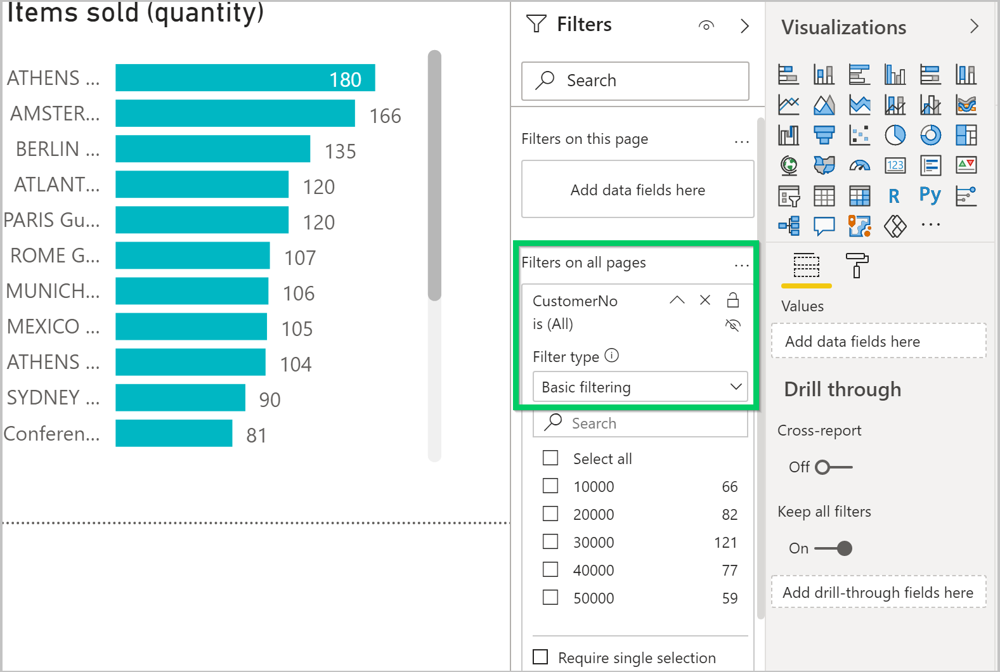
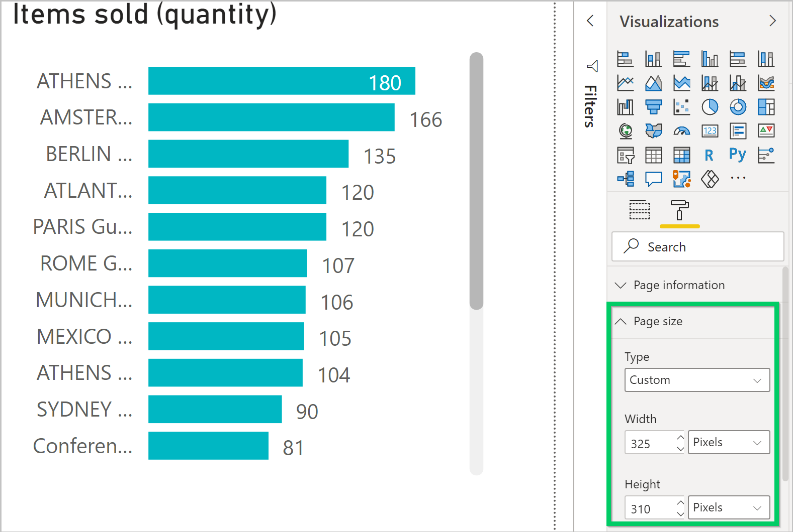

# Create Power BI reports for displaying list data in [!INCLUDE[prod_short](includes/prod_short.md)]

[!INCLUDE[prod_long](includes/prod_long.md)] includes a Power BI FactBox control element on many key list pages. The purpose of this FactBox is to display Power BI reports that are related to records in the lists, providing extra insight into the data. The idea is that as you move between rows in the list, the report updates for the selected entry.

[!INCLUDE[prod_long](includes/prod_long.md)] comes ready with some of these reports. You can also create your own custom reports that display in this FactBox. Creating these reports is similar to other reports. But there are a few design rules you have to follow to make sure the reports display as expected. These rules are explained in this article.

> [!NOTE]
> Refer to [Build Power BI Reports to Display [!INCLUDE [prod_long](includes/prod_long.md)] Data](across-how-use-financials-data-source-powerbi.md) for general information about creating and publishing Power BI reports for Business Central.

## Prerequisites

- A Power BI account.
- Power BI Desktop.

<!-- 
For more information about getting started, see [Use [!INCLUDE[prod_short](includes/prod_short.md)] as a Power BI Data Source](across-how-use-financials-data-source-powerbi.md).-->

## Create a report for a list page

1. Start Power BI Desktop.
2. Select **Get Data**, and start choosing the data source for the report.

    Specify the Business Central list pages that contain the data that you want in the report. For example, to create a report for the **Sales Invoices** list, include pages related to sales.

    Follow the instructions [Add [!INCLUDE[prod_short](includes/prod_short.md)] as a data source in Power BI Desktop](across-how-use-financials-data-source-powerbi.md#getdata) for more information.

3. Set the report filter.

    To make the data update to the selected record in the list, you add a filter to the report. The filter must include a field of the data source that's used to uniquely identify each record in the list. In developer terms, this field is the *primary key*. In most cases, the primary key for a list is the **No.** field.

    To set the filter, do the following steps:

    1. In the **Filters**, select the primary key field from the list of available fields.
    2. Drag the field to **Filters** pane and drop it in the **Filters on all pages** box.
    3. Set the **Filter type** to **Basic filtering**. It can't be page, visual, or advanced filter.

    
4. Design the report layout.

    Create the layout by dragging fields and adding visualizations. Learn more in [Work with Report view in Power BI Desktop](/power-bi/create-reports/desktop-report-view) in the Power BI documentation.

5. See the next sections about sizing the report and using multiple pages.

6. Save and name the report.

    Give the report a name that contains the name of the list page associated with the report, as it is in the client. The name isn't case-sensitive though. Suppose the report is for the **Sales Invoices** list page. In this case, include the words **sales invoices** somewhere in the name, like **my sales invoices.pbix** or **my_Sales Invoices_list.pbix**.

    This naming convention isn't a requirement. However, it makes selecting reports in [!INCLUDE[prod_short](includes/prod_short.md)] quicker. When the report selection page opens from a list page, it's automatically applied a filter based on the page name. The filter has the syntax: `@*<caption>*`,  like `@*Sales Invoices*`. This filtering is done to limit the reports that are displayed. Users can clear the filter to get a full list of reports available in Power BI.

7. When you're done, publish the report as usual.

    Learn more in [Publishing a Report](across-how-use-financials-data-source-powerbi.md#publish-reports).

8. Test the report.

    Once the report's been published to your workspace, it should be available from the Power BI FactBox on the list page in [!INCLUDE[prod_short](includes/prod_short.md)].

    To test it, do the following steps.

    1. Open [!INCLUDE[prod_short](includes/prod_short.md)] and go to the list page.
    2. If you don't see the Power BI FactBox, go the action bar, then select **Actions** > **Display** > **Show/Hide Power BI Reports**.
    3. In the Power BI FactBox, select **Select Reports**, select the **Enable** box for the report, then select **OK**.

    If designed correctly, the report displays.  

## Set the report size and color

The size of the report must be set to 325 pixels by 310 pixels. This size provides the proper scaling of the report in the available space of the Power BI FactBox control in [!INCLUDE[prod_short](includes/prod_short.md)]. To define the size of the report, place focus outside of the report layout area, and then choose the paint roller icon.

You can change the width and height of the report by choosing **Custom** in the **Type** field.

If you want the background of the report to blend with the background color of the Power BI FactBox control, set report background color to *#FFFFFF* (white). 

> [!TIP]
> Use the [!INCLUDE [prod_short](includes/prod_short.md)] theme file to build reports with the same color styling as the [!INCLUDE [prod_short](includes/prod_short.md)] apps. Learn more in [Use the [!INCLUDE [prod_short](includes/prod_short.md)] report theme](across-how-use-financials-data-source-powerbi.md#theme).

## Reports with multiple pages

With Power BI, you can create a single report with multiple pages. However, for reports that display with list pages, we recommend that they don't have more than one page. The Power BI FactBox only shows the first page of your report.

## Fix problems

This section explains how to fix problems that you might run into when you try to view a Power BI report for a list page in [!INCLUDE[prod_short](includes/prod_short.md)].  

### You can't see the Power BI FactBox on a list page

By default, the Power BI FactBox is hidden from view. To show the FactBox on a page, from the action bar, select **Actions** > **Display** > **Show/Hide Power BI Reports**.

### You can't see the report in the Select Report pane

The report's name doesn't contain the name of the list page that's being shown. Clear the filter to get a full list of Power BI reports available.  

### Report is loaded but blank, not filtered, or filtered incorrectly

Verify the report filter contains the right primary key. In most cases, this field is the **No.** field, but in the **G/L Entry** table, for example, you must use the **Entry No.** field.

### Report is loaded, but it shows a page you didn't expect

Verify that the page you want displayed is the first page in your report.  

### Report appears with an unwanted gray boarder, or it's too small or too large

Verify that the report size is set to 325 pixels x 310 pixels. Save the report, and then refresh the list page.  

## Related information

[Enable Your Business Data for Power BI](admin-powerbi.md)  
[Use [!INCLUDE[prod_short](includes/prod_short.md)] as a Power BI Data Source](across-how-use-financials-data-source-powerbi.md)  
[Get Ready for Doing Business](ui-get-ready-business.md)  
[Set Up [!INCLUDE[prod_short](includes/prod_short.md)]](setup.md)  
[Finance](finance.md)  

[!INCLUDE[footer-include](includes/footer-banner.md)]
