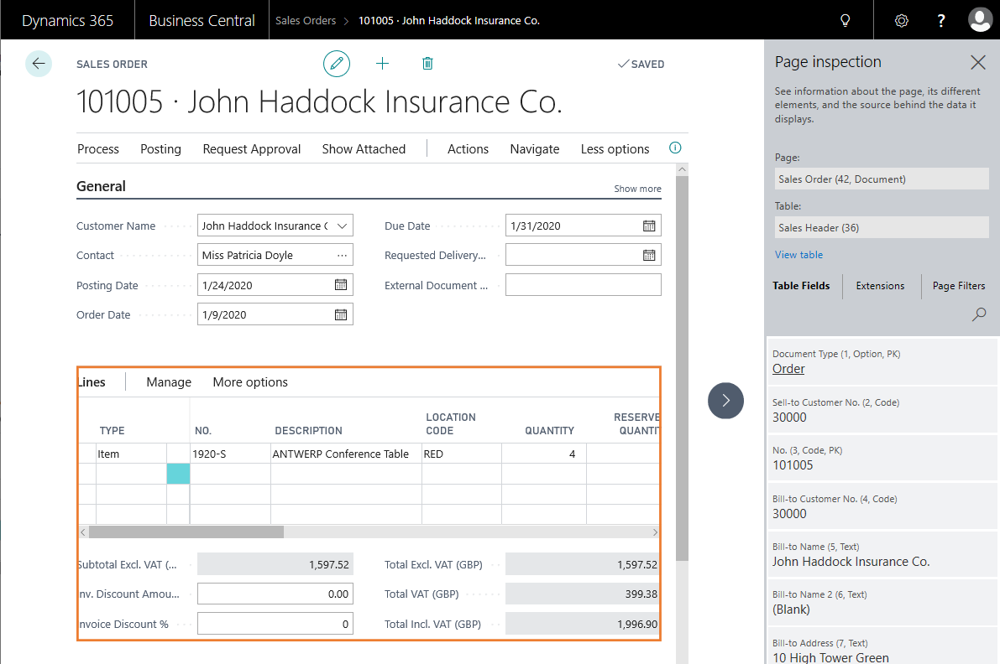
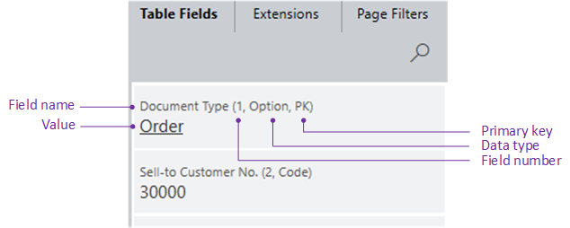

# Inspecting Pages in in Business Central

The page inspection feature enables you to get details about a page, providing insight into the page design, the different elements that comprise the page, and the source behind the data it displays.

Page inspection is especially designed for administrators, power users, support personnel, and developers. Page inspection helps you:

- Learn the data model behind a page.

- Discover pages and parts that can be reused in you application design.

- Troubleshoot data issues without having to perform tasks like copying the production database, viewing the entire source table, or digging into SQL.

- Debug the application, complementing [Designer](https://docs.microsoft.com/en-us/dynamics365/business-central/dev-itpro/developer/devenv-inclient-designer).

## Working with Page Inspection

To inspect a page, in the top right corner, choose , then choose **Inspect**. Or, you can use the keyboard shortcut Crtl+Alt+F1.

The **Inspect Page** pane opens on the right side. The following figure illustrates the **Page Inspection** pane on the **Sales Order** page.

When the **Page Inspection** pane first opens, it shows information that pertains to the main page object.

Use the keyboard or pointing device to move focus to different elements on the page. When you select a sub-page in a part of the main page or FactBox, the related area is highlighted by an orange border, and the **Page Inspection** pane shows information about the selected element. For example, the previous figure shows information about the list part in the **Sales Order** page.

As you navigate to other pages in the application, the **Page Inspection** pane will automatically update with page information as you move along.

## What Page Inspection Shows

Page inspection shows the following information for any page or sub-page in a part:

### Page

The **Page** field shows information about the main page or a selected (highlighted) sub-page in a part. The field shows the following information:

- The name, as specifed by its [Name property](https://docs.microsoft.com/en-us/dynamics365/business-central/dev-itpro/developer/properties/devenv-name-property)
- The ID as specifed by the [ID property](https://docs.microsoft.com/en-us/dynamics365/business-central/dev-itpro/developer/properties/devenv-id-property).
- The type, as specified by the [PageType property](https://docs.microsoft.com/en-us/dynamics365/business-central/dev-itpro/developer/properties/devenv-pagetype-property).

- Source table of page, including the table's name and ID.

- Table fields for the current record. Each field is shown with its name, number, data type, value, and a primary key indicator.
- Filters on the current page. This includes those that are set by code, Views, or user-defined.
- Extensions that affect the page. "Ext. page, Ext. table" or "New page, new table" (when it was added by the extension)

**Elements shown with limited information**  

- Role Center page types
    
    If a page has the type Role Center, the **Table** field does not appear, and the text **This is a Role Center page** is shown instead. Because the Role Center consists of several parts, there is no more information shown. To see more details, select the different parts that make up the page.

- Reports and report request pages

    If you open a report preview or report request page for inspection, the only information that is shown in the Page Inspection pane is the rpeort name and its ID.

- System parts, such as links and notes.

### Table

The **Table** field displays information about the source table of the main page or the selected page in a part, as specified by the page's [SourceTable property](https://docs.microsoft.com/en-us/dynamics365/business-central/dev-itpro/developer/properties/devenv-sourcetable-property). The **Table** field shows the following information:

- The name, as specifed by its [Name property](https://docs.microsoft.com/en-us/dynamics365/business-central/dev-itpro/developer/properties/devenv-name-property)
- The ID as specifed by the [ID property](https://docs.microsoft.com/en-us/dynamics365/business-central/dev-itpro/developer/properties/devenv-id-property).

- If the page does not have a source table.

### View Table

If a page has a source table, the **View table** link is available. This  link will open the table in a separate browser window, allowing you to see all records and fields in the table.

To view a table, above having read permission on the table, you must have execute permission on the system object **1350 Run Table**. This is granted by in permission set on your user account. 

### [Table Fields](#tab/tablefields)

The **Table Fields** tab displays information about all fields in the source table for the current record, including those fields that do not appear on the page.

Each field is shown with the following information:

- Field name as specified by the [Name property](https://docs.microsoft.com/en-us/dynamics365/business-central/dev-itpro/developer/properties/devenv-name-property).
- Field number as specified by the [Field No property](https://docs.microsoft.com/en-us/dynamics365/business-central/dev-itpro/developer/properties/devenv-field-no.-property).
- Data type as specified by the [Data Type property](https://docs.microsoft.com/en-us/dynamics365/business-central/dev-itpro/developer/properties/devenv-data-type-property).
- If the field is a primary key, it is indicated by **PK**. A primary is  specified by the [Key property](https://docs.microsoft.com/en-us/dynamics365/business-central/dev-itpro/developer/properties/devenv-key-property).
- Value of the field.

#### What field information is not shown

- Page fields that are not bound to the source table by the SourceExp property in their source expression are not shown.
- Fields in temporary tables.
- The value of fields that have a data type of blob, byte, media, or mediaset.

## [Extensions](#tab/extensions)

The **Extensions** tab displays extensions that are installed on the tenant and affect the selected page or source table.

"Ext. page, Ext. table" or "New page, new table" (when it was added by the extension)

Only extensions that add or extend the page or source table are shown. Any other extensions are ignored.

## [Page Filters](#tab/pagefilters)

The **Page Filters** tab displays the current filters used on the current page. This includes those that are set by code, Views, or user-defined.

## See Also  