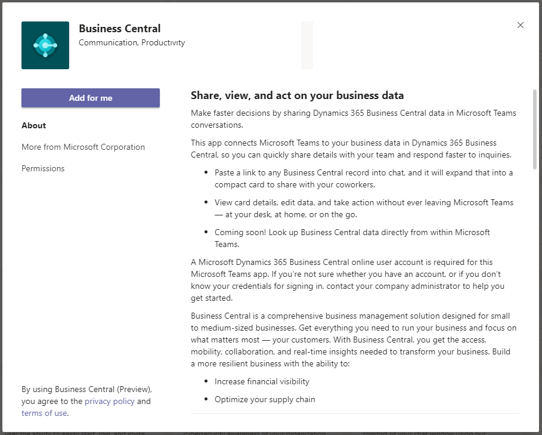

# Install the [!INCLUDE [prod_short](includes/prod_short.md)] App for Microsoft Teams

[!INCLUDE [online_only](includes/online_only.md)]

In this article, you learn how to install the [!INCLUDE [prod_short](includes/prod_short.md)] App for [Microsoft Teams](https://www.microsoft.com/microsoft-teams/). The app is available on the Teams marketplace, and you can use it with the Teams web, desktop, or mobile app.

> [!NOTE]
> Your administrator may have set things up so that the app is automatically installed for you. To check whether the app is installed, open Teams, then choose **Apps**. Search for **Business Central**, then choose it when you find it. If you see **Open** on the **Business Central** page, the app is already installed.  

## Prerequisites

- A [!INCLUDE [prod_short](includes/prod_short.md)] online user account is required for [!INCLUDE [prod_short](includes/prod_short.md)] app for Teams.

    If you’re not sure whether you have an account, or if you don’t know your credentials for signing in, contact your company administrator to help you get started.

- Access to the Teams desktop app or Teams in the browser. You can't install the [!INCLUDE [prod_short](includes/prod_short.md)] by using Teams mobile app.

- Your organization's policies allow you to install apps in Microsoft Teams.

## Add the Business Central app to Teams

There are three ways to install the Business Central app:

**Option 1: From a link**

This option is the quickest way to install the app.

1. Select this link: [https://teams.microsoft.com/l/app/84c2de91-84e8-4bbf-b15d-9ef33245ad29](https://teams.microsoft.com/l/app/84c2de91-84e8-4bbf-b15d-9ef33245ad29).

2. Wait for the Business Central app to appear.

    

3. Select **Add**.

**Option 2: From Teams**

1. Open and sign in to Teams.
2. In the left side, select **Apps**.
3. Search for **Business Central**.
4. Choose the app when you find it.
5. Choose **Add**.

> [!TIP]
> If you paste a link to a Business Central page into a Team conversation, and you don't have the app installed, you'll get a message like: **Business Central wants to show a preview of this link.** To install the app, select **Show Preview** and follow the instructions.

**Option 3: From Business Central**

1. Open Business Central.
2. Choose the  icon, enter **Get the Business Central app for Teams**, and then choose the related link.  
3. Choose **Get the app from store**.
4. Wait for Teams to open and the Business Central app to appear, then choose **Add**.

> [!NOTE]
> With either option, you may be asked to sign in to [!INCLUDE [prod_short](includes/prod_short.md)]. Select the **sign in** link, and follow the instructions to enter sign-in name and password for [!INCLUDE [prod_short](includes/prod_short.md)].

## Next step

You're now ready to use the app in Teams to search for contacts or share Business Central records. For more information, see [Searching for Customers, Vendors, and Other Contacts from Microsoft Teams](across-search-contacts-teams.md) or [Share Records in Microsoft Teams](across-working-with-teams.md).

## Related information

[Business Central and Microsoft Teams Integration Overview](across-teams-overview.md)  
[Teams FAQ](teams-faq.md)  
[Troubleshooting Teams](admin-teams-troubleshooting.md)  
[Changing Company and Other Settings in Teams](across-teams-settings.md)  
[Developing for Teams Integration](/dynamics365/business-central/dev-itpro/developer/devenv-develop-for-teams)  

## [!INCLUDE[prod_short](includes/free_trial_md.md)]  

[!INCLUDE[footer-include](includes/footer-banner.md)]