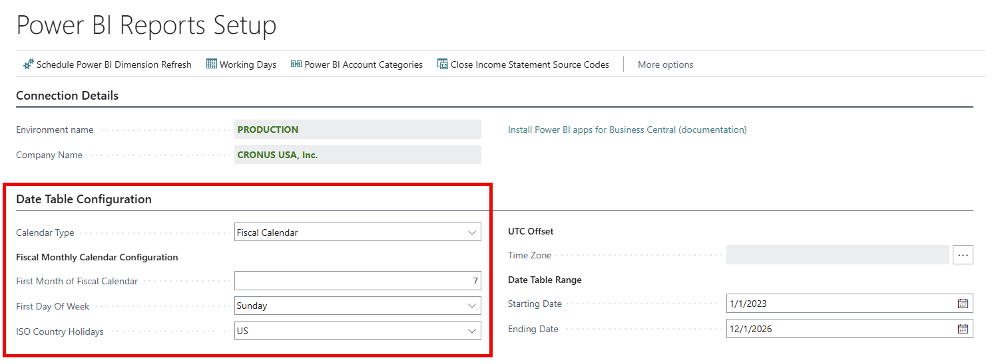

# Configure a fiscal calendar

This article describes how to configure a fiscal calendar for your Power BI Semantic Models. You configure your fiscal calendar on the **Power BI Reports Setup** page, and your settings flow through to each connected semantic model.

### Configure Calendar Type for a Fiscal Calendar

Setting Calendar Type to **Fiscal Calendar** configures the Power BI date table to use a Gregorian month-based fiscal year structure rather than the standard calendar year.

This means:

- Fiscal years begin on the **Fiscal Month of Fiscal Calendar** value.
- Fiscal months align to gregorian calendar month boundaries.
- Power BI reports should use the Fiscal Calendar fields (Fiscal Year, Fiscal Month, Fiscal Quarter, etc.).
- Fiscal Time Intelligence measures should be used for period comparisons.

### Define Fiscal Month of Fiscal Calendar

Use **Fiscal Month of Fiscal Calendar** to specify the calendar month in which your fiscal year begins.

The value should be entered as a number from 1 to 12, where:

1 = January

2 = February

3 = March

etc.

For example, if your fiscal year begins in July, set Fiscal Month of Fiscal Calendar = 7.

This setting determines:

- The start of the fiscal year
- How Fiscal Year, Fiscal Month, and Fiscal Quarter fields are calculated
- How fiscal time intelligence measures operate

## Related information

[Power BI Subscription Billing app](SRB/analytics/subscription-powerbi-app.md)  
[Overview of subscription billing](SRB/welcome.md)
