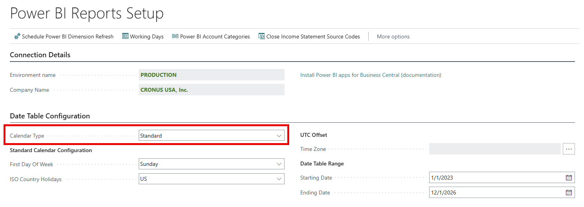
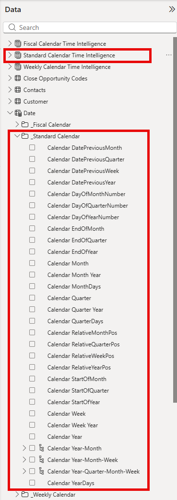

# Configure a Standard calendar

This article describes how to configure a Standard calendar for your Power BI Semantic Models. You configure your Standard calendar on the **Power BI Reports Setup** page, and your settings flow through to each connected semantic model.

### Configure Calendar Type for a Standard Calendar

Setting Calendar Type to **Standard** configures the Power BI date table to use a Gregorian month-based year structure.

This means:

- Standard Calendar years always begin in January.
- Standard Calendar months align to gregorian calendar month boundaries.
- Power BI reports should use the **Calendar fields** (Calendar Year, Calendar Month, Calendar Quarter, etc.).
- Standard Calendar Time Intelligence measures should be used for period comparisons.

## Related information

[Power BI Subscription Billing app](SRB/analytics/subscription-powerbi-app.md)  
[Overview of subscription billing](SRB/welcome.md)
