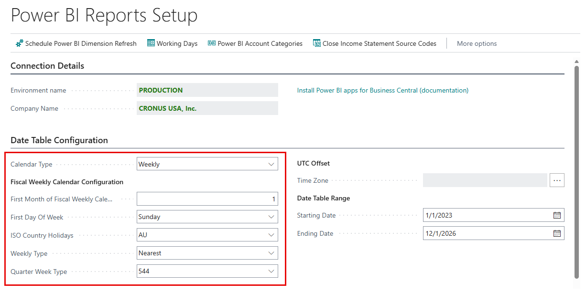
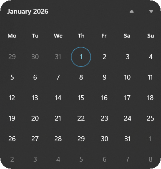

This article describes how to configure a week based calendar for your Power BI Semantic Models. The configurations are made in Business Central from the Power BI Reports Setup page which flow through to each connected semantic model.

## The Mental Model: Four Concepts to Consider

Configuration should always be thought about in this order:

1. [Define the Week Structure](#define-the-week-structure)
2. [Define the Fiscal Year Anchor](#define-the-fiscal-year-anchor)
3. [Define the Fiscal Boundary Rule](#define-the-fiscal-boundary-rule)
4. [Define the Period Pattern (445 / 454 / 544)](#define-the-period-pattern-445--454--544)

### Define the Week Structure

Before configuring fiscal boundaries or 445 patterns, you must first define the week structure.

The week structure establishes the framework of the calendar.

This is done by setting **First Day of Week**.

The First Day of Week should be treated as a foundational configuration that should not change once reporting begins. Changing the First Day of Week after implementation will:

- Change historical fiscal year start dates
- Change week numbers for all historical data
- Potentially shift which years contain 53 weeks
- Break period comparisons year-over-year

> [!IMPORTANT]
> Changing the First Day of Week changes the entire calendar structure.

### Define the Fiscal Year Anchor

The **Anchor** is the first day of the *First Month of Fiscal Weekly Calendar*. It is the **reference point** used to determine fiscal year boundaries.

In the example below, January is chosen as **First Month of Fiscal Weekly Calendar**, therefore the Anchor for 2026 is **Thursday** January 1.

> [!IMPORTANT]
> The Anchor is **not** the fiscal year start.

### Define the Fiscal Boundary Rule

Use **Weekly Type** to set the boundary rule (Last or Nearest). These rules determine how we snap the anchor to the week grid.

1. [Nearest](#nearest-rule) : Snap to closest week boundary.
2. [Last](#last-rule) : Snap to week containing the anchor.

#### Nearest Rule

This is exactly how the Last rule works.

Assume:

- WeeklyType = "Nearest"
- First Month of Fiscal Weekly Calendar = January
- First Day of Week = **Sunday**

The Anchor is Thursday, January 1, 2026.

##### Step 1 (Nearest Rule) - Define the Week Grid

Because First Day of Week is Sunday, the week grid runs from Sunday to Saturday.

So the week grid containing January 1, 2026 looks like:

| Sunday | Monday | Tuesday | Wednesday | Thursday  | Friday | Saturday |
| :---:  | :---:  | :---:   | :---:     | :---:     | :---:  | :---:    |
| Dec 28 | Dec 29 | Dec 30  | Dec 31    | **Jan 1** | Jan 2  | Jan 3    |

##### Step 2 (Nearest Rule) - Identify the Two Possible Week Boundaries

For the anchor (January 1), there are two possible fiscal year starts:

- The **previous** week starting Sunday, December 28, 2025
- The **next** week starting Sunday, January 4, 2026

The "Nearest" rule chooses whichever boundary is **closer to the anchor**.

##### Step 3 (Nearest Rule) - Compare Distances

Distance from January 1 to:

- December 28th is 4 days backward
- January 4th is 3 days forward

Because January 4 is closer, the fiscal year start is January 4th 2026.

#### Last Rule

This is exactly how the Last rule works.

Assume:

- WeeklyType = "Last"
- First Month of Fiscal Weekly Calendar = January
- First Day of Week = **Sunday**

The Anchor is Thursday, January 1, 2026

##### Step 1 (Last Rule) - Define the Week Grid

Because First Day of Week is Sunday, the week grid runs from Sunday to Saturday.

So in DAX terms:

- Sunday = day 1
- Monday = day 2
- Tuesday = day 3
- etc.

##### Step 2 (Last Rule) - Find the Start of the Week Containing the Anchor

January 1, 2026 is a Thursday, so that week grid looks like this:

| Sunday | Monday | Tuesday | Wednesday | Thursday  | Friday | Saturday |
| :---:  | :---:  | :---:   | :---:     | :---:     | :---:  | :---:    |
| Dec 28 | Dec 29 | Dec 30  | Dec 31    | **Jan 1** | Jan 2  | Jan 3    |

##### Step 3 (Last Rule) - Apply the "Last" Rule

The "Last" rule: The fiscal year begins on the first day of the week that contains the anchor date.

Since January 1 falls inside the week that started December 28, the fiscal year starts on **December 28, 2025**.

### Define the Period Pattern (445 / 454 / 544)

The next step is to determine how weeks are grouped into reporting periods.

This is done by setting **Quarter Week Type**:

- 445
- 454
- 544

Quarter Week Type controls how weeks are grouped within each quarter. Each quarter contains 13 weeks. Those 13 weeks are distributed across three fiscal months according to the selected pattern.

| Pattern | Weeks in Month 1 | Weeks in Month 2 | Weeks in Month 3 |
| :---:   | :---:            | :---:            | :---:            |
| 445     | 4                | 4                | 5                |
| 454     | 4                | 5                | 4                |
| 544     | 5                | 4                | 4                |

All three patterns total 13 weeks per quarter (52 weeks per year, before any 53rd week adjustment).

What the Quarter Week Type Does NOT:

- Change when the fiscal year starts
- Affect the week grid
- Influence the “Last” or “Nearest” rule
- Determine whether a year has 52 or 53 weeks

The Quarter Week Type only affects:

- How weeks are labeled as fiscal months
- How reporting periods are structured
