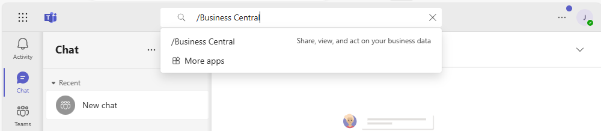
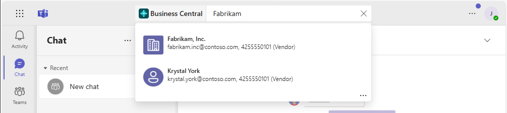
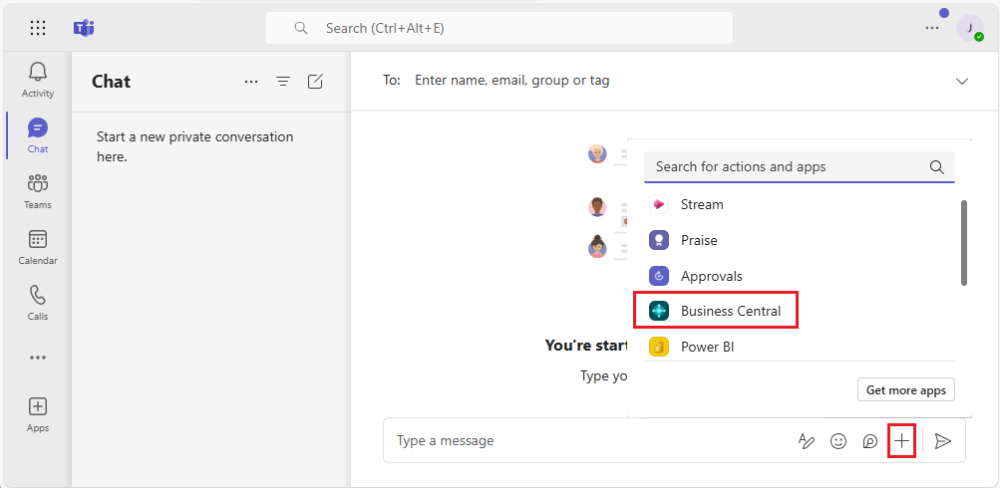
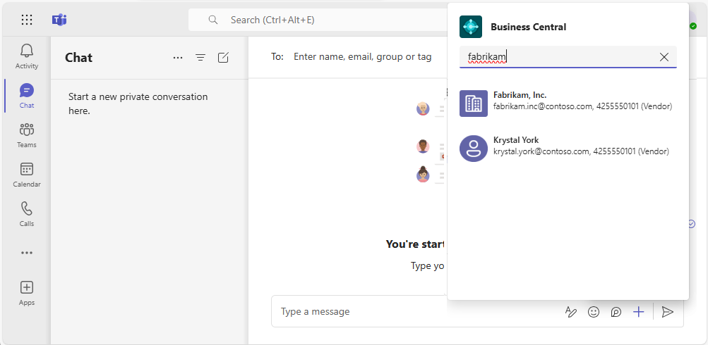

# Search for Customers, Vendors, and Other Contacts from Microsoft Teams

[!INCLUDE [online_only](includes/online_only.md)]. Introduced in 2021 release wave 1.

[!INCLUDE [prod_short](includes/prod_short.md)] has a comprehensive business contact management system that's essential for users in sales, operations, or other departmental roles. If you're a user in one of these roles, you'll often need to look up, meet, or start a conversation with your vendors, customers, and other contacts. With the [!INCLUDE [prod_short](includes/prod_short.md)] app for Teams, you can do these tasks directly from Teams, without having to switch to [!INCLUDE [prod_short](includes/prod_short.md)]. From within Teams, you can:

- Look up [!INCLUDE [prod_short](includes/prod_short.md)] contacts from the Teams command box or from the message compose area. Contacts can include prospects, vendors, customers, or other business relationships.
- Share a contact as a card in a Teams conversation.
- View details about the contact, interaction history, and other insights like outstanding payments or open documents.

## Prerequisites

- You have access to Microsoft Teams.
- You've installed the [!INCLUDE [prod_short](includes/prod_short.md)] app in Teams. Learn more in [Install the [!INCLUDE [prod_short](includes/prod_short.md)] App for Microsoft Teams](across-install-app-for-teams.md)
- You've got a [!INCLUDE [prod_short](includes/prod_short.md)] account with access to contacts in at least one company.

> [!NOTE]
> Whether you searching from the command box or message compose box, you may be asked to sign in or set up the app the first time. This step is necessary to search for contacts in the right Business Central company. Learn more about setting up the app to choose your company in [Changing Company and Other Settings in Teams](across-teams-settings.md).

## Look up contacts from the command box

The command box is at the top of every screen in Teams. It lets you search, take quick actions, or launch apps, like the [!INCLUDE [prod_short](includes/prod_short.md)] app. Searching from the command box is great for quickly looking up contacts and their related data for your own use. For example, suppose you want to look up an email address of a vendor to set up a calendar meeting. Or maybe you want to look up interaction history during a meeting with a customer.

1. In the command box, type **/Business Central**, then select the Business Central app from the results.

    

2. In the **Business Central** box, start typing search text, like a name, address, or phone number.

    As you type, matching results appear.

    
3. Select a contact from the results.

    The contact card appears beneath the command box.

4. If you want to add the contact card into a conversation, go to the upper right corner of the card, select **... (More options)** > **Copy**. Then, paste the copy in the message compose box of a conversation.  

Learn more about the Teams command box at [Teams - Use the command box](https://support.microsoft.com/en-us/office/use-the-command-box-13c4e429-7324-4886-b377-5dbed539193b).

## Look up contacts from the message compose box

The advantage of using the message compose box is that you can add a contact card directly to a conversation, for others to see.

1. Next to the message compose box, select **+** and then select **Business Central** from the list to launch the app.

    

2. In the **Business Central** box, start typing search text, like a name, address, or phone number.

    As you type, matching results appear.

    
3. Select a contact from the results.

    The contact card appears in the message compose box.

> [!NOTE]
> The contact card isn't sent to the conversation right away for others to see. You have the opportunity to review the contents of the card, and add text before or after it as you like. Then, send your message to the chat when ready.

## View contact card details

The contact card in Teams gives you a quick overview of the customer, vendor, or contact. The card is interactive&mdash;meaning you can view more information or even modify a contact by using the **Details** or **Pop-out** buttons.

The **Details** button opens a window within Teams that displays more information about the contact, but not as much as you'd see in [!INCLUDE [prod_short](includes/prod_short.md)]. To see all the information about a contact in [!INCLUDE [prod_short](includes/prod_short.md)], select **Pop-out**.

The contact card works just like cards for records, like items, customers, or sales orders. Learn more in [View card details](across-working-with-teams.md#view-card-details).

> [!NOTE]
> All participants in a Teams conversation can view cards for Business Central contact that you submit to a conversation. But to view more details about records, by using the **Details** or **Pop out** buttons on a card, they need access to [!INCLUDE [prod_short](includes/prod_short.md)]. Learn more in [Managing Microsoft Teams Integration](admin-teams-integration.md#minimum-requirements-1).

## Related information

[Business Central and Microsoft Teams Integration Overview](across-teams-overview.md)  
[Install the [!INCLUDE [prod_short](includes/prod_short.md)] App for Microsoft Teams](across-install-app-for-teams.md)  
[Teams FAQ](teams-faq.md)  
[Change Company and Other Settings in Teams](across-teams-settings.md)  
[Share Records in Microsoft Teams](across-working-with-teams.md)  
[Troubleshoot Teams](admin-teams-troubleshooting.md)  
[Develop for Teams Integration](/dynamics365/business-central/dev-itpro/developer/devenv-develop-for-teams)  

## [!INCLUDE[prod_short](includes/free_trial_md.md)]  

[!INCLUDE[footer-include](includes/footer-banner.md)]