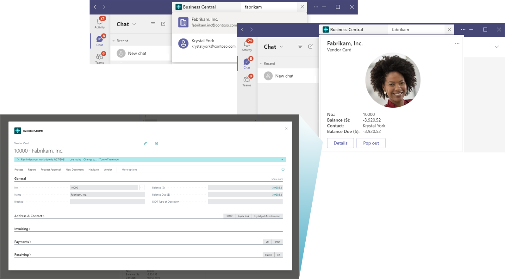
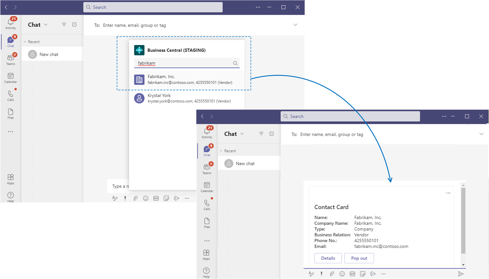

# Business Central and Microsoft Teams Integration

[!INCLUDE [online_only](includes/online_only.md)]

[Microsoft Teams](https://www.microsoft.com/en-us/microsoft-365/microsoft-teams) is a Microsoft 365 product that lets you connect with others, collaborate seamlessly, and simplify work. [!INCLUDE [prod_short](includes/prod_short.md)] offers an app that connects Microsoft Teams to your business data in [!INCLUDE [prod_short](includes/prod_short.md)] so you can quickly share details across team members, look up contacts, and respond faster to inquiries.

The app is available on the Teams marketplace, and you can use it with the Teams desktop, mobile app, or web.

## Features overview

The [!INCLUDE [prod_short](includes/prod_short.md)] app for Teams offers the following features.

### Look up details of customers, vendors, and other contacts

No matter where you are in Teams, you can look up details about customers, vendors, and other [!INCLUDE [prod_short](includes/prod_short.md)] contacts. This feature not only lets you view general information about contacts, but also gives access to interaction history, related documents, and more.

 

You can also share contact details in a conversation. From there, participants have access to even more details about the contact as well.

 

For more information, see [Searching for Contacts from Microsoft Teams](across-search-contacts-teams.md).

### Share records in conversations

Copy a link to any Business Central record and paste it into a Teams conversation to share with your coworkers. The app will then expand the link into a compact, interactive card that displays information about the record.

Once in the conversation, you and coworkers can view more details about the record, edit data, and take action - without leaving Teams.

For more information, see [Working with Business Central Data in Microsoft Teams](across-working-with-teams.md).

## Get Started

1. A [!INCLUDE [prod_short](includes/prod_short.md)] online user account is required for [!INCLUDE [prod_short](includes/prod_short.md)] app for Teams.

    If you’re not sure whether you have an account, or if you don’t know your credentials for signing in, contact your company administrator to help you get started.

    > [!TIP]
    > If your organization doesn't have a [!INCLUDE [prod_short](includes/prod_short.md)] subscription, you can sign up for a free trial. For more information, see [Getting Started with a Trial](across-preview.md#getting-started-with-a-trial).

2. As an administrator, see [Managing Microsoft Teams Integration with Business Central](admin-teams-integration.md) for information about getting users set up to work with [!INCLUDE [prod_short](includes/prod_short.md)] and Teams.
3. Install [!INCLUDE [prod_short](includes/prod_short.md)] app in Teams. See [Install the [!INCLUDE [prod_short](includes/prod_short.md)] App for Microsoft Teams](across-install-app-for-teams.md).
4. Once the app is installed, you're ready to go. See [Working with Business Central Data in Teams](across-working-with-teams.md). 

## See Also

[Teams FAQ](teams-faq.md)  
[Troubleshooting Teams](admin-teams-troubleshooting.md)  
[Developing for Teams Integration](/dynamics365/business-central/dev-itpro/developer/devenv-develop-for-teams)
  
## [!INCLUDE[prod_short](includes/free_trial_md.md)]  

[!INCLUDE[footer-include](includes/footer-banner.md)]