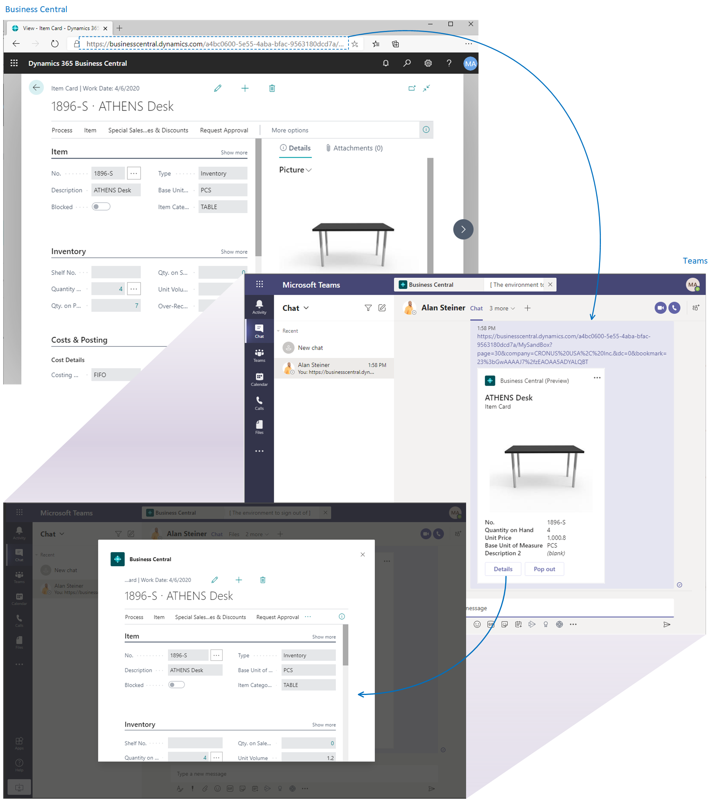

# Business Central and Microsoft Teams Integration

[!INCLUDE [online_only](includes/online_only.md)]

[Microsoft Teams](https://www.microsoft.com/en-us/microsoft-365/microsoft-teams) is a Microsoft 365 product that lets you connect with others, collaborate seamlessly, and simplify work. [!INCLUDE [prod_short](includes/prod_short.md)] offers an app that connects Microsoft Teams to your business data in [!INCLUDE [prod_short](includes/prod_short.md)] so you can quickly share details across team members and respond faster to inquiries.

## Overview

The [!INCLUDE [prod_short](includes/prod_short.md)] app lets you:

- Copy a link to any Business Central record and paste it into a Teams conversation to share with your coworkers. The app will then expand the link into a compact, interactive card that displays information about the record.
- Once in the conversation, you and coworkers can view more details about the record, edit data, and take action - without leaving Teams.

The app is available on the Teams marketplace, and you can use it with the Teams web, desktop, or mobile app.

## Get Started

1. As an administrator, see [Managing Microsoft Teams Integration with Business Central](admin-teams-integration.md) for information about getting users set up to work with [!INCLUDE [prod_short](includes/prod_short.md)] and Teams.
2. Install [!INCLUDE [prod_short](includes/prod_short.md)] app in Teams. See [Install the [!INCLUDE [prod_short](includes/prod_short.md)] App for Microsoft Teams](across-install-app-for-teams.md).
3. Once the app is installed, you're ready to go. See [Working with Business Central Data in Teams](across-working-with-teams.md). 

## See Also

[Teams FAQ](teams-faq.md)  
[Troubleshooting Teams](admin-teams-troubleshooting.md)  
[Developing for Teams Integration](/dynamics365/business-central/dev-itpro/developer/devenv-develop-for-teams)  
## [!INCLUDE[prod_short](includes/free_trial_md.md)]  

[!INCLUDE[footer-include](includes/footer-banner.md)]