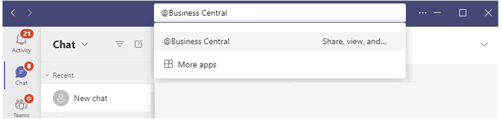
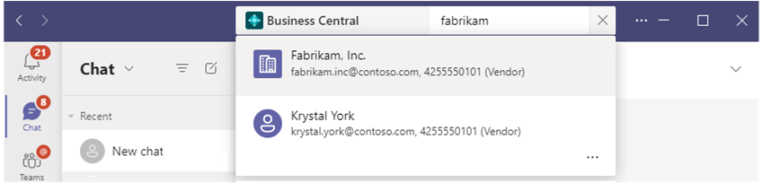

# Changing Sign-In and Other Settings in Teams

[!INCLUDE [online_only](includes/online_only.md)]. Introduced in 2021 release wave 1.

[!INCLUDE [prod_short](includes/prod_short.md)] has a comprehensive business contact management system that is essential for users in sales, operations, or other departmental roles. If you're a user in one of these roles, you'll often need to lookup, call, or start a conversation with your vendors, customers, and other contacts. With the [!INCLUDE [prod_short](includes/prod_short.md)] app for Teams, you can do these tasks directly from Teams, without having to switch to [!INCLUDE [prod_short](includes/prod_short.md)]. Specifically, the app lets you:

- Look up Business Central contacts from the Microsoft Teams command box or from the message compose area. Contacts can include prospects, vendors, customers, or other business relationships.
- Share a contact as a card during conversations in Microsoft Teams.
- View contact information, history of interactions, and other insights such as outstanding payments or open documents, in the details window in Teams.

## Prerequisites

- You have access to Microsoft Teams.
- You've installed the [!INCLUDE [prod_short](includes/prod_short.md)] app in Teams. For more information, see [Install the [!INCLUDE [prod_short](includes/prod_short.md)] App for Microsoft Teams](across-install-app-for-teams.md)

## Look up contacts from the command box

The command box is at the top of every screen in Teams. It lets you search, take quick actions, or launch apps, like the [!INCLUDE [prod_short](includes/prod_short.md)] app.

1. In the command box, type **@Business Central**, then select the Business Central app from the results.

    

2. In the **Business Central** box, start typing search text, like a name, address, or phone number.

    As you type, results will appear.

    
3. Select a contact from the results.

    The contact card appears beneath the command box.

For more information about the command box in Teams, see [Teams - Use the command box](https://support.microsoft.com/en-us/office/use-the-command-box-13c4e429-7324-4886-b377-5dbed539193b).

## Look up a contacts from the message compose box

The advantage of using the message compose box is that you can add a contact card to directly to conversation.

1. Beneath to message compose box, select the **Business Central** icon to launch the app.

    If you don't see the **Business Central** icon, select **Messaging extensions** (...).

    

2. In the **Business Central** box, start typing search text, like a name, address, or phone number.

    As you type, results will appear.
3. Select a contact from the results.

    The contact card appears in the message compose box.

## Viewing contact details

Contact card in Teams works just like cards for records, like items, customers, or sales orders. You can view more information or even modify a contact by selecting **Details** or **Pop-out** on the card. For more information, see [View card details](across-working-with-teams#view-card-details).

> [!NOTE]
> All participants in a Teams conversation will be able to view cards for Business Central contact that you submit to a conversation. But to view more details about records, by using the **Details** or **Pop out** buttons on a card, they'll need access to [!INCLUDE [prod_short](includes/prod_short.md)]. For more information, see [Managing Microsoft Teams Integration](admin-teams-integration.md#minimum-requirements-1).

## See Also

[Business Central and Microsoft Teams Integration Overview](across-teams-overview.md)  
[Install the [!INCLUDE [prod_short](includes/prod_short.md)] App for Microsoft Teams](across-install-app-for-teams.md)  
[Teams FAQ](teams-faq.md)  
[Troubleshooting Teams](admin-teams-troubleshooting.md)  
[Developing for Teams Integration](/dynamics365/business-central/dev-itpro/developer/devenv-develop-for-teams)  

## [!INCLUDE[prod_short](includes/free_trial_md.md)]  

[!INCLUDE[footer-include](includes/footer-banner.md)]