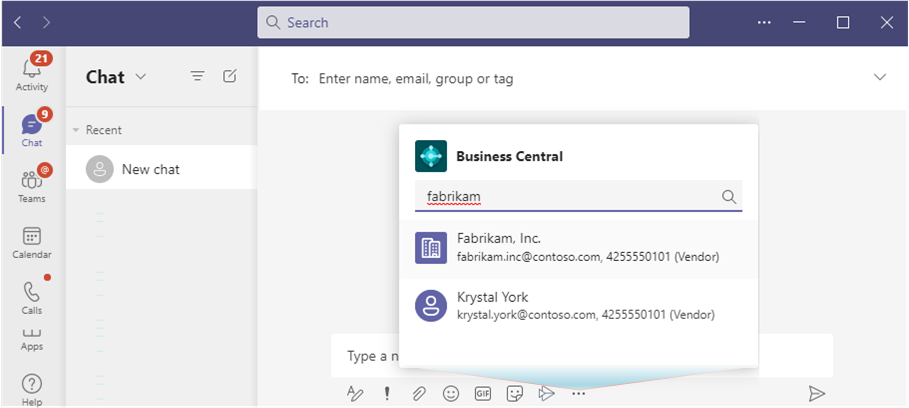
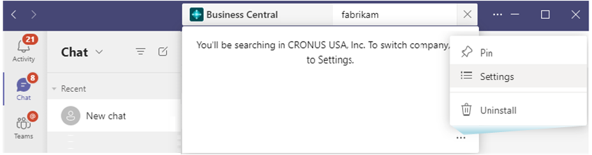

# Changing Company and Other Settings in Teams

[!INCLUDE [online_only](includes/online_only.md)]

The [!INCLUDE [prod_short](includes/prod_short.md)] app for Teams includes a **Settings** page that lets you view and change information about your connection to [!INCLUDE [prod_short](includes/prod_short.md)]. For example, you switch the [!INCLUDE [prod_short](includes/prod_short.md)] environment and company you're connected to. You can also see which account you're using to access [!INCLUDE [prod_short](includes/prod_short.md)], and sign out and in again as needed.

There are two ways to open the **Settings** page: 1) from the message compose box or 2) from the command box.

1. Beneath the message compose box, right-click the [!INCLUDE [prod_short](includes/prod_short.md)] app icon, then select **Settings**.

    

2. From the command box at the top, search for **@Business Central**, select **... (More options)**, then select **Settings**.

   

## See Also

[Business Central and Microsoft Teams Integration Overview](across-teams-overview.md)  
[Install the [!INCLUDE [prod_short](includes/prod_short.md)] App for Microsoft Teams](across-install-app-for-teams.md)  
[Searching for Customers, Vendors, and Other Contacts from Microsoft Teams](across-search-contacts-teams.md)  
[Share Records in Microsoft Teams](across-working-with-teams.md)  
[Teams FAQ](teams-faq.md)  
[Troubleshooting Teams](admin-teams-troubleshooting.md)  
[Developing for Teams Integration](/dynamics365/business-central/dev-itpro/developer/devenv-develop-for-teams)  

## [!INCLUDE[prod_short](includes/free_trial_md.md)]  

[!INCLUDE[footer-include](includes/footer-banner.md)]