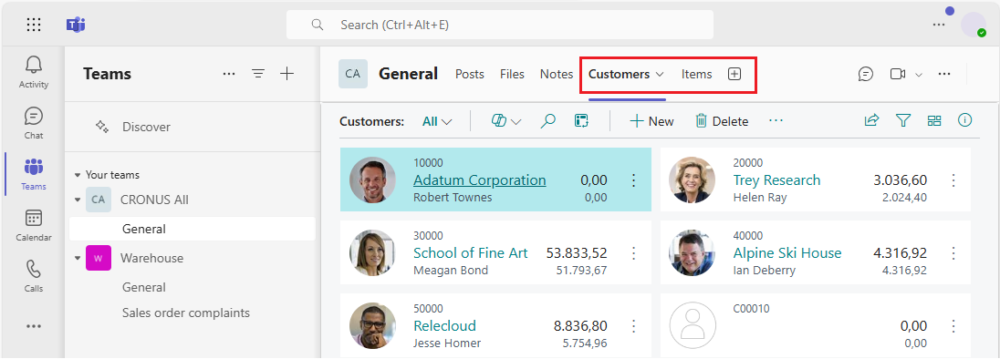
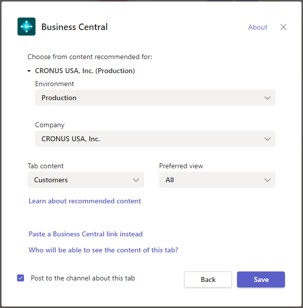
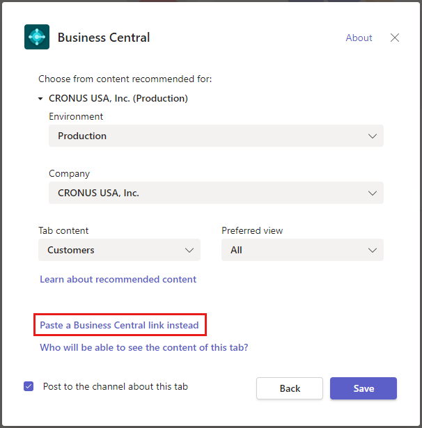
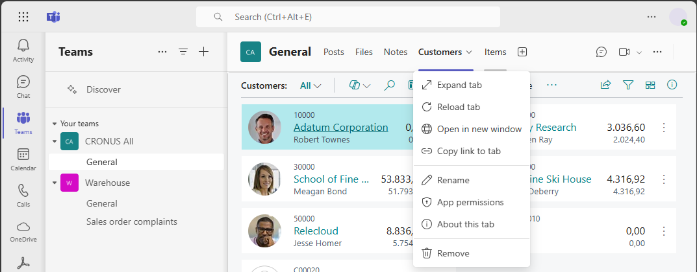

# Add Business Central tab in Microsoft Teams

[!INCLUDE [online_only](includes/online_only.md)]

In Teams, tabs appear at the top of channels and chats, giving participants quick access to pertinent information. This article explains different ways to add a tab that displays [!INCLUDE [prod_short](includes/prod_short.md)] data.

## About Business Central tabs

A [!INCLUDE [prod_short](includes/prod_short.md)] tab provides a focused view of [!INCLUDE [prod_short](includes/prod_short.md)] list and card pages. The tab doesn't display the full [!INCLUDE [prod_short](includes/prod_short.md)] web client. There's no browser border, [!INCLUDE [prod_short](includes/prod_short.md)] banner (for example with Tell Me, search, help) or top navigation menu&mdash;just page content and its actions. The content is interactive, meaning that you can select actions and links, change data, and more. You're limited to what you see and can do by the same permissions assigned to your account in [!INCLUDE [prod_short](includes/prod_short.md)].

Learn more about who can view the content of a [!INCLUDE [prod_short](includes/prod_short.md)] tab in [Who can see the content of a tab?](/dynamics365/business-central/teams-faq?tabs=tabs#who-can-view).

> [!TIP]
> Are you a developer? You can also add tabs programmatically using the Microsoft Graph API. Learn more in [Add Business Central Tabs to Teams](/dynamics365/business-central/dev-itpro/developer/devenv-develop-for-teams-tabs).  

## Prerequisites

To add a [!INCLUDE [prod_short](includes/prod_short.md)] tab, the following requirements must be met:

- You have access to Microsoft Teams.
- You have a [!INCLUDE [prod_short](includes/prod_short.md)] license.
- You've installed the [!INCLUDE [prod_short](includes/prod_short.md)] app in Teams. Learn more in [Install the [!INCLUDE [prod_short](includes/prod_short.md)] App for Microsoft Teams](across-install-app-for-teams.md).

To view [!INCLUDE [prod_short](includes/prod_short.md)] tab that was added by another participant in the channel or chat, the following requirements must be met:

- You have access to Microsoft Teams.
- You have a [!INCLUDE [prod_short](includes/prod_short.md)] license or limited access to Business Central with a Microsoft 365 license only. Learn more in [Business Central Access with Microsoft 365 Licenses](admin-access-with-m365-license.md).
- You've installed the [!INCLUDE [prod_short](includes/prod_short.md)] app in Teams.

## Add tab using recommended content

Use these steps to add a tab by choosing what to display from a readily available list of recommended content that's based your role center&mdash;without leaving Teams. Learn more about the content that you can choose from in [Where does the recommended content come from?](/dynamics365/business-central/teams-faq?tabs=tabs#where-does-the-recommended-content-come-from).

1. At the top of a channel or chat in Teams, select **+ Add a tab**.
2. In the **Search** box, type *business central*, then select the **[!INCLUDE [prod_short](includes/prod_short.md)]** icon and wait for the [!INCLUDE [prod_short](includes/prod_short.md)] tab configuration window to appear.

   

3. The **Choose from content recommended for** option shows the company in [!INCLUDE [prod_short](includes/prod_short.md)] that you working with. If you want to show content from another company, select the current company, then use the **Environment** and **Company** options to specify company you want to work with.
4. Select down arrow in the **Tab content** option and choose the content that you want to display.

   <!-- The list shows all pages that are bookmarked on your role center in [!INCLUDE [prod_short](includes/prod_short.md)]. To learn more about the content that you can choose from, see [Where does the recommended content come from?](teams-faq.md#recommended-content).-->
5. Some pages may include different views, which are variations of the page that's filtered to show specific data. To change the view for the content, select the down arrow for the **Preferred view** option and choose the view from the list.

   Learn more in [Save and Personalize Views](ui-views.md).
6. Select **Post to the channel about this tab** to automatically post an announcement in the Teams channel or chat to let participants know that you've added this tab.
7. Select **Save**.

## Add tab using a page link

Another way to add a tab by using a link (URL) to the page that you want to show. This way is useful when you want to display a specific [!INCLUDE [prod_short](includes/prod_short.md)] record or a list page that isn't bookmarked on your role center.

1. At the top of a channel or chat in Teams, select **+ Add a tab**.
2. In the **Search** box, type *business central*, then select the **[!INCLUDE [prod_short](includes/prod_short.md)]** icon.
3. Wait for the [!INCLUDE [prod_short](includes/prod_short.md)] tab configuration window to appear, then select **Paste a [!INCLUDE [prod_short](includes/prod_short.md)] link instead** option.

   
4. Go to [!INCLUDE [prod_short](includes/prod_short.md)], and open the page that you want to display in the tab.
5. Copy the link to the page.

   There are two ways to copy the link. The easiest and preferred way is to select **Share**  > **Copy Link**. The other way is to copy the entire URL from the browser's address bar. Learn more in [Sharing Business Central Records and Page Links](across-working-with-teams.md).

6. Go back to Teams and paste the link in the **URL** box.
7. In the **Tab name** box, enter a name that displays on the tab.
8. Select **Post to the channel about this tab** to automatically post an announcement in the Teams channel or chat to let participants know that you've added this tab.
9. Select **Save**.

## Change a tab and its content

After a tab has been added, you can make certain changes to the tab. For example, you can rename the tab, move it, and remove it. You find these actions in the tab options that are available by selecting the down arrow on the tab.

As for the content of a tab, you can modify the data, if you have permission. If you change the data, others won't see the changes until they leave the tab and come back. The same is true for you if someone else makes changes to data. You can't change the page that displays on the tab, so just remove the tab and add another one the suits.

You can also change your view of the page and its data, like sorting and switching the layout between list and tile views. When you make these kinds of changes, they won't affect what others see. They see what you originally posted, until they make similar changes themselves.

## Related information

[Business Central and Microsoft Teams Integration Overview](across-teams-overview.md)  
[Install the [!INCLUDE [prod_short](includes/prod_short.md)] App for Microsoft Teams](across-install-app-for-teams.md)  
[Share Business Central Records and Page Links in Microsoft Teams](across-working-with-teams.md).  
[Teams FAQ](teams-faq.md)  
[Search for Customers, Vendors, and Other Contacts from Microsoft Teams](across-search-contacts-teams.md)  
[Change Company and Other Settings in Teams](across-teams-settings.md)  
[Troubleshoot Teams](admin-teams-troubleshooting.md)  
[Develop for Teams Integration](/dynamics365/business-central/dev-itpro/developer/devenv-develop-for-teams)  

## [!INCLUDE[prod_short](includes/free_trial_md.md)]  

[!INCLUDE[footer-include](includes/footer-banner.md)]
