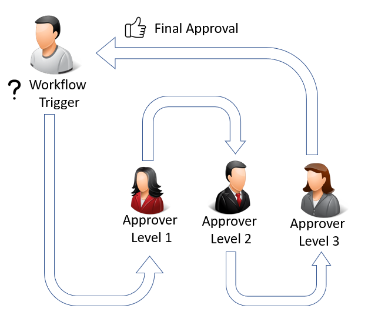
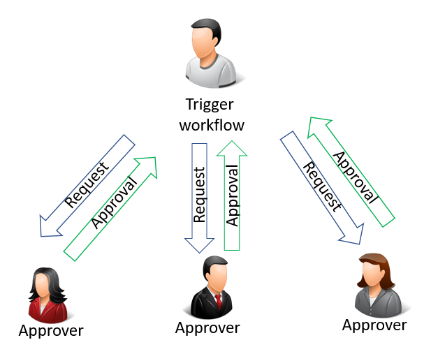
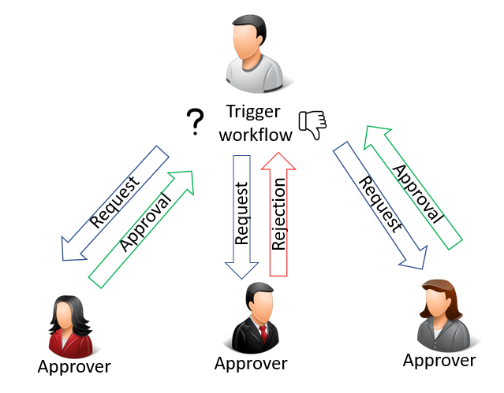

# Use Approval Workflows

A workflow is a sequence of tasks triggered by an action, a condition, or a rule. Workflows are usually implemented to integrate business logic into an organization, such as the separation of duties, unifying processes, or to apply best practices.

The workflows can be designed to create requests for approval of a record field change while keeping the old data in case the request isn't approved. The new value won't be implemented until the last request is approved.

The business logic could be the approval of:

- New master data such as general ledger (G/L) accounts, customers, vendors, or items.
- Changes to fields in existing records containing sensitive information, such as **Vendor Bank Account No.** or **Customer Credit Limit**.
- Changes to fields in existing records containing business critical information, such as **Item Sales Prices**.
- New users or changes to user permissions.
- Purchase documents.
- Sales documents.
- Incoming documents.
- Finance journals prior to posting.

The following illustration is example of a workflow with sequential approval triggered by a user. By triggering the workflow, an approval request is created for the first approver.  

You see in the illustration above how the request must be approved by the first approver before it's sent on to the next one. If the request isn't approved by the first approver, the request will never go to the next.

The route taken from the initial triggering of the workflow can vary depending on the nature of the approval.  

The following illustration shows a parallel approval triggered by the user. A parallel approval means the approval request is sent to all approvers simultaneously.  

However, the workflow isn't concluded until all requests have been approved, as shown in the following illustration:  

> [!NOTE]  
> For a workflow with multiple approvers, all approvers must approve each step before the workflow can move forward to the next event. Approval from just one approver will not move the workflow forward.

You can set up and use workflows that connect business-process tasks performed by different users. It's also possible to create the same workflow more than once. Each workflow can be triggered by an event using different filters. This is useful if an approval request for one department must be approved by one approver, while requests for other departments must be approved by a different approver. System tasks, such as automatic posting, can be included as steps in workflows, preceded or followed by user tasks. Requesting and granting approval to create new records are typical workflow steps.  

Before you can begin using workflows, you must set up workflow users, create the workflows (potentially preceded by code customization), and specify how users receive notifications. Learn more at [Setting Up Workflows](across-set-up-workflows.md).

> [!NOTE]  
> Typical workflow steps involve users requesting approval of tasks and approvers accepting or rejecting approval requests. That's why many topics about how to use workflows refer to approvals.  

 The following table describes a sequence of tasks, with links to the articles that describe them.  

| **To** | **See** |
|--|--|
| Set up an approval workflow to start when the first entry-point event occurs. | [Enable Approval Workflows](across-how-to-enable-workflows.md) |
| Request approval of a task; as an approver, accept, decline, or delegate approvals; and send or view approval notifications. | [How To Use Approval Workflows](across-how-use-approval-workflows.md) |
| Create workflow steps that restrict a certain record type from being used before a certain event occurs, for example, approval of the record. | [Restrict and Allow Usage of a Record](across-how-to-restrict-and-allow-usage-of-a-record.md) |
| View workflow step instances with **Completed** status. | [View Archived Workflow Step Instances](across-how-to-view-archived-workflow-step-instances.md) |
| Delete an approval workflow that will no longer be used. | [Delete Approval Workflows](across-how-to-delete-workflows.md) |

## Related information

[Setting Up Approval Workflows](across-set-up-workflows.md)  
[Workflow](across-workflow.md)  
[Work with [!INCLUDE[prod_short](includes/prod_short.md)]](ui-work-product.md)  

[!INCLUDE[footer-include](includes/footer-banner.md)]
