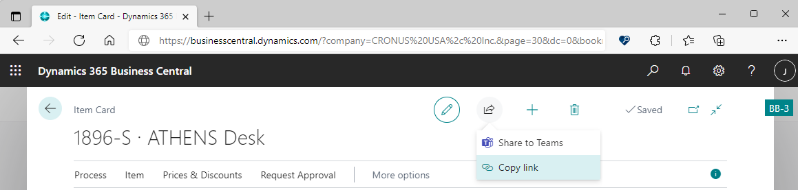
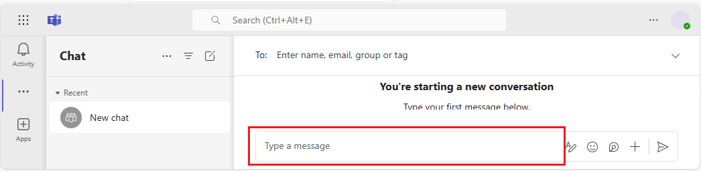

# Sharing Business Central records and page links in Microsoft Teams

[!INCLUDE [online_only](includes/online_only.md)]

[!INCLUDE [prod_short](includes/prod_short.md)] offers a couple ways to share data from Business Central directly in a Microsoft Teams conversation:

- With the [!INCLUDE [prod_short](includes/prod_short.md)] app installed in Teams, you can include an interactive card of any Business Central record in a Teams conversation.

- With or without the [!INCLUDE [prod_short](includes/prod_short.md)] app installed, you can share a link from pages in Business Central to a Teams conversation.

The following sections describe the different ways in detail.

## Include and view a Business Central card in a Teams conversation

With the Business Central app for Teams, you can copy a link from any Business Central record, like a customer or sales order, and paste the link into a Teams conversation. The app connects Microsoft Teams to your business data in [!INCLUDE [prod_short](includes/prod_short.md)]\. It then expands the link into a compact, interactive card that displays information about the record. Once in the conversation, you and coworkers can view more details about the record, edit data, and take action&mdash;without leaving Teams.

### Prerequisites

- You have access to Microsoft Teams.
- You've installed the [!INCLUDE [prod_short](includes/prod_short.md)] app in Teams. Learn more in [Install the [!INCLUDE [prod_short](includes/prod_short.md)] App for Microsoft Teams](across-install-app-for-teams.md)

> [!NOTE]
> All participants in a Teams conversation will be able to view cards for Business Central records that you submit to the conversation. But to view more details about records, by using the **Details** or **Pop out** buttons on a card, they'll need access to [!INCLUDE [prod_short](includes/prod_short.md)]. Learn more in [Managing Microsoft Teams Integration](admin-teams-integration.md#minimum-requirements-1).

### Include a Business Central card in a Teams conversation

1. Sign in to [!INCLUDE [prod_short](includes/prod_short.md)] using your browser.
2. Open the record that you want to share.

    The app is designed to display a card for almost any type of [!INCLUDE [prod_short](includes/prod_short.md)] page. But it provides the best experience when used for pages that display a single record, such as an item, customer, or sales order.
3. Copy the link to the page.

    There are two ways to copy the link. The easiest and preferred way is to select **Share**  > **Copy Link**. Alternatively, copy the entire URL from the browser's address bar.

    
4. Go to Teams and start a conversation, which can be chat with a person, group of persons, or a team channel.
5. Paste the link (URL) in the message box where you compose a message. You might need to add a space or press <kbd>Enter</kbd> for the URL to be recognized.

    

    > [!TIP]
    > If you get a message like: *Business Central wants to show a preview of this link.*, it means that you don't have the Business Central app for Teams installed. To install the app, select **Show Preview** and follow the instructions.

    > [!NOTE]
    > Depending on your Business Central version, the first time you paste a link into a conversation, you might be asked to sign in to [!INCLUDE [prod_short](includes/prod_short.md)] and give consent for the app to connect to [!INCLUDE [prod_short](includes/prod_short.md)]. Follow the on-screen instructions. You'll only have to do this step once.

6. Wait a moment while a card is generated in the message box.
7. When the card appears, review the contents of the card carefully for any sensitive information before sending the message. This step is important because once you send the message, everyone in the conversation can see the card.
8. If the card looks good, select **Send** to submit it to the conversation.
9. To view more details or make changes to the record shown in the card, select **Details**. Learn more in the next section.

### View card details

Once a card's been sent to a conversation, all participants with the [proper permissions](admin-teams-integration.md#permissions) can select **Details** to open a window that displays more information about the record&mdash;and possibly make changes to the record. It doesn't matter if you're the one sending the card or the one receiving the card. The **Details** feature is especially useful to recipients because it quickly provides concise, targeted information about the record.

The details window is similar to what you'd see in [!INCLUDE [prod_short](includes/prod_short.md)], but it's focused on the page or record that the card is about. When you're finished viewing and making changes, close the window to return to the Teams conversation.

Here are a couple things to keep in mind when working with the card details:

- To open the card details, users must have permission on the page and its data in [!INCLUDE [prod_short](includes/prod_short.md)]\.
- Cards in Teams chats aren't automatically updated to changes. Any changes you save to a record in the details window are saved in [!INCLUDE [prod_short](includes/prod_short.md)]\. But the card in Teams won't show the changes in the conversion, until you paste the link again.

Learn more about working with cards and card details in [Teams FAQ](teams-faq.md).

## Share a link to page from Business Central to Teams

Directly from most collection pages, like the **Items** page, and details pages, like the **Items** card, you can send a link to the page to specific recipients in a Teams conversation. For example, you can share a link to a filtered view of your records. Recipients can then select the link to open the page in [!INCLUDE [prod_short](includes/prod_short.md)]\.

### Prerequisites

- You have access to Microsoft Teams.
- (Optional) You've installed the [!INCLUDE [prod_short](includes/prod_short.md)] app in Teams. 

  With the app installed, messages you send with the link will also include a compact card for the page. For more information about how to install the app, see [Install the [!INCLUDE [prod_short](includes/prod_short.md)] App for Microsoft Teams](across-install-app-for-teams.md).

### Share a link

1. In [!INCLUDE [prod_short](includes/prod_short.md)]\, open the page that you want to share.
2. At the top of the page, select the  icon, then **Share to Teams**.
3. If you're asked, sign in to Teams with your user name and password.
4. In the **Share to Teams** page, type a name of a person, group, or channel that you want send the message to.
5. The message box includes a link to the page. If the [!INCLUDE [prod_short](includes/prod_short.md)] app for Teams is installed, a card for the linked record or page will also appear in the message box.

   Add more information if you like, then select **Share**.
6. The link is now shared. To view the conversation, select **Go to Teams**.

## Related information

[Business Central and Microsoft Teams Integration Overview](across-teams-overview.md)  
[Install the [!INCLUDE [prod_short](includes/prod_short.md)] App for Microsoft Teams](across-install-app-for-teams.md)  
[Teams FAQ](teams-faq.md)  
[Searching for Customers, Vendors, and Other Contacts from Microsoft Teams](across-search-contacts-teams.md)  
[Changing Company and Other Settings in Teams](across-teams-settings.md)  
[Troubleshooting Teams](admin-teams-troubleshooting.md)  
[Developing for Teams Integration](/dynamics365/business-central/dev-itpro/developer/devenv-develop-for-teams)  

## [!INCLUDE[prod_short](includes/free_trial_md.md)]  

[!INCLUDE[footer-include](includes/footer-banner.md)]
