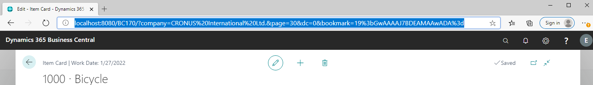
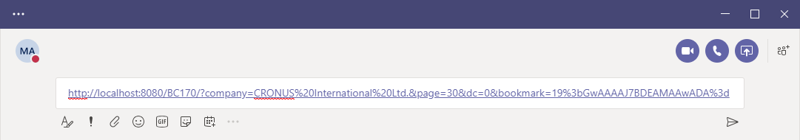

# Working with Business Central Data in Microsoft Teams

[!INCLUDE [teams_preview.md](includes/teams_preview.md)]

[!INCLUDE [prodshort](includes/prodshort.md)] offers an app that connects Microsoft Teams to your business data in [!INCLUDE [prodshort](includes/prodshort.md)], so you can quickly share details across team members and respond faster to inquiries. In this article, you'll learn how to use the app to share [!INCLUDE [prodshort](includes/prodshort.md)] data with coworkers in a Teams conversation.

## Overview

The [!INCLUDE [prodshort](includes/prodshort.md)] app lets you:

- Copy a link to any Business Central record and paste it into a Teams conversation to share with your coworkers. The link will expand that into a compact, interactive card that displays information about the record.
- Once in the conversation, you and coworkers can view more details about the record, edit data, and take action - without leaving Teams.

## Prerequisites

- You have access to Microsoft Teams.
- You've installed the [!INCLUDE [prodshort](includes/prodshort.md)] app in Teams. For more information, see [Install the [!INCLUDE [prodshort](includes/prodshort.md)] App for Microsoft Teams](across-install-app-for-teams.md)

> [!NOTE]
> All participants in a Teams conversation will be able to view cards for Business Central records that you submit to the conversation. But to view more details about records, by using the **Details** or **Pop-out** buttons on a card, they'll need access to [!INCLUDE [prodshort](includes/prodshort.md)]. For more information, see [Managing Microsoft Teams Integration](admin-teams-integration.md).
<!--
- People You and your coworkers have the following permissions in [!INCLUDE [prodshort](includes/prodshort.md)]
  - To paste a [!INCLUDE [prodshort](includes/prodshort.md)] link into a Teams conversation and have it expand into a card, you have to have at least permission to view the page and its data.
  - Once a card is submitted into a conversation, any user in that conversation can view that card without having permission to Business Central.
  - For other users to view more details from card, they must also have view permission, as a minimum, to the page and its data. If they want to change data, they'll need modify permissions.

  Setting up permissions is typically done by an administrator. For more information, see [Managing Microsoft Teams Integration](admin-teams-integration.md).-->

## Include a Business Central card in a Teams conversation

1. Sign in to [!INCLUDE [prodshort](includes/prodshort.md)] using your browser.
2. Open the record that you want to share.

    The app is designed to display card type pages from [!INCLUDE [prodshort](includes/prodshort.md)]. So open a page that displays a single record, like an item, customer, or sales order. You can't use it for role centers or pages that display several records in a list.

3. Copy the entire URL from the browser's address bar.

   
4. Go to Teams and start a conversation, which can be chat with a person, group of persons, or a team channel.

    <!--Teams imposes a few limitations here eg. you cannot unfurl a link during a Voice/Video call :/ We should probably only mention this in a Troubleshooting section (and i hope it will also be fixed soon)-->
5. Paste the URL into the box where you add a message.

   
6. The first time you paste a link into a conversation, you'll be asked to sign in to [!INCLUDE [prodshort](includes/prodshort.md)] and give consent for the app to retrieve data. Just follow the on-screen instructions.

    > [!NOTE]
    > You'll only have to do this step once.

7. Wait a moment while a card is generated in the message box.

8. When the card appears, review the contents of the card carefully for any sensitive information before sending the message. This step is important because once you send the message, everyone in the conversation can see the card.

9. If the card looks good, select **Send** to submit it to the conversation.

    > [!TIP]
    > After the card appears, and before you select **Send**, you can delete the pasted URL if you like.

10. To view more details or make changes to the record, select **Details**.

    The details page is similar to what you'd see in [!INCLUDE [prodshort](includes/prodshort.md)]. But it's slightly trimmed for Teams. When you're finished viewing and making changes, close the window to return to the Teams conversation.

    > [!NOTE]
    > Any changes you make won't be reflected in the card until the next time you paste its link in a conversation.

## See Also

[Business Central and Microsoft Teams Integration Overview](across-teams-overview.md)  
[Install the [!INCLUDE [prodshort](includes/prodshort.md)] App for Microsoft Teams](across-install-app-for-teams.md)  
[Getting Started](product-get-started.md)  

## [!INCLUDE[d365fin](includes/free_trial_md.md)]  
