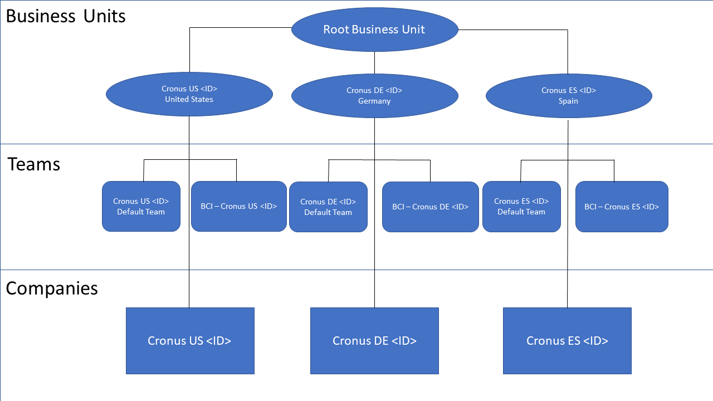
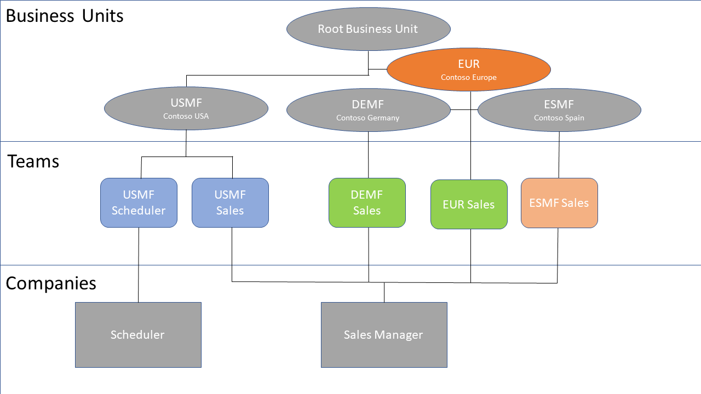

# Data Ownership Models
[!INCLUDE[d365fin](includes/cds_long_md.md)] requires that you specify an owner for the data you store. For more information, see [Entity ownership](https://docs.microsoft.com/powerapps/maker/common-data-service/types-of-entities#entity-ownership) in the Power Apps documentation. When you set up integration between [!INCLUDE[d365fin](includes/cds_long_md.md)] and [!INCLUDE[d365fin](includes/d365fin_md.md)] you must choose one of two ownership models for records that are synchronized:

* Team 
* Person (user)

Actions that can be performed on these records can be controlled on a user level. For more information, see [User and team entities](https://docs.microsoft.com/powerapps/developer/common-data-service/user-team-entities). We recommend the Team ownership model because it makes it easier to manage ownership for multiple people.

## Team Ownership
In [!INCLUDE[d365fin](includes/d365fin_md.md)], a company is a legal and business entity that offers ways to secure and visualize business data. Users always work in the context of a company. The closest that [!INCLUDE[d365fin](includes/cds_long_md.md)] comes to this concept is the business unit entity, which does not have legal or business implications.

Because business units lack legal and business implications, you cannot force a one-to-one (1:1) mapping to synchronize data between a company and a business unit, either one-way or bi-directional. To make synchronization possible, when you enable synchronization for a company in [!INCLUDE[d365fin](includes/d365fin_md.md)], the following happens in [!INCLUDE[d365fin](includes/cds_long_md.md)]:

* We create a company entity that is equivalent to the company entity in [!INCLUDE[d365fin](includes/d365fin_md.md)]. The name of the company is suffixed with "BC Company ID." For example, Cronus International Ltd. (93555b1a-af3e-ea11-bb35-000d3a492db1).
* We create a default business unit that has the same name as the company. For example, Cronus International Ltd. (93555b1a-af3e-ea11-bb35-000d3a492db1).
* We create separate owner team with the same name as the company and associate it with the business unit. The name of the team is prefixed with "BCI -." For example, BCI - Cronus International Ltd. (93555b1a-af3e-ea11-bb35-000d3a492db1).
* Records that are created and synchronized to [!INCLUDE[d365fin](includes/cds_long_md.md)] are assigned to the "BCI Owner" team that is linked to the business unit.

The following image shows an example of this data setup in [!INCLUDE[d365fin](includes/cds_long_md.md)].

In this configuration, records that are related to the Cronus US company will be owned by a team that is linked to the Cronus US <ID> business unit in [!INCLUDE[d365fin](includes/cds_long_md.md)]. Users who can access that business unit through a security role that is set to business unit–level visibility in [!INCLUDE[d365fin](includes/cds_long_md.md)] can now see those records. The following example shows how to use teams to provide access to those records.

* The Sales Manager role is assigned to members of the Cronus US Sales team.
* Users who have the Sales Manager role can access account records for members of the same business unit.
* The Cronus US Sales team is linked to the Cronus US business unit that was mentioned earlier. Members of the Cronus US Sales team can see any account that is owned by the Cronus US <ID> user, which would have come from the Cronus US company entity in [!INCLUDE[d365fin](includes/d365fin_md.md)].

However, the 1:1 mapping between business unit, company, and team is just a starting point, as shown in the following image.

In this example, a new EUR (Europe) root business unit is created in [!INCLUDE[d365fin](includes/cds_long_md.md)] as the parent for both Cronus DE (Gernamy) and Cronus ES (Spain). The EUR business unit is not related to synchronization. However, it can give members of the EUR Sales team access to account data in both Cronus DE and Cronus ES by setting the data visibility to **Parent/Child BU** on the associated security role in [!INCLUDE[d365fin](includes/cds_long_md.md)].

Synchronization determines which team should own records. This is controlled by the **Default owning team** field on the BCI - <ID> record. When a BCI - <ID> record is enabled for synchronization we automatically create the associated business unit and owner team (if it doesn't already exist), and set the **Default owning team** field. When synchronization is enabled for an entity, administrators can change the owning team, but a team must always be assigned.

> [!NOTE]
> Records become read-only after a company is added and saved, so be sure to choose the correct company.

### Choosing a different business unit
You can change the business unit selection. If you choose another unit, for example, one that you created earlier in CDS it will keep its original name. That is, it will not be suffixed with the company ID. We will create a team that does use the naming convention.

## Person Ownership
If you choose the Person ownership model you must specify each salesperson who will own new records. The business unit and team are created as described in the previous section.  

## See Also
[About [!INCLUDE[d365fin](includes/cds_long_md.md)]](admin-common-data-service.md)