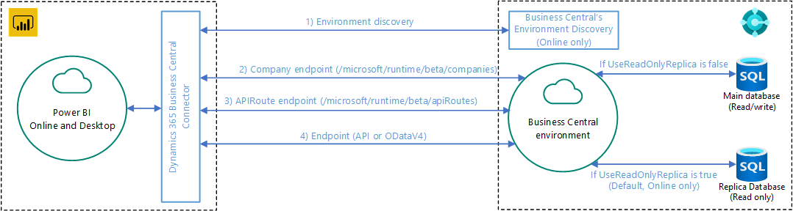
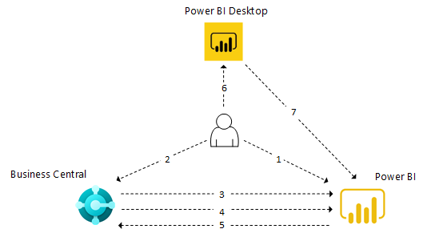

# Power BI Integration Component and Architecture Overview for [!INCLUDE[prod_short](includes/prod_short.md)]

In this article, you'll learn about the different aspects of Power BI integration with [!INCLUDE[prod_short](includes/prod_short.md)] to help you understand its implementation and use.

## Components

The following table describes the major components involved with Power BI integration.

|Component|Description|
|---------|-----------|
|Power BI|A cloud-based report hosting and management service.|
|Power BI Desktop|An authoring tool for building reports and dashboards, and allows you to run reports. It's available as a free download on Microsoft Store and is installed locally.|
|[!INCLUDE[prod_short](includes/prod_short.md)]|Online or on-premises solution with connectors exposed to Power BI and the ability to embed a Power BI part.|

## What's available from the start

The following table describes available features.

|Feature|[!INCLUDE[prod_short](includes/prod_short.md)] online or on-premises support|
|-------|---------------------|
|Power BI connectors|Both. Different connectors for online and on-premises. Same connector used for Power BI Desktop and Power BI Service |
|Embedded experience for viewing a given report inside a FactBox in [!INCLUDE[prod_short](includes/prod_short.md)]|Both. Requires configuration to display reports for on-premises.|
|Power BI report management from [!INCLUDE[prod_short](includes/prod_short.md)]|Online|
|Default Power BI reports on role centers deployed to Power BI|Online|
|Power BI Apps on Microsoft AppSource|Online.|

## Architecture

[!INCLUDE[prod_short](includes/prod_short.md)] integrates with Power BI through a connector using OData. The data source for Power BI reports is exposed as OData web services.

## General Flow

The following diagram illustrates the basic workflow for users when connecting [!INCLUDE[prod_short](includes/prod_short.md)] to Power BI.

1. User signs up for a Power BI account.
2. User connects to Power BI from [!INCLUDE[prod_short](includes/prod_short.md)].
3. [!INCLUDE[prod_short](includes/prod_short.md)] verifies the license.
4. [!INCLUDE[prod_short](includes/prod_short.md)] deploys default reports to the Power BI service. This step only happens for [!INCLUDE[prod_short](includes/prod_short.md)] online.
5. [!INCLUDE[prod_short](includes/prod_short.md)] makes reports in Power BI available for selection in [!INCLUDE[prod_short](includes/prod_short.md)]. Default reports are automatically displayed in Power BI parts.
6. User creates a report in Power BI Desktop.
7. User publishes the report to the Power BI service. The reports are then available for selection in [!INCLUDE[prod_short](includes/prod_short.md)].

## See Related Training at [Microsoft Learn](/learn/modules/configure-powerbi-excel-dynamics-365-business-central/index)

## See Also

[Business Central and Power BI](admin-powerbi.md)  
[Power BI for consumers](/power-bi/consumer/end-user-consumer)  
[The 'new look' of the Power BI service](/power-bi/service-new-look)  
[Quickstart: Connect to data in Power BI Desktop](/power-bi/desktop-quickstart-connect-to-data)  
[Power BI documentation](/power-bi/)  
[Business Intelligence](bi.md)  
[Getting Started](product-get-started.md)  
[Importing Business Data from Other Finance Systems](across-import-data-configuration-packages.md)  
[Setting Up [!INCLUDE[prod_short](includes/prod_short.md)]](setup.md)  
[Using [!INCLUDE[prod_short](includes/prod_short.md)] as a Power BI Data Source](across-how-use-financials-data-source-powerbi.md)  
[Using [!INCLUDE[prod_short](includes/prod_short.md)] as a Power Apps Data Source](across-how-use-financials-data-source-powerapps.md)  
[Using [!INCLUDE[prod_short](includes/prod_short.md)] in Power Automate](across-how-use-financials-data-source-flow.md)  

## [!INCLUDE[prod_short](includes/free_trial_md.md)]  

[!INCLUDE[footer-include](includes/footer-banner.md)]