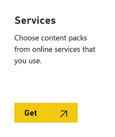
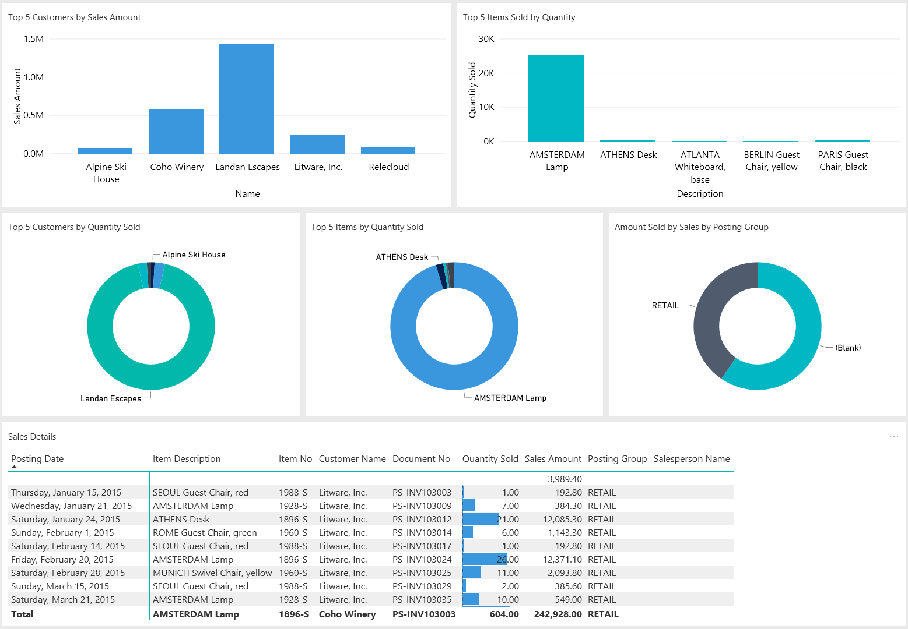

# Enabling Your Business Data for Power BI

Getting insights into your [!INCLUDE[prodshort](includes/prodshort.md)] data is easy with the [!INCLUDE[prodshort](includes/prodshort.md)] apps for Power BI. Power BI retrieves your data and then builds an out-of-the-box dashboard and reports based on that data.  

You must have a valid account with [!INCLUDE[prodshort](includes/prodshort.md)] and with Power BI. Also, you must download [Power BI Desktop](https://powerbi.microsoft.com/desktop/) if you wish to create your own Power BI reports. Power BI apps require permissions to the tables where data is retrieved from. More details on the requirements are described below.  

> [!IMPORTANT]
> The Power BI Apps that are described in this article are designed to use Azure Active Directory as the authentication mechanism unless otherwise specified. Also, you need a [Power BI Pro license](/power-bi/service-features-license-type) to share your content, and the people you share it with do too, or the content must be in a workspace in a [Premium capacity](/power-bi/service-premium-what-is). For more information, see [Ways to share your work in Power BI](/power-bi/service-how-to-collaborate-distribute-dashboards-reports).

[!INCLUDE [prodlong](includes/prodlong.md)] has published the following apps for Power BI:

- [!INCLUDE [prodlong](includes/prodlong.md)] - CRM  
- [!INCLUDE [prodlong](includes/prodlong.md)] - Finance  
- [!INCLUDE [prodlong](includes/prodlong.md)] - Sales  

## Using the [!INCLUDE [prodshort](includes/prodshort.md)] dashboards in Power BI

Each app provides reports that you can drill into:

- Choose any visual on the dashboard to bring up one of the underlying reports.  
- Filter the report or add fields that you want to monitor.  
- Pin this customized view to the dashboard to continue tracking.  
  You can refresh data manually, and you can set up a refresh schedule. For more information, see [Configuring scheduled refresh](/power-bi/refresh-scheduled-refresh).  

The apps are designed to work with data from any company that you have in your [!INCLUDE[prodshort](includes/prodshort.md)]. When you install the Power BI app, you specify one or more parameters to connect to your [!INCLUDE [prodshort](includes/prodshort.md)].  

> [!NOTE]
> You can also build your own reports and dashboards in Power BI based on your [!INCLUDE[d365fin](includes/d365fin_md.md)] data. For more information, see [Connecting Your Business Data to Power BI](across-how-use-financials-data-source-powerbi.md).  

### To connect your data in Power BI

1. Open your browser, navigate to https://powerbi.microsoft.com, and sign into your account.
2. Select **Get Data** at the bottom of the left navigation pane.  

    

    You can also get starting from within [!INCLUDE [prodshort](includes/prodshort.md)]. From your Home page, navigate to **Report Selection** in the Power BI section. Select either **Service** or **My Organization** from the ribbon. When either of these actions are selected, you will be taken to either the Organization gallery in Power BI or to Microsoft AppSource, which will also be filtered to only display apps related to [!INCLUDE[prodshort](includes/prodshort.md)].

3. In the **Services** box, select **Get**. This will open a page displaying **AppSource** and **Apps for Power BI**.  

<!--    -->
4. Select **Apps** from the **Apps for Power BI** tab, choose the **Microsoft Dynamics 365 Business Central** app that you want to use, and then select **Get it now**.  
<!--    /-->
5. When prompted, enter the name of the environment and company in your [!INCLUDE[prodshort](includes/prodshort.md)] app that you want to connect to. If you have not created multiple environments, enter **Production**. For the company parameter, ensure you are entering the name and not the the display name. You can find the company name in the **Companies** page in your [!INCLUDE[prodshort](includes/prodshort.md)]instance.  

    > [!NOTE]
    > If you connect to [!INCLUDE [prodshort](includes/prodshort.md)] on-premises, you must specify the *Web Service URL* parameter. Find this in the **Web Services** page in [!INCLUDE [prodshort](includes/prodshort.md)]. Your [!INCLUDE [server](includes/server.md)] instance must be configured for Basic authentication, and you must specify a user and the Web Access Key of that user as their password. In the following example, replace *myserver:7048* with your [!INCLUDE [server](includes/server.md)] name and *CRONUS%20US* with your company name.  
    > ```https://myserver:7048/BC140/ODataV4/Company('CRONUS%20US')/```

6. Once connected, a dashboard and reports are added to your Power BI workspace. When completed, the tiles show data from your [!INCLUDE[prodshort](includes/prodshort.md)] company.

    

### What Now?

- Try [asking a question in the Q&A box](/power-bi/service-q-and-a-tips) at the top of the dashboard.
- [Change the tiles](/power-bi/service-dashboard-edit-tile) in the dashboard.  
- [Select a tile](/power-bi/service-dashboard-tiles) to open the underlying report.  
- By default, your dataset is not scheduled to refresh. You can change the refresh schedule or try refreshing it on demand using           **Refresh Now**. For more information, see [Configuring scheduled refresh](/power-bi/refresh-scheduled-refresh).

## Power BI in [!INCLUDE [prodshort](includes/prodshort.md)]

Your Home page in [!INCLUDE [prodshort](includes/prodshort.md)] can include a Power BI control element that can be configured to display Power BI reports on your Home page.

> [!IMPORTANT]
> You must have a valid account with [!INCLUDE [prodshort](includes/prodshort.md)] and with Power BI. Also, if you want to modify any reports, you must you must download Power BI Desktop. For more information, see [Using Business Central as a Power BI Data Source](across-how-use-financials-data-source-powerbi.md).  

### On first login

When you first sign into [!INCLUDE [prodshort](includes/prodshort.md)], you will notice an empty Power BI part on your Home page. In order to view the reports, you must first connect to Power BI by selecting the *Get Started with Power BI* link.

[!INCLUDE [prodshort](includes/prodshort.md)] then communicates with the Power BI service to determine if you have a valid Power BI account. Once your license is verified, the default Power BI reports display on your Home page.

### Selecting Power BI reports

The Power BI control on your Home page can display any Power BI report. To view an existing report, choose the **Select Report** action from the Power BI drop down command list.  

The reports selection page shows a list of all the Power BI reports that you have access to. This list is retrieved from your Power BI workspace. Enable each report that you want to display on the Home page, and then choose OK. You will be returned to your Home page, and the last report you enabled will appear. Using the drop-down command list, use the previous and next command to navigate between reports.  

### Get reports

If you do not see any reports on the Select Reports page, or do not see the report you want. You can choose to get reports from *My Organization* or from *Services*.
Choose *My Organization* to go to the Power BI services where you can view the reports within your organization that you have been rights to view and add them to your workspace. Choose *Services* to go to Microsoft AppSource where you can install Power BI apps.  

You can also choose to create new Power BI reports. Once those reports are published to your Power BI workspace, they will appear on this page.  

### Managing Reports

In the Power BI section on your Home page, you can choose the **Manage Report** action from the drop down command list so that you can modify the report that was in focus on the role center.  

Modifications can be made to the report and saved.  Any changes made to the report will be changed for any user that this report is shared with since you are modifying the report that is stored in the Power BI service.  

Once you have completed your changes, select Save. If this is a shared report, you may want to select Save As to avoid making this change for all users.
Return to the role center and the updated report will appear. If you did a Save As command, you will need to open the select report page and enable the new report.

### Uploading reports

You can upload new Power BI reports and share them with all users of your [!INCLUDE [prodshort](includes/prodshort.md)]. The reports are shared within each company in [!INCLUDE [prodshort](includes/prodshort.md)].  

To upload a report, select the **Upload Report** action from the drop-down command list. You can then upload a .pbix file that defines the reports that you want to share. You can change the default name of the file.  

Once the report has been uploaded to your Power BI workspace, it automatically uploads to the Power BI workspaces of all other users in that company upon their next sign in to [!INCLUDE [prodshort](includes/prodshort.md)].

## System Requirements

To import your [!INCLUDE[prodshort](includes/prodshort.md)] data into Power BI, you must have permissions to the web services used to retrieve data. The web services required for each Power BI app include:

### Microsoft Dynamics 365 Business Central – CRM

- Sales Opportunities
- Excel Template View Company Information
- Power BI Report Labels

### Microsoft Dynamics 365 Business Central – Finance

- PowerBIFinance
- Excel Template View Company Information
- Power BI Report Labels

### Microsoft Dynamics 365 Business Central - Sales

- Item Sales by Customer
- Sales Dashboard
- Excel Template View Company
- Power BI Report Labels

> [!NOTE]
> [!INCLUDE [prodshort](includes/prodshort.md)] on-premises uses the same web service end points as [!INCLUDE [prodshort](includes/prodshort.md)] online.

## Web Services

An easy way to find the web services is to search for *web services* in [!INCLUDE[prodshort](includes/prodshort.md)]. In the **Web Services** page, make sure that the **Publish** field is selected for the web services listed above.

## Troubleshooting

The Power BI dashboard relies on the published web services that are listed above, and it will show data from the demonstration company or your own company if you import data from your current finance solution. However, if something goes wrong, this section provides a workaround for the most typical issues.  

### You do not have a Power BI account

A Power BI account has not been set up. In order to have a valid Power BI account, you must have a license, and you must have previously signed into Power BI, in order for your Power BI workspace to have been created.  

### Message: There are no enabled reports. Choose Select Report to see a list of reports that you can display.

This message will appear if the default report failed to deploy to your Power BI workspace, or the report deployed but did not successfully refresh. If this happens, navigate to the report in your Power BI workspace, select **Dataset**, **Settings**, and then manually update the credentials. Once the dataset successfully refreshes, navigate back to Business Central and manually select the report from the **Select Reports** page.

### You need a Power BI Pro license to install the [!INCLUDE [prodshort](includes/prodshort.md)] app in Power BI

You need a [Power BI Pro license](/power-bi/service-features-license-type) to share your content, and the people you share it with do too, or the content must be in a workspace in a [Premium capacity](/power-bi/service-premium-what-is). For more information, see [Ways to share your work in Power BI](/power-bi/service-how-to-collaborate-distribute-dashboards-reports).  

### "Parameter validation failed, please make sure all parameters are valid"

This error indicates that the one more of the parameters are not valid.

- The specified environment parameter does not match any existing [!INCLUDE [prodshort](includes/prodshort.md)] production or sandbox environment.
- The specified company parameter does not match any existing [!INCLUDE [prodshort](includes/prodshort.md)] companies. Verify the company name in the **Companies** page in [!INCLUDE [prodshort](includes/prodshort.md)].
- If connecting to [!INCLUDE [prodshort](includes/prodshort.md)] on-premises. you have entered a URL that is not valid. You can verify the URL in the **Web Services** page in [!INCLUDE [prodshort](includes/prodshort.md)]  
- A port is not open to allow the request to go through your firewall.

### Cannot sign in

If you get a "login failed" error after using your [!INCLUDE [prodshort](includes/prodshort.md)] user credentials to sign in, then you are probably experiencing one of the following issues:

- The account that you are using does not have permissions to retrieve the [!INCLUDE [prodshort](includes/prodshort.md)] data from your account. Verify that you have permissions to the required data in [!INCLUDE [prodshort](includes/prodshort.md)] and try again.
- You have selected an authentication type other than Basic if connecting to [!INCLUDE [prodshort](includes/prodshort.md)] on-premises.
- You have not entered a valid user name or password.

### Incorrect company name

A common mistake is to enter the company display name instead of the company name. To find the company name search for **Companies**. Then use the **Name** field when entering your company name.

### The key didn't match any rows in the table

If you enter a non-valid company name during the connection process, you may get the error message "The key didn't match any rows in the table". Provide the correct company name and try connecting again.

### Historical data appears to be missing

Once the Power BI app is installed and your data shows up in Power BI, you may notice that not all your data displays. The datasets are filtered to only return the previous 365 days of data. This default is in place to help make the reports faster.  

### I only see data for a single company

The Power BI app will only display data from the [!INCLUDE [prodshort](includes/prodshort.md)] company that was defined when the Power BI app was installed. Data from additional companies can be added to the reports by adding new queries that use different companies as the data source.  

## See Related Training at [Microsoft Learn](/learn/modules/configure-powerbi-excel-dynamics-365-business-central/index)

## See Also

[Power BI for consumers](/power-bi/consumer/end-user-consumer)  
[The 'new look' of the Power BI service](/power-bi/service-new-look)  
[Quickstart: Connect to data in Power BI Desktop](/power-bi/desktop-quickstart-connect-to-data)  
[Power BI documentation](/power-bi/)  
[Business Intelligence](bi.md)  
[Getting Started](product-get-started.md)  
[Importing Business Data from Other Finance Systems](across-import-data-configuration-packages.md)  
[Setting Up [!INCLUDE[d365fin](includes/d365fin_md.md)]](setup.md)  
[Using [!INCLUDE[d365fin](includes/d365fin_md.md)] as a Power BI Data Source](across-how-use-financials-data-source-powerbi.md)  
[Using [!INCLUDE[d365fin](includes/d365fin_md.md)] as a Power Apps Data Source](across-how-use-financials-data-source-powerapps.md)  
[Using [!INCLUDE[d365fin](includes/d365fin_md.md)] in Power Automate](across-how-use-financials-data-source-flow.md)  

## [!INCLUDE[d365fin](includes/free_trial_md.md)]  
