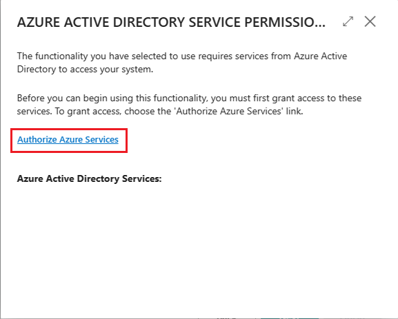
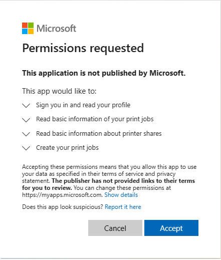

# Set Up Universal Print Printers

Universal Print is a Microsoft 365 subscription-based service that runs entirely on Microsoft Azure. It gives you centralized printer management through the Universal Print portal. [!INCLUDE[prod_short](includes/prod_short.md)] makes printers set up in Universal Print available to client users through the **Universal Print Integration** extension.

The complete setup requires you work in both Microsoft Azure, using the [Azure portal](https://portal.azure.com), and in [!INCLUDE[prod_short](includes/prod_short.md)]. The setup is divided between two main tasks as described in this article:

1. In Microsoft Azure, set up Universal Print and add the printers you want to use in Business Central to a print share. Go to [this section](#set-up-universal-print-and-printers-in-microsoft-azure).
2. In [!INCLUDE[prod_short](includes/prod_short.md)], add the printers from the print shares in Universal Print. Go to [this section](#add-printers-in-business-central-online) for online or [here](#add-printers-in-business-central-on-premises) for on-premises.

## Prerequisites

- Supported printers

  [!INCLUDE[prod_short](includes/prod_short.md)] supports the same printers as Universal Print, which can be either Universal Print–compatible or non-compatible printers. Non-compatible printers can't communicate with Universal Print directly, so they require extra connector software, which is provided by Universal Print. Some older printers may not be supported. 

- Universal Print:

  - A Universal Print subscription/license for your organization.

    Learn more at [License Universal Print](/universal-print/fundamentals/universal-print-license).

  - You have at least the [Printer Administrator](/entra/identity/role-based-access-control/permissions-reference#printer-administrator) role in Microsoft Entra ID.

    To manage Universal Print, your account must have at least the [Printer Administrator](/entra/identity/role-based-access-control/permissions-reference#printer-administrator) role in Microsoft Entra ID. These roles are only needed for managing Universal Print. They aren't required by people setting up and  the printers from [!INCLUDE[prod_short](includes/prod_short.md)].

- [!INCLUDE[prod_short](includes/prod_short.md)] online and on-premises:

  - [!INCLUDE[prod_short](includes/prod_short.md)] 2021 release wave 1 or later.
  - **Universal Print Integration** extension is installed.

    This extension is published and installed by default as part of [!INCLUDE[prod_short](includes/prod_short.md)] online and on-premises. You can verify whether it's installed on the **Extension Management** page. Learn more at [Installing and Uninstalling Extensions in Business Central](ui-extensions-install-uninstall.md).
- [!INCLUDE[prod_short](includes/prod_short.md)] on-premises only:
  - Microsoft Entra ID or NavUserPassword authentication is configured.
    > [!NOTE]
    >  Universal Print extension doesn't support service-to-service (S2S) authentication. It requires a signed-in user to send print jobs to the Universal Print service through Graph API.
  - An application for Business Central is registered in your Microsoft Entra tenant and [!INCLUDE[prod_short](includes/prod_short.md)].

    Like other Azure services that work with [!INCLUDE[prod_short](includes/prod_short.md)], Universal Print requires an app registration for [!INCLUDE[prod_short](includes/prod_short.md)] in Microsoft Entra ID. The app registration provides authentication and authorization services between [!INCLUDE[prod_short](includes/prod_short.md)] and Universal Print.

    Your deployment may already use an app registration for other Azure services, like Power BI. If so, then use the existing app registration for Universal Print as well, instead of adding a new one. The only thing you'll need to do, in this case, is modify the app registration to include the relevant print permissions for Microsoft Graph API: **PrinterShare.ReadBasic.All**, **PrintJob.Create**, and **PrintJob.ReadBasic.** 

    To register an app and set the proper permissions, follow the steps described in [Register an application in Microsoft Entra ID](/dynamics365/business-central/dev-itpro/administration/register-app-azure#register-an-application-in-azure-active-directory).

## Set up Universal Print and printers in Microsoft Azure

Before you can start managing Universal Print printers in Business Central, there are several tasks to get Universal Print up and running in Azure with the printers you want to use.

For detailed instructions on how to get set up, see [Get started: Set up Universal Print](/universal-print/fundamentals/universal-print-getting-started) in the Universal Print documentation. Here's an overview of the steps you'll need to complete. Most of these steps are done in the Azure portal.

1. Assign Universal Print licenses to yourself and other users.

    How you assign the license depends on whether you're integrating with Business Central online or on-premises.

    - With [!INCLUDE[prod_short](includes/prod_short.md)] online, you assign licenses using the Microsoft 365 admin center.

      Learn more at [Microsoft Admin Center Help - Assign licenses to users](/microsoft-365/admin/manage/assign-licenses-to-users).

    - With [!INCLUDE[prod_short](includes/prod_short.md)] on-premises, you assign licenses in your tenant using the Azure portal.

      Learn more at [Assign or remove licenses in the Azure portal](/azure/active-directory/fundamentals/license-users-groups).

2. Install the Universal Print connector for registering printers that can't communicate with Universal Print directly.

    Most in-market printers can't communicate with Universal Print directly, so you'll need to install the Universal Print connector. Learn more at [Installing the Universal Print Connector](/universal-print/fundamentals/universal-print-connector-installation).

3. Register your printers in Universal Print.

    Registering a printer makes Universal Printer aware of the printer.

    - For printers that can communicate directly with Universal Print, follow the steps provided by the printer manufacturer.

    - For other printers, register the printers by using the Universal Print connector. 

      Learn more at [Printer registration](/universal-print/fundamentals/universal-print-connector-printer-registration).

4. Change printer properties (optional)

    After a printer is registered, you can view and modify printer properties, such as default preferences.

    Learn more at [Managing Printer Settings using the Universal Print Portal](/universal-print/reference/portal/printer-settings).

5. Share the printers with users.

    Any printer you want to use in [!INCLUDE[prod_short](includes/prod_short.md)] will need to be added to a *printer share* in Universal Print. Any user who needs access to the printer must be added as a member of the printer share. Learn more at [Share a Printer](/universal-print/reference/portal/share-printers).

    > [!TIP]
    > You can always add or remover users later. Learn more at [Configure user permssions for printer share](/universal-print/reference/portal/share-printers#configure-user-permissions-for-a-printer-share).

6. Enable document conversion.

    Universal Print renders content for print in XPS format. Some legacy in-market printers don't support XPS content rendering&mdashin many cases, only PDF format. Printing to these printers will fail unless Universal Print is set up to convert documents to the printer-supported format.

    Learn more at [Document conversion](/universal-print/reference/portal/settings#2-document-conversion).

Now, you're ready to add the printers to [!INCLUDE[prod_short](includes/prod_short.md)], set up default printers for reports, and print.  

## Add printers in Business Central online

After printers are set up and shared in Universal Print, you're ready to add them to [!INCLUDE[prod_short](includes/prod_short.md)] for use. There are two ways to add Universal Print printers. You can add the printers all at once or individually, one at a time.

Adding printers individually let's you set up the same Universal Print printer in [!INCLUDE[prod_short](includes/prod_short.md)] more than once. Then, for each added printer, you can change the print settings, like paper tray, size, and orientation. This way, you can set up printers for different reports and documents with special output requirements.

> [!NOTE]
> Are you using [!INCLUDE[prod_short](includes/prod_short.md)] on-premises? If so, go to the [next section](#add-printers-in-business-central-on-premises), the first time setup is slightly different.  
<!-- To Do Adding printers individually lets you duplicate printers with custom , like different paper trays and paper size and orientation.  To add printers individually, you'll need to know printer's share name in Universal Print. -->

1. [!INCLUDE[open-search](includes/open-search.md)], enter **Printer Management**, then select the related link.
2. Select **Universal Print**, then choose one of the following options:

   - **Add all Universal Print printers** to add all printers not already added. You can use this option even if there are already printers added.
   - **Add a Universal Print printer** to add a specific printer.  
3. Follow the on-screen instructions.

    - If you chose **Add all Universal Print printers**, then the **Add Universal Print Printers** setup starts. 

    - If you chose to **Add a Universal Print printer**, then the **Universal Printer Settings** page appears. Fill in the **Name** field, then select **...** next to the **Print Share in Universal Print** field to select the printer share that contains the Universal Print printer. Fill in the remaining fields as needed. [!INCLUDE[tooltip-inline-tip](includes/tooltip-inline-tip_md.md)].

After a printer has been added, you can view and change its settings from the **Printer Management** page. Just select the printer, then choose **Edit printer settings**.

## Add printers in Business Central on-premises

<!--With [!INCLUDE[prod_short](includes/prod_short.md)] on-premises, unlike online, users aren't automatically authenticated with the registered app in Azure used for the Universal Print service. So, before any Business Central user (including admins) can add or even use Universal Print printers, they'll have to authenticate with the Azure app and grant access to the Universal Print service. The following procedure describes how to initiate this authentication flow. Each user typically only has to do this task once.-->

Before a user can add or use Universal Print printers Business Central, they have to authorize access to the Azure services used by Universal Print and grant it to permission to data and operations like:

- Signing in and reading user profile
- Reading basic print job information
- Creating print jobs

This is typically done the first time they connect to the Azure registered app used for Universal Print. In Business Central online does, this authorization flow is done seamlessly, with no user interaction. But Business Central on-premises operates differently. It requires that you, or any other user who wants to use Universal Print printers, initiate the authentication flow&mdash;usually, one time only. The most direct way is described in the following steps. A less direct way is by connecting to another integrated service that uses the same Azure registered app, like Power BI or OneDrive. Each user typically only has to do this task once.

> [!NOTE]
> If you're an admin, we recommend you complete this task before other users. Then afterwards, inform users who will need to use Universal Print printers how to do it. If the Azure registered app for Universal Print requires admin consent for API permissions, it's easier if you grant consent on behalf of the organization. You can grant admin consent from the Azure Portal or when you run the steps that follow. 

<!-- To Do Adding printers individually lets you duplicate printers with custom , like different paper trays and paper size and orientation.  To add printers individually, you'll need to know printer's share name in Universal Print. -->
### Connect to Universal Print for the first-time

Complete these steps to connect to the Universal Print service for the first-time.

1. [!INCLUDE[open-search](includes/open-search.md)], enter **Printer Management**, then select the related link.
2. Select **Universal Print** > **Add all Universal Print printers** to start the **Add Universal Print Printers** assisted setup guide (wizard).
3. Follow the on-screen instructions until you get to the **MICROSOFT ENTRA SERVICE PERMISSIONS** page.

    <!--The MICROSOFT ENTRA SERVICE PERMISSIONS page appears. You'll be prompted to give consent to Azure Services. You'll be lead through the process of verifying your Microsoft Entra ID setup, checking your Universal Print license, and then adding the printers.-->

   

4. Select the **Authorize Azure Services** link.

   1. If the **Permission Requested** page appears, read it carefully and select **Accept** to agree and continue. If you're running as an admin, you can select **Consent on behalf of organization** if you want to consent for all users.

      .

   2. If you're prompted, sign in using your name and password.

5. When authorization completes successfully, you're returned to the **Add Universal Print Printers** page. Select **Next** > **Finish** to complete the setup.

After a printer has been added, you can view and change its settings from the **Printer Management** page. Just select the printer, then choose **Edit printer settings**.

Once you complete the initial sign-in, you can use the Universal Print printers to print reports and other print jobs. For more information, go to [Printing a Report](ui-work-report.md#PrintReport). If you want to add, remove, or change any printers, just go back to the **Print Management** page and select **Universal Print**.

## Common problems and resolutions

In this section, you'll learn about the common problems that users may experience when trying to set up or use Universal Print printers.

### You don't have access to the printer \<your-printer\>.

If a user gets this message when trying to print a document to a Universal Print printer, it may be caused by one of the following conditions:

- The user doesn't have Universal Print licensed assigned to their Microsoft 365 or Azure Active AD account. 
- The user isn't assigned to the printer share in Universal Print.
- (On-premises) The Azure app registration used for Universal Print isn't working or has recently changed since the last time the user signed in.
- (On-premises) The user hasn't yet signed in to Azure registered app for Universal Printer app and consented for the first time.

## There was an error fetching printers shared to you.

If a user gets this message when trying to add a Universal Print printer from the **Printer Management** page, it's typically because they haven't yet signed in to Azure registered app for Universal Printer app and consented for the first time. 
<!--
### Troubleshooting

#### You don't see the a printer in the 

The printer is not shared in Universal Print.

### You get an error when tryong to add all or a single printer

You have'nt been assigned a Uincersla Print license.

There was an error fetching printers shared to you. You don't have access to the data. Make sure your account has been assigned a Universal Print license and you have the required permissions.
or 
You don't seem to have access to Universal Print. Make sure you have a Universal Print subscription, and that your account has been assigned a Universal Print license.

## Could not upload the document to print job 50.

There is a technical problem withe the printer. Unsupported document-format: application/pdf. Supported formats: Attribute document-format-supported: SimpleIppValue-Type:MimeMediaType-Value:application/oxps

-->

## Next steps
[Set Up Default Printers](ui-specify-printer-selection-reports.md).

## Related information

[Printers Overview](admin-printer-setup-overview.md)  
[Set Up Email Printers](admin-printer-setup-email.md)
[Printing a Report](ui-work-report.md#PrintReport)  
[Work with [!INCLUDE[prod_short](includes/prod_short.md)]](ui-work-product.md)  
[Run Batch Jobs](ui-how-run-batch-jobs.md)  

[!INCLUDE[footer-include](includes/footer-banner.md)]
