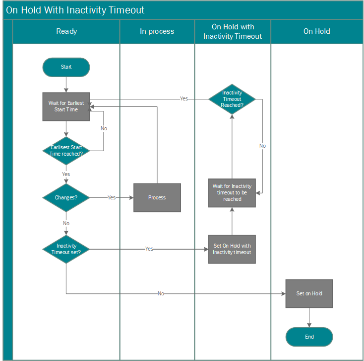

# Scheduling a Synchronization between Business Central and Common Data Service
You can synchronize [!INCLUDE[d365fin](includes/d365fin_md.md)] with [!INCLUDE[d365fin](includes/cds_long_md.md)] on scheduled intervals by setting up jobs in the job queue. The synchronization jobs synchronize data in [!INCLUDE[d365fin](includes/d365fin_md.md)] records and [!INCLUDE[d365fin](includes/cds_long_md.md)] records that have been previously coupled together. Or for records that are not already coupled, depending on the synchronization direction and rules, the synchronization jobs can create and couple new records in the destination system. 

There are several synchronization jobs that are available out-of-the-box. The jobs are run in the following order to avoid coupling dependencies between entities. For more information, see [Use Job Queues to Schedule Tasks](/dynamics365/business-central/admin-job-queues-schedule-tasks.md).

1. CURRENCY - [!INCLUDE[d365fin](includes/cds_long_md.md)] synchronization job.
2. VENDOR - [!INCLUDE[d365fin](includes/cds_long_md.md)] synchronization job. 
3. CONTACT - [!INCLUDE[d365fin](includes/cds_long_md.md)] synchronization job.
4. CUSTOMER - [!INCLUDE[d365fin](includes/cds_long_md.md)] synchronization job.
5. SALESPEOPLE - [!INCLUDE[d365fin](includes/cds_long_md.md)] synchronization job.

You can view the jobs on the **Job Queue Entries** page. For more information, see [Use Job Queues to Schedule Tasks](admin-job-queues-schedule-tasks.md).

### Default Synchronization Job Queue Entries  
The following table describes the default synchronization jobs for [!INCLUDE[d365fin](includes/cds_long_md.md)].  

|Job Queue Entry|Description|Direction|Integration Table Mapping|Default Synchronization Frequency (mins)|Default inactivity sleep time (mins)|  
|---------------------|---------------------------------------|---------------|-------------------------------|-----|-----|  
|CONTACT - [!INCLUDE[d365fin](includes/cds_long_md.md)] synchronization job|Synchronizes [!INCLUDE[d365fin](includes/cds_long_md.md)] contacts with [!INCLUDE[d365fin](includes/d365fin_md.md)] contacts.|Bidirectional|CONTACT|30|720  (12 hours)| 
|CURRENCY - [!INCLUDE[d365fin](includes/cds_long_md.md)] synchronization job|Synchronizes [!INCLUDE[d365fin](includes/cds_long_md.md)] transaction currencies with [!INCLUDE[d365fin](includes/d365fin_md.md)] currencies.|From [!INCLUDE[d365fin](includes/d365fin_md.md)] to [!INCLUDE[d365fin](includes/cds_long_md.md)]|CURRENCY|30|720   (12 hrs)| 
|CUSTOMER - [!INCLUDE[d365fin](includes/cds_long_md.md)] synchronization job|Synchronizes [!INCLUDE[d365fin](includes/cds_long_md.md)] accounts with [!INCLUDE[d365fin](includes/d365fin_md.md)] customers.|Bidirectional|CUSTOMER|30|720  (12 hrs)|
|VENDOR - [!INCLUDE[d365fin](includes/cds_long_md.md)] synchronization job|Synchronizes [!INCLUDE[d365fin](includes/cds_long_md.md)] accounts with [!INCLUDE[d365fin](includes/d365fin_md.md)] customers.|Bidirectional|VENDOR|30|720  (12 hrs)|
|SALESPEOPLE - [!INCLUDE[d365fin](includes/cds_long_md.md)] synchronization job|Synchronizes [!INCLUDE[d365fin](includes/d365fin_md.md)] salespeople with [!INCLUDE[d365fin](includes/cds_long_md.md)] users.|From [!INCLUDE[d365fin](includes/cds_long_md.md)] to [!INCLUDE[d365fin](includes/d365fin_md.md)]|SALESPEOPLE|30|1440  (24 hrs)|

## Synchronization Process  
Each synchronization job queue entry uses a specific integration table mapping that specifies which [!INCLUDE[d365fin](includes/d365fin_md.md)] table and [!INCLUDE[d365fin](includes/cds_long_md.md)] entity to synchronize. The table mappings also include some settings that control which records in the [!INCLUDE[d365fin](includes/d365fin_md.md)] table and [!INCLUDE[d365fin](includes/cds_long_md.md)] entity to synchronize.  

To synchronize data, [!INCLUDE[d365fin](includes/cds_long_md.md)] entity records must be coupled to [!INCLUDE[d365fin](includes/d365fin_md.md)] records. For example, a [!INCLUDE[d365fin](includes/d365fin_md.md)] customer must be coupled to a [!INCLUDE[d365fin](includes/cds_long_md.md)] account. You can set up couplings manually, before running the synchronization jobs, or let the synchronization jobs set up couplings automatically. The following list describes how data is synchronized between Common Data Service and [!INCLUDE[d365fin](includes/d365fin_md.md)] when you are using the synchronization job queue entries. For more information, see [Couple and Synchronize Records Manually](admin-how-to-couple-and-synchronize-records-manually.md).

-   The **Sync. Only Coupled Records** check box controls whether new records are created when you synchronize. By default, the check box is selected, which means that only records that are coupled will be synchronized. In the integration table mapping, you can change the table mapping between a [!INCLUDE[d365fin](includes/cds_long_md.md)] entity and a [!INCLUDE[d365fin](includes/d365fin_md.md)] table so that the integration synchronization jobs will create new records in the destination database for each record in the source database that is not coupled. For more information, see [Creating New Records](admin-how-to-modify-table-mappings-for-synchronization.md#creating-new-records). 
    
    **Example**
    If you clear the **Sync. Only Coupled Records** check box, when you synchronize customers in [!INCLUDE[d365fin](includes/d365fin_md.md)] with accounts in [!INCLUDE[d365fin](includes/cds_long_md.md)], a new account is created for each customer in [!INCLUDE[d365fin](includes/d365fin_md.md)] and automatically coupled. Additionally, because the synchronization is bidirectional in this case, a new customer is created and coupled for each [!INCLUDE[d365fin](includes/cds_long_md.md)] account that is not already coupled.  

    > [!NOTE]  
    > There are rules and filters that determine what data is synchronized. For more information, see [Synchronization Rules](admin-synchronizing-business-central-and-sales.md).

-   When new records are created in [!INCLUDE[d365fin](includes/d365fin_md.md)], the records use the either the template that is defined for the integration table mapping or the default template that is available for the record type. Fields are populated with data from [!INCLUDE[d365fin](includes/d365fin_md.md)] or [!INCLUDE[d365fin](includes/cds_long_md.md)] depending on the synchronization direction. For more information, see [Modify Table Mappings for Synchronization](admin-how-to-modify-table-mappings-for-synchronization.md).  

-   With subsequent synchronizations, only records that have been modified or added after the last successful synchronization job for the entity will be updated.  

     New records in [!INCLUDE[d365fin](includes/cds_long_md.md)] are added in [!INCLUDE[d365fin](includes/d365fin_md.md)]. If data in fields in [!INCLUDE[d365fin](includes/cds_long_md.md)] records has changed, the data is copied to the corresponding field in [!INCLUDE[d365fin](includes/d365fin_md.md)].  

-   With bidirectional synchronization, the job synchronizes from [!INCLUDE[d365fin](includes/d365fin_md.md)] to [!INCLUDE[d365fin](includes/cds_long_md.md)], and then from [!INCLUDE[d365fin](includes/cds_long_md.md)] to [!INCLUDE[d365fin](includes/d365fin_md.md)].

## About Inactivity Timeouts
Some job queue entries, such as those that schedule synchronization between [!INCLUDE[d365fin](includes/d365fin_md.md)] and [!INCLUDE[d365fin](includes/cds_long_md.md)], use the **Inactivity Timeout** field on the Job Queue Entry card to prevent the job queue entry from running unnecessarily.  
  

> 

When the value in this field is not zero, and the job queue did not find any changes during the last run, [!INCLUDE[d365fin](includes/d365fin_md.md)] puts the job queue entry on hold. When that happens, the **Status of Job Queue** field will show **On Hold Due to Inactivity**, and [!INCLUDE[d365fin](includes/d365fin_md.md)] will wait for the period of time specified in **Inactivity Timeout** field before it runs the job queue entry again. 

For example, by default, the CURRENCY job queue entry, which synchronizes currencies in [!INCLUDE[d365fin](includes/cds_long_md.md)] with exchange rates in [!INCLUDE[d365fin](includes/d365fin_md.md)], will look for changes to exchange rates every 30 minutes. If no changes are found, [!INCLUDE[d365fin](includes/d365fin_md.md)] puts the CURRENCY job queue entry on hold for 720 minutes (six hours). If an exchange rate is changed in [!INCLUDE[d365fin](includes/d365fin_md.md)] while the job queue entry is on hold, [!INCLUDE[d365fin](includes/d365fin_md.md)] will automatically reactivate the job queue entry and restart the job queue. 

> [!Note]
> [!INCLUDE[d365fin](includes/d365fin_md.md)] will automatically activate job queue entries that are on hold only when changes happen in [!INCLUDE[d365fin](includes/d365fin_md.md)]. Changes in [!INCLUDE[d365fin](includes/cds_long_md.md)] will not activate job queue entries.

## To view the synchronization job log  
1. Choose the  icon, enter **Integration Synchronization Log**, and then choose the related link.
2.  If one or more error occurred for a synchronization job, the number of errors appears in the **Failed** column. To view the errors for the job, choose the number.  

    > [!TIP]  
    > You can view all synchronization job errors by opening the synchronization job error log directly.

## To view the synchronization job log from the table mappings  
1. Choose the  icon, enter **Integration Table Mappings**, and then choose the related link.
2.  In the **Integration Table Mappings** page, select an entry, and then choose **Integration Synch. Job Log**.  

## To view the synchronization error log  
* Choose the  icon, enter **Integration Synchronization Errors**, and then choose the related link.

## See Also  
[Synchronizing Data in Business Central and [!INCLUDE[d365fin](includes/cds_long_md.md)]](admin-synchronizing-business-central-and-sales.md)  
[Manually Synchronize Table Mappings](admin-manual-synchronization-of-table-mappings.md)  
[Scheduling a Synchronization between Business Central and [!INCLUDE[d365fin](includes/cds_long_md.md)]](admin-scheduled-synchronization-using-the-synchronization-job-queue-entries.md)  
[About Integrating Dynamics 365 Business Central with [!INCLUDE[d365fin](includes/cds_long_md.md)]](admin-prepare-dynamics-365-for-sales-for-integration.md)  
