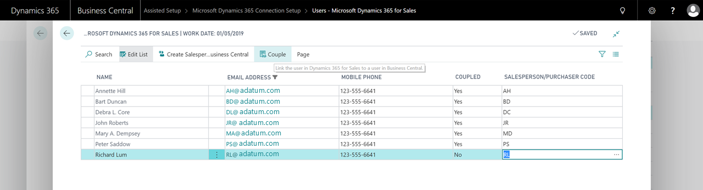

# Setting Up User Accounts for Integrating with Dynamics 365 for Sales
This article provides an overview of how to set up the user accounts that are required to integrate [!INCLUDE[crm_md](includes/crm_md.md)] with [!INCLUDE[d365fin](includes/d365fin_md.md)].  

<!-->> [!VIDEO https://www.youtube.com/embed/VWVmJQpqbHU]-->

## Setting Up the Admininstrator User Account in Sales
You must add your administrator user account for [!INCLUDE[d365fin](includes/d365fin_md.md)] as a user in [!INCLUDE[crm_md](includes/crm_md.md)], and then promote the user to administrator in [!INCLUDE[crm_md](includes/crm_md.md)]. The administrator user account must also have the System Customizer role and at least one other non-administrative user role, such as Sales Manager, in [!INCLUDE[crm_md](includes/crm_md.md)].

## Setting Up the User Account for the Integration
You must create a dedicated user account in your Office 365 subscription that both [!INCLUDE[d365fin](includes/d365fin_md.md)] and [!INCLUDE[crm_md](includes/crm_md.md)] can use to synchronize data. This user account must be able to sign in to [!INCLUDE[crm_md](includes/crm_md.md)], which means this user must have a license for [!INCLUDE[crm_md](includes/crm_md.md)]. This account must also be a non-interactive account in [!INCLUDE[crm_md](includes/crm_md.md)]. For more information about how to create users in [!INCLUDE[crm_md](includes/crm_md.md)], see [Manage security, users, and teams](http://go.microsoft.com/fwlink/?LinkID=616518). After the connection is set up, [!INCLUDE[d365fin](includes/d365fin_md.md)] will assign the user account the security roles that it needs in [!INCLUDE[d365fin](includes/d365fin_md.md)].

> [!IMPORTANT]  
> Do not use the administrator account for [!INCLUDE[crm_md](includes/crm_md.md)] for synchronization. Doing so will break the synchronization.
> Also, to avoid constant synchronization, changes to data that are made by the integration user account are not synchronized. <!--What changes would this account make?--> After the connection is made, we recommend setting the access mode for the user account for integration to non-interactive mode in [!INCLUDE[crm_md](includes/crm_md.md)]. For more information, see [Create a non-interactive user account](https://docs.microsoft.com/en-us/dynamics365/customer-engagement/admin/create-users-assign-online-security-roles#create-a-non-interactive-user-account).

## Setting Up Accounts for Sales People
You must create user accounts in [!INCLUDE[crm_md](includes/crm_md.md)] for the salespeople from [!INCLUDE[d365fin](includes/d365fin_md.md)]. To make that easier, the Microsoft 365 admin center offers an Excel template that you can use. On the **Active users** page, choose **More**, and then **Import multiple users**. Choose **Download a CSV file with headers only**, and then enter the information for the salespersons. To see an example, choose **Download a CSV file with headers and sample user information**. After you enter the information about the users, the next step in the import process is to assign the users licenses to the Dynamics 365 Customer Engagement Plan.  

After you import the users, and assign them licenses for Dynamics 365 Customer Engagement, you must assign the users to the **Salesperson** role in [!INCLUDE[crm_md](includes/crm_md.md)].

## See Also  
[Integrating with Dynamics 365 for Sales](admin-prepare-dynamics-365-for-sales-for-integration.md)  
