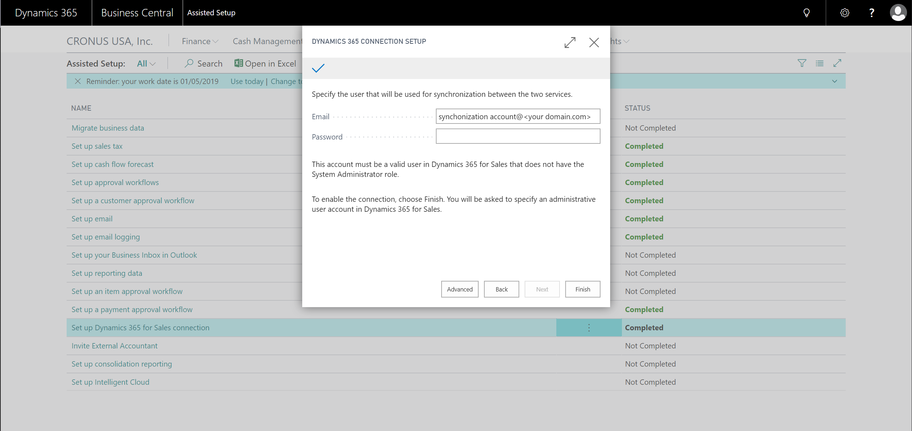

# Setting Up User Accounts for Integrating with Common Data Service
This article provides an overview of how to set up the user accounts that are required to integrate [!INCLUDE[d365fin](includes/cds_long_md.md)] with [!INCLUDE[d365fin](includes/d365fin_md.md)].  

## Setting Up the Administrator User Account
You must add your administrator user account for [!INCLUDE[d365fin](includes/d365fin_md.md)] as a user in [!INCLUDE[d365fin](includes/cds_long_md.md)]. When you set up the connection between [!INCLUDE[d365fin](includes/d365fin_md.md)] and [!INCLUDE[d365fin](includes/cds_long_md.md)] we will use this account one time to install and configure some required components. <!--Verify this-->

## Setting Up the User Account for the Integration
You must create a dedicated user account in your Office 365 subscription that both [!INCLUDE[d365fin](includes/d365fin_md.md)] and [!INCLUDE[d365fin](includes/cds_long_md.md)] can use to synchronize data. This user account must be able to sign in to [!INCLUDE[d365fin](includes/cds_long_md.md)], which means this user must have a license for [!INCLUDE[d365fin](includes/cds_long_md.md)] and at least one security role assigned to it in [!INCLUDE[d365fin](includes/cds_long_md.md)]. <!--not sure that this applies as described [here](/dynamics365/customer-engagement/admin/create-users-assign-online-security-roles#create-a-user-account). For more information about how to create users in [!INCLUDE[d365fin](includes/cds_long_md.md)], see [Manage security, users, and teams](https://go.microsoft.com/fwlink/?LinkID=616518). --> After the connection is set up, [!INCLUDE[d365fin](includes/d365fin_md.md)] will assign the user account the security roles that it needs in [!INCLUDE[d365fin](includes/d365fin_md.md)].

<!---->

> [!IMPORTANT]  
> Do not use the administrator account for [!INCLUDE[d365fin](includes/cds_long_md.md)] for synchronization. Doing so will break the synchronization.

## Permissions and Security Roles for User Accounts in [!INCLUDE[d365fin](includes/cds_long_md.md)]
When you install the CDS Base Integration Solution, permissions for the integration user account are configured. If those permissions are changed you might need to reset them. You can do that by reinstalling the CDS Base Integration Solution by choosing **Redeploy Integration Solution** on the **Common Data Service Connection Setup** page. The Business Central CDS Integration security role is deployed.

<!--
The following tables list the minimum permissions for the user accounts in [!INCLUDE[d365fin](includes/cds_long_md.md)].

### Minimum Permissions for the Administrator
The following table displays the minimum permissions on each tab for each security role that is required for the administrator user.

##### Customization
|Security Role|Access Level|Dynamics NAV 2018 and Earlier|Business Central   October 2018|Business Central   April 2019|
|----|----|-----|----|----|
|Model Driven App|Global|||Read|
|Plugin Assembly|Global|Read|Read|Read|
|Plugin Type|Global|Read|Read|Read|
|Relationship|Global|||Read|
|SDK Message|Global|Read|Read|Read|
|SDK Message Proessing Step|Global|Read|Read|Read|
|SDK Message Proessing Step Image|Global|Read|Read|Read|
|System From|Global|||Write|

##### Custom Entities
|Security Role|Access Level|Dynamics NAV 2018 and Earlier|Business Central   October 2018|Business Central   April 2020|
|----|----|-----|----|----|
|Business Central Account Statistics|Global|Read|Read|Read|
|Business Central Connection|Global|Create, Read, Write, Delete|Create, Read, Write, Delete|Create, Read, Write, Delete|
|Post Configuration|Global|||Write|

#### Integration User
The following table displays the minimum permissions on each tab for each security role that is required for the integration user.

##### Core Records
|Security Role|Access Level|Dynamics NAV 2018 and Earlier|Business Central   October 2018|Business Central   April 2019|
|----|----|-----|----|----|
|Account|Global|Create, Read, Write, Append, Append To, Assign|Create, Read, Write, Append, Append To, Assign|Create, Read, Write, Append, Append To, Assign|
|Action Card|Global||Read|Read|
|Connection|Global|Read|Read|Read|
|Contact|Global|Create, Read, Write, Append, Append To|Create, Read, Write, Append, Append To|Create, Read, Write, Append, Append To|
|Note|Global|||Create, Read, Write, Delete Append, Assign|
|Opportunity|Global||Create, Read, Write, Append, Append To|Create, Read, Write, Append, Append To|
|Post|Global|||Create, Read, Append To|
|User Entity UI|User|Create, Read, Write|Create, Read, Write|Create, Read, Write|

##### Sales
|Security Role|Access Level|Dynamics NAV 2018 and Earlier|Business Central   October 2018|Business Central   April 2019|
|----|----|-----|----|----|
|Invoice|Global|Create, Read, Write, Append, Append To|Create, Read, Write, Append, Append To|Create, Read, Write, Append, Append To|
|Order|Global|Read, Write, Append To|Read, Write, Append To|Read, Write, Append, Append To, Assign|
|Product|Global|Create, Read, Write, Append, Append To|Create, Read, Write, Append, Append To|Create, Read, Write, Append, Append To|
|Property|Global|Read|Read|Read|
|Property Association|Global|Read|Read|Read|
|Property Option Set Item|Global|Read|Read|Read|
|Quote|Global|Read|Read|Read|

##### Service
|Security Role|Access Level|Dynamics NAV 2018 and Earlier|Business Central   October 2018|Business Central   April 2019|
|----|----|-----|----|----|
|Case|Global|Read|Read|Read|

##### Business Management
|Security Role|Access Level|Dynamics NAV 2018 and Earlier|Business Central   October 2018|Business Central   April 2019|
|----|----|-----|----|----|
|Currency|Global|Create, Read, Write|Create, Read, Write|Create, Read, Write|
|Organization|Global|Read, Write|Read, Write|Read, Write|
|Security Role|Global|||Read|
|User|Global|Create, Read, Write, Append, Append To|Create, Read, Write, Append, Append To|Create, Read, Write, Append, Append To|
|User Settings|Global|Create, Read, Write, Delete, Append To|Create, Read, Write, Delete, Append To|Create, Read, Write, Delete, Append To|
|Act on Behalf of Another User|Global|Yes|Yes|Yes|

##### Customization
|Security Role|Access Level|Dynamics NAV 2018 and Earlier|Business Central   October 2018|Business Central   April 2019|
|----|----|-----|----|----|
|Field|Global||Read|Read|
|Plug-in Assembly|Global|Read|Read|Read|
|Plug-in Type|Global|Read|Read|Read|
|SDK Message|Global|Read|Read|Read|
|SDK Message Processing Step|Global|Read|Read|Read|
|Web Resource|Global|Read|Read|Read|

##### Custom Entities
|Security Role|Access Level|Dynamics NAV 2018 and Earlier|Business Central   October 2018|Business Central   April 2019|
|----|----|-----|----|----|
|Dynamics 365 Business Central Account Statistics|Global|Create, Read, Write, Append To|Create, Read, Write, Append To|Create, Read, Write, Append To|
|Dynamics 365 Business Central Connection|Global|Read|Read|Read|

### Product Availability User
You can allow sales people to view inventory levels for the items they sell by granting them the permissions described in the following table.

##### Custom Entities
|Security Role|Access Level|Dynamics NAV 2018 and Earlier|Business Central   October 2018|Business Central   April 2019|
|----|----|-----|----|----|
|Dynamics 365 Business Central Account Statistics|Global|Create, Read, Write, Append To|Create, Read, Write, Append To|Create, Read, Write, Append To|
|Dynamics 365 Business Central Connection|Global|Read|Read|Read|

-->

## See Also  
[Integrating with Common Data Service](admin-common-data-service.md)  
[Integrating with Dynamics 365 Sales](admin-prepare-dynamics-365-for-sales-for-integration.md)  
