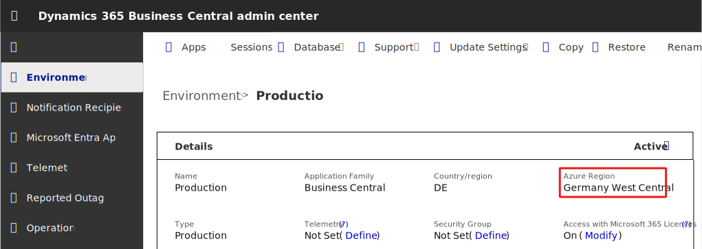

# Copilot data movement across geographies

Although Copilot in Business Central is available in all geographic areas where Business Central online is available, it requires Microsoft Azure OpenAI Service, which is available only in specific regions.  

Depending on where your environment is hosted, you might need to allow data to move outside of your primary data residency to an Azure OpenAI endpoint located in another geography. You provide consent in the **Copilot & agent capabilities** page. If you don't provide consent, Copilot won't be available to your organization. Learn how to provide consent in [Allow data movement across geographies](enable-ai.md#allow-data-movement-across-geographies).

Individual Copilot features might not be available in all geographies. Learn more about geographic and language availability at [Copilot international availability](https://aka.ms/bapcopilot-intl-report-external). Copilot and generative AI features from non-Microsoft publishers, such as those originating from customizations or AppSource apps you install, each define their own specific Azure OpenAI Service regions. Consult with the extension publisher to understand which regional Azure services are used by the extension.

## How data movement across geographies works

When you use Copilot, your inputs (prompts) and outputs (results), including any personal data, might move outside of your geography to the location where the Azure OpenAI Service endpoint is hosted. We might store prompt and output data for up to 24 hours to monitor for abuse, but we don't look at it unless our automated systems flag it for review. We don't use your data to train, retrain, or improve Azure OpenAI Service foundation models. Learn more at [Abuse Monitoring](/azure/ai-services/openai/concepts/abuse-monitoring).

> [!IMPORTANT]
> If your Business Central environment is hosted in the EU Data Boundary, we use an Azure OpenAI endpoint in the same boundary. Learn more: [EU Data Boundary countries and datacenter locations](/privacy/eudb/eu-data-boundary-learn#eu-data-boundary-countries-and-datacenter-locations)

The following table describes when and how data can move across geographies for Copilot in Business Central. 

| Azure&nbsp;region&nbsp;where&nbsp;your&nbsp;Business&nbsp;Central environment is hosted | Azure geography where Azure OpenAI Service is hosted |Consent required for data movement across geographies? |How to allow data to move across geographic areas|
| - | - | - |-|
|<ul><li>Australia (South East)</li><li>United Kingdom (South, West)</li><li>India (Central, South)</li><li>United States (Central, East, North Central, South Central, West)</li></ul>|Within the same geographic area of your Business Central environment|No|No action required. Data doesn't move across geographies in this scenario. |
|<ul><li>Europe (West, North)</li><li>France (Central, South)</li><li>Germany (North, West Central)</li><li>Norway (East, West)</li><li>Switzerland (North, West) </li></ul>|Spain, Sweden, or Switzerland|Yes|Data doesn't move outside the EU Data Boundary in this scenario. Learn more about EU Data Boundary countries and datacenter locations at [What is the EU Data Boundary?](/privacy/eudb/eu-data-boundary-learn#eu-data-boundary-countries-and-datacenter-locations)  For environments in these Azure regions, Copilot may use Azure OpenAI Service in any of the three Azure geographies.  **Note:** By default, the **Allow data movement** toggle is on. If you don't want to provide consent to data movement to other geographies within the EU Data Boundary, you can switch off the toggle at any time. In this case, Copilot features won't be available to your organization.|
|<ul><li>Asia (East, South East)</li><li>Brazil (South)</li><li>Canada (Central, East)</li><li>Japan (East, West)</li><li>Korea (Central, South)</li><li>South Africa (North, West)</li><li>United Arab Emirates (North, West)</li></ul> |United States|Yes|**Note:** By default, the **Allow data movement** toggle is on. If you don't want to provide consent to data movement, you can switch off the toggle at any time. In this case, Copilot features won't be available to your organization.|

> [!IMPORTANT]
> The **Allow data movement** toggle is on by default from update 25.0. Administrators can opt out at any time, even before environments are upgraded. Environments upgrading to update 25.0 or later will have the **Allow data movement** toggle turned on by default from November 3, 2024, or from the date you have specified for the environment to be upgraded to update 25.0. New environments created after October 1, 2024, will have the **Allow data movement** toggle turned on.

## How to find the Azure region of a Business Central environment

To find the Azure region where a Business Central environment is hosted, sign in to the Business Central admin center, choose the environment to display details, and then find the **Azure Region** field. Learn more: [Managing production and sandbox environments in the admin center](/dynamics365/business-central/dev-itpro/administration/tenant-admin-center-environments)

## Related information

[What is the EU Data Boundary?](/privacy/eudb/eu-data-boundary-learn)  
[Business Central country/regional availability and supported languages](/dynamics365/business-central/dev-itpro/compliance/apptest-countries-and-translations)  
