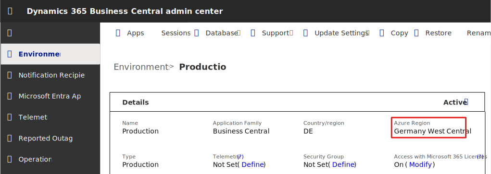

# Copilot data movement across geographies

Although Copilot in Business Central is available in all geographic areas where Business Central online is available, it requires Microsoft Azure OpenAI Service, which is available only in specific regions.  

Depending on where your environment is hosted, you might need to allow data to move outside of your primary data residency to an Azure OpenAI endpoint located in another geography. You provide consent in the **Copilot & agent capabilities** page. If you don't provide consent, Copilot won't be available to your organization. Learn how to provide consent in [Allow data movement across geographies](enable-ai.md#allow-data-movement-across-geographies).

Individual Copilot features might not be available in all geographies. Learn more about geographic and language availability at [Copilot international availability](https://aka.ms/bapcopilot-intl-report-external). Copilot and generative AI features from non-Microsoft publishers, such as those originating from customizations or Marketplace apps you install, each define their own specific Azure OpenAI Service regions. Consult with the extension publisher to understand which regional Azure services are used by the extension.

## How data movement across geographies works

When you use Copilot, your inputs (prompts) and outputs (results), including any personal data, might move outside of your geography to the location where the Azure OpenAI Service endpoint is hosted. We might store prompt and output data for up to 24 hours to monitor for abuse, but we don't look at it unless our automated systems flag it for review. We don't use your data to train, retrain, or improve Azure OpenAI Service foundation models. Learn more at [Abuse Monitoring](/azure/ai-services/openai/concepts/abuse-monitoring).

> [!IMPORTANT]
> If your Business Central environment is hosted in the EU Data Boundary, we use an Azure OpenAI endpoint in the same boundary. Learn more in [EU Data Boundary countries and datacenter locations](/privacy/eudb/eu-data-boundary-learn#eu-data-boundary-countries-and-datacenter-locations).

The following table describes when and how data can move across geographies for Copilot in Business Central.

|Azure&nbsp;region&nbsp;where&nbsp;your&nbsp;Business&nbsp;Central environment is hosted|Azure geography where Azure OpenAI Service is hosted|Consent required for data movement across geographies?|How to allow data to move across geographic areas|
|-|-|-|-|
|<ul><li>Australia (South East)</li><li>United Kingdom (South, West)</li><li>India (Central, South)</li><li>United States (Central, East, North Central, South Central, West)</li></ul>|Within the same geographic area as the Business Central environment|No|No action required. Data doesn't move across geographies in this scenario.|
|<ul><li>Europe (West, North)</li><li>France (Central, South)</li><li>Germany (North, West Central)</li><li>Norway (East, West)</li><li>Sweden (Central, South)</li><li>Switzerland (North, West) </li></ul>|A geography in the EU Data Boundary|Yes|Azure OpenAI Service is available in multiple geographies within the EU Data Boundary. Copilot can operate in any of these locations, and your data will remain inside the EU Data Boundary at all times.<br><br>Learn more about the countries and datacenter locations included in the boundary in [What is the EU Data Boundary?](/privacy/eudb/eu-data-boundary-learn#eu-data-boundary-countries-and-datacenter-locations)<br><br>**Note:** The **Allow data movement** toggle is turned on by default. If you disable it, Copilot won’t be able to process data across EU Data Boundary geographies, and Copilot features will no longer be available to your organization.|
|<ul><li>Asia (East, South East)</li><li>Brazil (South)</li><li>Canada (Central, East)</li><li>Japan (East, West)</li><li>Korea (Central, South)</li><li>South Africa (North, West)</li><li>United Arab Emirates (North, West)</li></ul> |United States|Yes|**Note:** By default, the **Allow data movement** toggle is on. If you don't want to provide consent to data movement, you can switch off the toggle at any time. In this case, Copilot features won't be available to your organization.|

<!--
> [!IMPORTANT]
> The **Allow data movement** toggle is on by default from update 25.0. Administrators can opt out at any time, even before environments are upgraded. Environments upgrading to update 25.0 or later will have the **Allow data movement** toggle turned on by default from November 3, 2024, or from the date you have specified for the environment to be upgraded to update 25.0. New environments created after October 1, 2024, will have the **Allow data movement** toggle turned on.-->

## How to find the Azure region of a Business Central environment (data residency)

To find the Azure region where a Business Central environment is hosted, sign in to the Business Central admin center, choose the environment to display details, and then find the **Azure Region** field. Learn more: [Managing production and sandbox environments in the admin center](/dynamics365/business-central/dev-itpro/administration/tenant-admin-center-environments)



## Understanding Azure OpenAI Service geography and data residency

This section provides detailed information about the geographic factors that affect Copilot data movement and availability.

### Business Central country/region version

**What it is**: The localized version of Business Central used on an environment specified by an admin when the enviroment was created.

**Why it matters**:

- Controls which regulatory features, tax calculations, and reporting formats are available
- Determines which localization-specific functionality you have access to
- Automatically determines the Azure region where Business Central data is stored
- Can't be changed after environment creation

**Key point**: It's about **localization and regulatory compliance**, not the physical data location or language.

**Example**: A Denmark (DK) environment includes Danish VAT rules, tax reporting, and regulatory requirements, regardless of where the environment is physically hosted.

### Azure region for Business Central data residency

**What it is**: The Azure region where your Business Central environment database is physically hosted and stored, like Europe (West) or United States (East)

**Why it matters**:

- Determines physical location of your business data
- Automatically determined by environment's country/region setting chosen by admin when environment created.
- Affects data residency compliance and regulations
- Can result in cross-geography data movement if Azure OpenAI Service operates in a different geography

**Key point**: It's about **where your business data lives**.

**Example**: A Danish (DK) environment is hosted in Azure's Europe North region, keeping your customer data, transactions, and business records.

### Azure OpenAI Service geography

**What it is**: The physical Azure data center regions where the AI model processes your prompts and generates responses. An Azure geography can consist of one or more data center regions.

**Why it matters**:

- Determines where AI processing occurs for compliance and data sovereignty
- Affects latency and performance of AI responses

**Key point**: It's about **where the AI thinks**, not where your business data lives.

**Example**: When you use analysis assist in Business Central, your prompt is sent to an Azure OpenAI endpoint in a specific geography (such as Europe, United States, or Asia Pacific) for processing.

### How geography and data residency factors work together

These two geographic factors are **independent** but work together with environment configuration and language settings to determine Copilot availability:

```
┌─────────────────────────────────────────────────────────────────┐
│ User in England                                                 │
│                                                                 │
│ [1] Uses Business Central in language: English (United Kingdom) │
│         ↓                                                       │
│ [2] Environment country/region is: United Kingdom (GB)          │
│     (UK VAT, tax rules, regulatory features)                    │
│         ↓                                                       │
│ [3] Environment data stored in Azure region: United Kingdom West│
│     (Database, transactions, customer data)                     │
│         ↓                                                       │
│ [4] Copilot prompt sent to AZURE OPENAI in: United Kingdom      │
│     (AI processing, model inference)                            │
│         ↓                                                       │
│ [5] Response returned in: English (supported language)          │
└─────────────────────────────────────────────────────────────────┘

   ✓ All factors align - Full functionality available
```

**Cross-geography scenario**:

```
┌─────────────────────────────────────────────────────────────────┐
│ User in Japan                                                   │
│                                                                 │
│ [1] Uses Business Central in language: Japanese (Japan)         │
│         ↓                                                       │
│ [2] Environment country/region is: Japan (JP)                   │
│         ↓                                                       │
│ [3] Environment data stored in Azure region: Japan West         │
│         ↓                                                       │
│         ↓  ! DATA CROSSES GEOGRAPHY BOUNDARY                    │
│         ↓                                                       │
│ [4] Copilot prompt sent to AZURE OPENAI in: United States West  │
│     (Feature not yet available in Asia geography)               │
│         ↓                                                       │
│         ↓  ! RESPONSE CROSSES GEOGRAPHY BOUNDARY                │
│         ↓                                                       │
│ [5] Response returned in: Japanese (supported language)         │
└─────────────────────────────────────────────────────────────────┘

   !  Cross-geography data movement occurs
   → Check your organization's data residency policies
```

Learn more about all factors affecting Copilot availability in [Copilot country/region availability and supported languages](copilot-agents-region-language-availability.md#key-factors-of-copilot-availability).

## Related information

[What is the EU Data Boundary?](/privacy/eudb/eu-data-boundary-learn)  
[Business Central country/regional availability and supported languages](/dynamics365/business-central/dev-itpro/compliance/apptest-countries-and-translations)  
