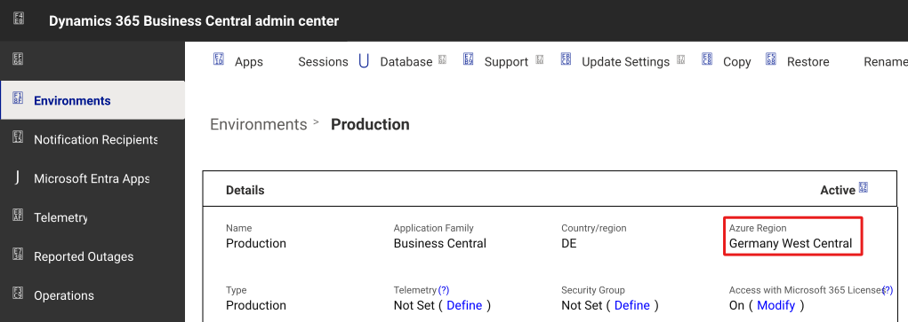

# Data movement across geographies for Business Central Copilot and agent capabilities

The Business Central Copilot and agent capabilities covered by this article use Microsoft-managed Azure OpenAI resources. Azure OpenAI processing isn't available in every geography in which Business Central online environment is hosted. As a result, the affected capabilities might require data to be processed in a different Azure geography from the Business Central environment.

> [!IMPORTANT]
> This article doesn't describe data residency or geographic processing for **Microsoft Copilot in Business Central**, the Microsoft Copilot experience available starting with Business Central version 29. Microsoft Copilot is governed by Microsoft Copilot and Microsoft 365 privacy, security, compliance, and data residency commitments.
>
> Learn more in [Data, Privacy, and Security for Microsoft Copilot](/microsoft-365/copilot/microsoft-365-copilot-privacy) and [Data Residency for Microsoft Copilot](/microsoft-365/enterprise/m365-dr-service-copilot).

You manage consent for this processing by using the **Allow data movement** setting on the **Copilot & agent capabilities** page. Capabilities that require this cross-geography processing aren't available if you don't allow data movement. Learn how to provide consent in [Allow data movement across geographies](enable-ai.md#allow-data-movement-across-geographies).

Individual Copilot capabilities might not be available in all geographies. Learn more about geographic and language availability at [Copilot international availability](https://aka.ms/bapcopilot-intl-report-external). Copilot and generative AI features from non-Microsoft publishers, such as those originating from customizations or Marketplace apps you install, each define their own specific Azure OpenAI Service regions. Consult with the extension publisher to understand which regional Azure services are used by the extension.

## How data movement across geographies works

The information in this section applies to Copilot and agent requests routed through Business Central's Microsoft-managed AI resources. It doesn't describe the processing, storage, or residency of interactions with Microsoft Copilot in Business Central.

When you use Copilot capabilities, your inputs (prompts) and outputs (results), including any personal data, might move outside of your geography to the location where the Azure OpenAI Service endpoint is hosted. We might store prompt and output data for up to 24 hours to monitor for abuse, but we don't look at it unless our automated systems flag it for review. We don't use your data to train, retrain, or improve Azure OpenAI Service foundation models. Learn more at [Abuse Monitoring](/azure/ai-services/openai/concepts/abuse-monitoring).

> [!IMPORTANT]
> If your Business Central environment is hosted in the EU Data Boundary, we use an Azure OpenAI endpoint in the same boundary. Learn more in [EU Data Boundary countries and datacenter locations](/privacy/eudb/eu-data-boundary-learn#eu-data-boundary-countries-and-datacenter-locations).

## Azure OpenAI routing for Business Central-native capabilities

The following table shows the Azure OpenAI geography used by the Business Central Copilot and agent capabilities covered by this article. The table doesn't identify where Microsoft Copilot interactions are processed or stored.
For Microsoft Copilot residency commitments, see [Data Residency for Microsoft 365 Copilot](/microsoft-365/enterprise/m365-dr-service-copilot).

> [!NOTE]
> The Azure region of the Business Central environment remains relevant to Business Central data residency and to the native-capability routing described in this article. Microsoft Copilot data-residency commitments are based on the Microsoft Copilot/Microsoft 365 service and tenant context, not this routing table.

|Azure&nbsp;geography/regions&nbsp;where&nbsp;the Business Central environment is hosted|Azure geography where Azure OpenAI Service is hosted|Consent required for data movement across geographies?|What you need to do|
|-|-|-|-|
|<ul><li>United States (Central, East, North Central, South Central, West)</li></ul>|United States|No|No action required. Data doesn't move across geographies in this scenario.|
|<ul><li>Europe (West, North)</li><li>France (Central, South)</li><li>Germany (North, West Central)</li><li>Norway (East, West)</li><li>Sweden (Central, South)</li><li>Switzerland (North, West)</li></ul>|Within [EU Data Boundary](/privacy/eudb/eu-data-boundary-learn#eu-data-boundary-countries-and-datacenter-locations) (covers multiple geographies)|Yes|Processing can occur across geographies within the EU boundary. By default, the **Allow data movement** toggle on the **Copilot & agent capabilities** page is on.<br><br>If you don't want to provide consent to data movement, turn off the toggle. In this case, Copilot features won't be available to your organization.|
|<ul><li>United Kingdom (South, West)</li></ul>|Copilot features within the same geographic area as the Business Central environment.<br><br>Agent features within EU Data Boundary (covers multiple geographies)|Yes|Agent processing can occur across geographies within the EU boundary. By default, the **Allow data movement** toggle on the **Copilot & agent capabilities** page is on.<br><br>If you don't want to provide consent to data movement for agents, turn off the toggle. In this case, neither Copilot or agent features will be available to your organization. Alternatively, turn on the toggle to allow using Copilot features, but turn off all agent features.|
|<ul><li>Australia (South East)</li><li>India (Central, South)</li></ul>|Copilot features within the same geographic area as the Business Central environment.<br><br>Agent features within United States|Yes|Agent processing can occur across geographies within the EU boundary. By default, the **Allow data movement** toggle on the **Copilot & agent capabilities** page is on.<br><br>If you don't want to provide consent to data movement for agents, turn off the toggle. In this case, neither Copilot or agent features will be available to your organization. Alternatively, turn on the toggle to allow using Copilot features, but deactivate all agent features.|
|<ul><li>Asia (East, South East)</li></li><li>Brazil (South)</li><li>Canada (Central, East)</li><li>Japan (East, West)</li><li>Korea (Central, South)</li><li>South Africa (North, West)</li><li>United Arab Emirates (North, West)</li></ul> |United States|Yes|By default, the **Allow data movement** toggle on the **Copilot & agent capabilities** page is on.<br><br>If you don't want to provide consent to data movement, turn off the toggle. In this case, Copilot features won't be available to your organization.|

## How to find the Azure region of a Business Central environment (data residency)

To find the Azure region where a Business Central environment is hosted, sign in to the Business Central admin center, choose the environment to display details, and then find the **Azure Region** field. Learn more: [Managing production and sandbox environments in the admin center](/dynamics365/business-central/dev-itpro/administration/tenant-admin-center-environments)



## Understanding Azure OpenAI Service geography and data residency

This section provides detailed information about the geographic factors that affect Copilot data movement and availability.

### Business Central country/region version

**What it is**: The localized version of Business Central used on an environment specified by an admin when the environment was created.

**Why it matters**:

- Controls which regulatory features, tax calculations, and reporting formats are available.
- Determines which localization-specific functionality you have access to.
- Automatically determines the Azure region where Business Central data is stored.
- Can't be changed after environment creation.

**Key point**: It's about **localization and regulatory compliance**, not the physical data location or language.

**Example**: A Denmark (DK) environment includes Danish VAT rules, tax reporting, and regulatory requirements, regardless of where the environment is physically hosted.

### Azure region for Business Central data residency

**What it is**: The Azure region where your Business Central environment database is physically hosted and stored, like Europe (West) or United States (East).

**Why it matters**:

- Determines physical location of your business data.
- Automatically determined by environment's country/region setting chosen by admin when environment created.
- Affects data residency compliance and regulations.
- Can result in cross-geography data movement if Azure OpenAI Service operates in a different geography.

**Key point**: It's about **where your business data lives**.

**Example**: A Danish (DK) environment is hosted in Azure's Europe North region, keeping your customer data, transactions, and business records.

### Azure OpenAI Service geography

**What it is**: The physical Azure data center regions where the AI model processes your prompts and generates responses. An Azure geography can consist of one or more data center regions.

**Why it matters**:

- Determines where AI processing occurs for compliance and data sovereignty
- Affects latency and performance of AI responses

**Key point**: It's about **where the AI thinks**, not where your business data lives.

**Example**: When you use analysis assist in Business Central, your prompt is sent to an Azure OpenAI endpoint in a specific geography (such as Europe, United States, or Asia Pacific) for processing.

### How geography and data residency factors work together

These two geographic factors are **independent** but work together with environment configuration and language settings to determine Copilot availability:

```
┌─────────────────────────────────────────────────────────────────┐
│ User in US                                                      │
│                                                                 │
│ [1] Uses Business Central in language: Spanish (United States)  │
│         ↓                                                       │
│ [2] Environment country/region is: United States                │
│         ↓                                                       │
│ [3] Environment data stored in Azure region: United States      │
│         ↓                                                       │
│ [4] Copilot response returned in: Spanish (United States)       │
└─────────────────────────────────────────────────────────────────┘

   ✓ Copilot processing stays in the United States geography
```

**Cross-geography scenario**:

```
┌─────────────────────────────────────────────────────────────────┐
│ User in Japan                                                   │
│                                                                 │
│ [1] Uses Business Central in language: Japanese (Japan)         │
│         ↓                                                       │
│ [2] Environment country/region is: Japan (JP)                   │
│         ↓                                                       │
│ [3] Environment data stored in Azure region: Japan West         │
│         ↓                                                       │
│         ↓  ! DATA CROSSES GEOGRAPHY BOUNDARY                    │
│         ↓                                                       │
│ [4] Copilot prompt sent to AZURE OPENAI in: United States West  │
│     (Feature not yet available in Asia geography)               │
│         ↓                                                       │
│         ↓  ! RESPONSE CROSSES GEOGRAPHY BOUNDARY                │
│         ↓                                                       │
│ [5] Response returned in: Japanese (supported language)         │
└─────────────────────────────────────────────────────────────────┘

   !  Cross-geography data movement occurs
   → Check your organization's data residency policies
```

Learn more about all factors affecting Copilot availability in [Copilot country/region availability and supported languages](copilot-agents-region-language-availability.md#key-factors-of-copilot-availability).


## Related information

[Configure Copilot and agent capabilities](enable-ai.md)
[Data, Privacy, and Security for Microsoft Copilot](/microsoft-365/copilot/microsoft-365-copilot-privacy)  
[Enterprise data protection in Microsoft Copilot and Microsoft Copilot Chat](/microsoft-365/copilot/enterprise-data-protection)  
[Data Residency for Microsoft 365 Copilot](/microsoft-365/enterprise/m365-dr-service-copilot)  
[How data is protected and audited in Microsoft 365 and Microsoft Copilot](/microsoft-365/copilot/microsoft-365-copilot-architecture-data-protection-auditing)  
[Manage Microsoft Copilot scenarios in the Microsoft 365 admin center](/microsoft-365/copilot/microsoft-365-copilot-page)  
[Application card: Microsoft Copilot (for organizations)](/microsoft-365/copilot/microsoft-365-copilot-application-card)  
[What is the EU Data Boundary?](/privacy/eudb/eu-data-boundary-learn)  
