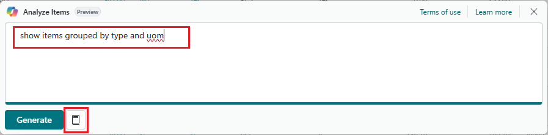

# Analyze data in lists with help from Copilot (preview)

[!INCLUDE[preview-banner](includes/preview-banner.md)]

This article explains how to use the *analysis assist* to help you analyze data on list pages.

[!INCLUDE[production-ready-preview-dynamics365](includes/production-ready-preview-dynamics365.md)]

## About analysis assist

Analysis assist is a Copilot for the [analysis mode](analysis-mode.md) on list pages in Business Central. The analysis mode provides an interactive and versatile way to calculate, summarize, and examine data. To analyze data in the analysis mode, you create an *analysis* tab where you transform the data to display the desired aggregations and summarizations. For example, you arrange fields in rows and columns, specify filters, sort columns, and pivot on fields. With analysis assist, instead of doing this task manually, you achieve much of the same&mdash;or least as a start&mdash;by using words. By expressing the structure you want in natural language, like "sort on quantity from smallest to largest" or "show average cost per category", analysis assist uses AI to generate a suggested layout on an analysis tab.

## Available languages

[!INCLUDE[analysis-assist-language-support](includes/analysis-assist-language-support.md)]

## Prerequisites

- Analysis assist capability is activated and you're granted permissions to use it. This task is typically done by an admin. [Learn more about configuring Copilot and AI capabilities](enable-ai.md).
<!-- - The display language in Business Central is set to one the following English locales: en-AU, en-CA, en-GB, en-IE, en-IN, en-NZ, en-PH, en-SG, en-US, en-ZA. [Learn how to change the language](ui-change-basic-settings.md#language)-->
- Your Business Central environment is in any country/region except Canada (this feature isn't yet available in Canada).

## Get started

1. Open the list page you want to analyze.

   For example, to work with **Items** page, select the  icon (<kbd>Alt</kbd>+<kbd>Q</kbd>), enter *items*, and then choose the related link.

1. You can start analyzing data with Copilot directly from the list page or by first entering the analysis mode. To get started, do one of the following steps:

    - In the action bar at the top of the page, select  **Copilot** > **Analyze list**.
    - In the action bar at the top of the page, select  **Enter analysis mode**, then select  **Copilot** > **Create new analysis**.

1. In the **Analyze** with Copilot window, enter a description of the layout you want. This description is known as a *prompt*.

    

    > [!TIP]
    > For help in writing a prompt, select  **Prompt guide**, and choose one of the options to get you started. The text in brackets `[ ]` is shown only as an example and isn't included in the Copilot window.

1. Select **Generate** and then wait while Copilot generates the layout on new analysis tab.
1. Review the results on the new analysis tab.

   > [!NOTE]
   > If navigate away from the new analysis tab (such as going to another anlaysis tab or page) or make layout changes on the tab (such as sorting columns or changing settings in the **Columns** and **Analysis Filters** tabs), the new analysis tab is automatically saved and Copilot closes.

1. If you want to change the generated analysis, you can do one of the steps:

   - To build on the previous instructions, enter the information in the **Add more details about the analysis** box, then select the  **Adjust** arrow. Copilot remembers your previous instructions and uses them to make adjustments.

   - To start from scratch by adding new instructions, select the  **Edit prompt:**, add the details to the prompt, and then select **Generate**.

1. If you want to save the analysis tab, select **Keep it**. If you don't to save it, select **Discard**.

## Prompt tips and examples

Creating effective prompts for Copilot is essential to get accurate and relevant analysis suggestions. There are also ways to minimize text you add in prompts to make it faster when typing. Here are some tips and guidelines followed by some examples:

- Be concise and avoid long sentences or multiple sentences.
- Make sure field names used in prompts are somewhat close to actual field names on the page.
- Use natural language, expressing the data structure you want in a friendly and conversational manner.
- Use common keywords, phrases, and terms used in data analysis, like `group by`, `sum`, `sort by`, and so on.
- If the initial response isn't what you want, add follow-up instructions or rephrase the last instruction.
- Common abbreviations are acceptable.
- Letter case isn't important.

### Examples

These following prompt examples use analysis assist on the **Items** list. The items page includes three summable fields for analysis: **Quantity on Hand**, **Unit Cost**, **Unit Price**.

Prompt: `Show items by brand and unit of measure`

This prompt tries to show totals for all summable fields, grouped by brand and **Base Unit of Measure** field. But in this case, "brand" doesn't match any field name, so Copilot probably can't find a matching field so it asks you to rephrase the prompt and try again.

Prompt: `Show items by type and uom`

This prompt shows totals for all summable fields, grouped by the **Type** field and **Base Unit of Measure** field. But instead of writing out "unit of measure", the abbreviation `uom` is used.

Prompt: `Show total quantity per type per UoM`

This prompt creates a pivot table on the **Quantity on Hand** field per **Base Unit of Measure** per **Type**.

## See also

[Responsible AI FAQ for analysis assist](faqs-analysis-assist.md)  
[Ad hoc data analysis](reports-adhoc-analysis.md)  
