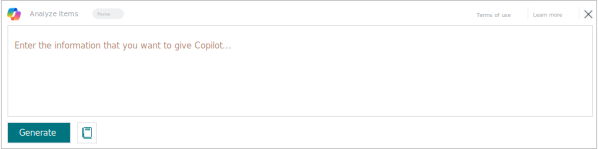
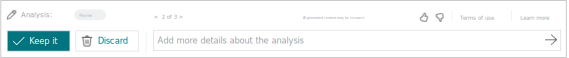

# Analyze data in lists with Copilot

Copilot makes it even easier to use [analysis mode](analysis-mode.md) on list pages in Business Central *analysis assist*. 

## About analysis assist

Analysis assist is a Copilot for the analysis mode on list pages in [!INCLUDE [prod_short](includes/prod_short.md)]. Analysis mode provides an interactive and versatile way to calculate, summarize, and examine data. To analyze data in analysis mode, create an analysis tab where you transform the data to display the desired aggregations and summarizations—for example, arranging fields in rows and columns, specify filters, sorting columns, and pivot on fields.

With analysis assist, instead of doing these tasks manually, you can express the structure you want in natural language and get a suggested layout as a starting point. Copilot can also help by adding fields from related tables (for example, showing items together with the purchasing vendor address). It can translate instructions like "sort on quantity from smallest to largest" or "show average cost per category" into the corresponding rows, columns, filters, and aggregations.

## Supported languages

[!INCLUDE[copilot-geo-and-language-availability](includes/copilot-language-support.md)]

## Prerequisites

- An administrator activated the **Analyze list** capability on the **Copilot & agent capabilities** page and granted you the required permissions to use analysis mode. Learn more in [Configure Copilot and agent capabilities](enable-ai.md).  

## Get started

1. Open the list page you want to analyze.

   For example, to work with the **Items** page, select the  icon (<kbd>Alt</kbd>+<kbd>Q</kbd>), enter *items*, and then choose the related link.

1. You can start analyzing data with Copilot directly from the list page or by first entering analysis mode. To get started, do one of the following steps:

    - In the action bar at the top of the page, select  **Copilot** > **Analyze list**.
    - In the action bar at the top of the page, select  **Enter analysis mode**, then select  **Copilot** > **Create new analysis**.

1. In the **Analyze Items** window, enter a description of the layout you want. This description is known as a *prompt*.

    

    > [!TIP]
    > For help with writing a prompt, select  **Prompt guide**, and choose one of the options to get you started. The text in brackets `[ ]` is shown only as an example and isn't included in the Copilot window.

1. Select **Generate** and then wait while Copilot generates the layout on new analysis tab.
1. Review the results on the new analysis tab.

   > [!NOTE]
   > If you navigate away from the new analysis tab (such as going to another analysis tab or page), the new analysis tab is automatically saved and Copilot closes.

1. If you want to change the generated analysis, you can do one of these steps:

   - To build on the previous instructions, enter the information in the **Add more details about the analysis** box, then select the  **Adjust** arrow. Copilot remembers your previous instructions and uses them to make adjustments.

     

   - To manually adjust the layout, you can interact directly with the columns, data area, and analysis filters. For example, you can adjust a filter and remove a column, and Copilot remains available in case you want assistance with building on your manual adjustments and previous instructions.
   - To start from scratch by adding new instructions, select the  **Edit prompt:**, add the details to the prompt, and then select **Generate**.

1. Use **< Back** and **> Next** at the top of the Copilot window to review the different layouts you created as you made adjustments for this analysis tab. You can go back to any adjustments that you or Copilot made to the tab since you created it.

1. If you want to save the analysis tab, select **Keep it**. If you don't want to save it, select **Discard**.

## Prompt tips and examples

Creating effective prompts for Copilot is essential to get accurate and relevant analysis suggestions. There are also ways to minimize text you add in prompts to make it faster when typing. Here are some tips and guidelines followed by some examples:

- Be concise and avoid long sentences or multiple sentences.
- Make sure field names used in prompts are somewhat close to actual field names on the page.
- Use natural language, expressing the data structure you want in a friendly and conversational manner.
- Use common keywords, phrases, and terms used in data analysis, like `group by`, `sum`, `sort by`, and so on.
- If the initial response isn't what you want, add follow-up instructions or rephrase the last instruction.
- Common abbreviations are acceptable.
- Letter case isn't important.

### Examples

These following prompt examples use analysis assist on the **Items** list. The items page includes three summable fields for analysis: **Quantity on Hand**, **Unit Cost**, **Unit Price**.

Prompt: `Show low-stock items by category`

This prompt can be used to group item records by their assigned category, filtering items to only those items with low stock. Copilot suggests a definition for low inventory and applies a filter such as "Quantity on Hand less than 10". In this case, the items list doesn't display the **Category** field, Instead, Copilot brings that field into the analysis tab so that you don´t need to go through the manual effort of personalizing the page.

Prompt: `Show items by brand and unit of measure`

This prompt tries to show totals for all summable fields, grouped by brand and the **Base Unit of Measure** field. But in this case, "brand" doesn't match any field name, so Copilot probably can't find a matching field. It then asks you to rephrase the prompt and try again.

Prompt: `Show items by type and uom`

This prompt shows totals for all summable fields, grouped by the **Type** field and **Base Unit of Measure** field. In this prompt, the abbreviation `uom` is used instead of writing out "unit of measure". Copilot is often able to interpret abbreviations or alternate names and match them to fields on the list.

Prompt: `Show total quantity per type per UoM`

This prompt creates a pivot table on the **Quantity on Hand** field per **Base Unit of Measure** per **Type**.

Prompt: `group items by vendor's country/region`

This prompt groups items by the vendors' countries/regions. Because the country/region data is stored in the **Vendor** table, not the **Item** table, Copilot uses analysis mode to include fields from related tables. In this case, Copilot uses the vendor number from the item record to retrieve the country/region from the **Vendor** table and adds `Country/Region Code [Vendor, via: Vendor No. = No.]` in the **Row Groups** section of the **Columns** pane.

> [!TIP]
> Copilot performs better when you mention the related table from which you want to add more fields.

## How Copilot works with fields for analysis assist

Copilot can use any of the visible or hidden fields on the list page and add them as columns to the analysis tab layout. Hidden fields are those fields that you would typically add to the list by personalizing the page.

When Copilot determines that a hidden field is useful for your analysis tab, the field is shown as a column in the tab layout. It also appears in the **Columns** pane so that you can hide or reorder it or add it to any other analysis tabs for this list.  

> [!NOTE]
> If an administrator turned off personalization for your profile (role), Copilot isn't able to use hidden fields from the list.

Copilot can only access fields that are visible or hidden on the current page or that appear on related pages. It can't access fields that exist only on the source table.

## Using tabs created by Copilot in preview

If you used the **Analysis Assist** feature while in preview, you might have asked Copilot to create analysis tabs that include hidden fields from the list. These tabs are no longer compatible. When you next open one of these analysis tabs, a message indicates which hidden fields were removed. You can add these fields again manually, or ask Copilot to create a new tab for you.

## Related information

[Responsible AI FAQ for analysis assist](faqs-analysis-assist.md)  
[Ad hoc data analysis](reports-adhoc-analysis.md)  
