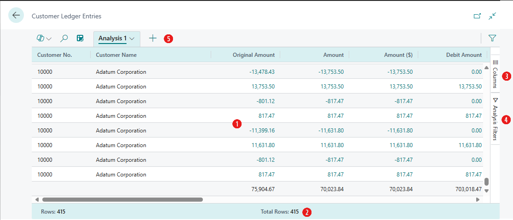

# Analyze list page and query data using data analysis feature

> **APPLIES TO:** [!INCLUDE [prod_short](includes/prod_short.md)] 2023 release wave 2 and later

This article explains how to use the data analysis feature from list pages and queries. The data analysis lets you analyze data directly from the page, without having to run a report or open another application, such as Excel. The feature provides an interactive and versatile way to calculate, summarize, and examine data. Instead of running reports using different options and filters, you can add multiple tabs that represent different tasks or views on the data. Some examples are: "My customers," "Follow up items," "Recently added vendors," "Sales statistics," or any other view you can imagine.

> [!TIP]
> A good thing about the data analysis feature is that it doesn't change the underlying data of a list page or query. It also doesn't change the layout of the page or query when it isn't in analysis mode. So, the best way to learn about what you can do in analysis mode is to try out things.

## Prerequisites

- If you're using [!INCLUDE [prod_short](includes/prod_short.md)] version 22, the data analysis feature is in preview. So, an admin must enable it before you can use it. To enable it, go to the **Feature Management** page and switch on **Feature Update: Analysis mode, quickly analyze data directly in Business Central**. [Learn more about Feature Management](/dynamics365/business-central/dev-itpro/administration/feature-management).
- In version 23 and later, your account must be assigned the **DATA ANALYSIS - EXEC** permission set or include execute permission on the system object **9640 Allow Data Analysis mode**. As an admin, you can exclude these permissions for users who you don't want to access the analysis mode.

> [!NOTE]
> Some list pages don't offer the **Enter analysis mode** toggle for turning on analysis mode. The reason is that developers can disable analysis mode on specific pages by using the [AnalysisModeEnabled property](/dynamics365/business-central/dev-itpro/developer/properties/devenv-analysismodeenabled-property) in AL.

## Get started

Follow these steps to start using the analysis mode.

> [!TIP]
> Analysis mode also includes a Copilot feature called *analysis assist* that can help you get started. [Learn more about analysis assist with Copilot.](analysis-assist.md)

1. Open the list page or query.

   For example, to work with the **Customer Ledger Entries** page, select the  icon (<kbd>Alt</kbd>+<kbd>Q</kbd>), enter *customer ledger entries*, and then choose the related link. 

1. In the action bar at the top of the page, select the **Enter analysis mode**  button.

    The analysis mode opens the data in an experience that's optimized for data analysis. While in analysis mode, the normal action bar is replaced with a special analysis mode bar. The following figure illustrates the different areas of a page in the analysis mode.

   

   Each area is explained in the sections that follow.

1. Use the different areas to manipulate, summarize, and analyze data. See the sections that follow for details.

1. When you want to stop the analysis mode, select the **Leave analysis mode**  button.

   The analysis tabs that you added remain until you delete them. If you return to the analysis mode again, you see them exactly as you left them.

> [!NOTE]
> The data shown in analysis mode is controlled by the filters or views set on the list page. This capability allows you to prefilter data before entering analysis mode.

## Work with analysis mode

In the analysis mode, the page is divided into two areas:

- The main area, which consists of the data area (1), summary bar (2), and tabs bar (5).
- The data manipulation area, which consists of two panes: columns (3) and analysis filters (4).

### Data area (1)

The data area is where the rows and columns of the list page query are shown and data is summarized. The data area provides a versatile way to control the layout of columns and a quick way to get a summary of the data. For columns that contain numeric values, the sum of all values in the column is shown in the last row, unless you define row groups. In this case, the sums appear as a subtotal for the groups.  

:::image type="content" source="media/analysis-mode-data-area.png" alt-text="Shows an overview of a data area on a page in the analysis mode" lightbox="media/analysis-mode-data-area.png":::

- To move a column, select it and drag it to where it makes the most sense in your analysis.
- To sort on a column, select the column header. To sort on multiple columns, select and hold the <kbd>Shift</kbd> key while selecting the column headers you want to sort on.
- To access several actions that you can do on columns, right-click the column or hover over it and select the menu icon . For example:

  - To pin a column to the data area so that it doesn't move off the screen when you scroll, select  > **Pin column** > **Pin left** the column part.
  - Define data filters directly on the column definition instead of going to the **Analysis Filters** panes. You can still peek in on details about related data and for each line, and open the card to learn more about a given entity.
- Use the data area to interact with the data. For columns that contain numeric, summable values, you can get descriptive statistics on a set of fields by marking them. The statistics appear in the status bar (2) along the bottom of the page.

In the data area, you can filter on all columns, including totals such as sum or count. 

:::image type="content" source="media/analysis-mode-filter-on-totals.png" alt-text="Screenshot of how to filter on totals in analysis mode" lightbox="media/analysis-mode-filter-on-totals.png":::

### Summary bar (2)

The summary bar is along the bottom of the page and displays statistics about the data in the list page or query. As you interact with columns whose values can be summed, like selecting multiple rows in a column that displays amounts, the data updates.

:::image type="content" source="media/analysis-mode-totals-row.png" alt-text="Shows an overview of a summary bar on the analysis mode" lightbox="media/analysis-mode-totals-row.png":::

The following table describes the different numbers that are shown in the totals area:

|Number|Description|
|-|-|
|Rows|The number of selected rows as a part of the total number of available rows. |
|Total rows|The number of rows in the unfiltered list or query.|
|Filtered|The number of rows displayed as a result of the filters applied to the list or query.|
|Average|The average value in all the selected summable fields.|
|Count|The number of selected rows.|
|Min|The minimum value in all the selected summable fields.|
|Max|The maximum value in all the selected summable fields.|
|Sum|The sum total of all the values in the selected summable fields.|

### Columns (3)

The **Columns** pane is one of two panes that work together to define your analysis. The other area is the **Analysis filters** pane. The **Columns** pane is used to summarize the data. Use the **Columns** pane to define which columns should be included in the analysis.

:::image type="content" source="media/analysis-mode-columns-3.png" alt-text="Shows an overview of the columns pane in the analysis mode" lightbox="media/analysis-mode-columns-3.png":::

|Areas|Description|
|-|-|
|Search/check or clear all boxes|Search for columns. To select/clear all columns, select the checkbox.|
|Check boxes|This area includes a checkbox for each field in the list's or query's source table. Use this area to change what columns are shown. Select a checkbox to show a column for the field on the page; clear the checkbox to hide the column. |
|Row groups|Use this area to group and sum data by one or more fields. You can only include non-numeric fields, like text, date, and time fields. Row groups are used often in pivot mode.|
|Values|Use this area to specify fields that you want a sum total for. You can only include fields that contain numbers that can be added together; for example, not text, date, or time fields.|

To move a field from one area to another, select the grab icon  next to the column in the list and drag it into the target area. You're prevented from moving a field to an area where it isn't allowed.

> [!NOTE]
> If you use personalization to add or remove fields from a list page, your choice of visibility is reflected in the **Columns** pane. An added field has the **Show** checkbox cleared. To include the added field in an analysis definition, select the checkbox in the **Columns** pane. To learn more about personalization, go to [Add/remove fields and columns on a page](ui-personalization-user.md#fields).

#### Add fields from related tables

> [!NOTE]
> Adding fields from related tables is available from version 26.2 and to use it, you must have the **Add Related Fields** permission set.
>
> Before version 27.0, the feature is enabled with the feature key `Add fields from related tables in analysis mode`. Learn more in [Add fields from related tables in analysis mode feature key](analysis-mode-feature-key.md).

Analysis mode allows you to add fields from related tables to your analysis view. For example, if you're analyzing the **Customer** page, you can add fields from the **Location** table. You can then group data by these related fields, enabling a more comprehensive and advanced data analysis.

To add fields from related tables, you select the **Add columns from** option from the **Analysis** context menu. Now, you see the tables related to the current page's source table as suggestions. When you choose the related table, an **Insert column(s) from** dialog opens with all the fields that are available in that table. You can also use the **Choose a source page** dropdown to navigate through and find fields that you'd like to see in your analysis view. After you choose the field or fields to add, they're added to the **Columns** pane and to the data area. Use the **Remove related columns** option to remove the related fields from the analysis tab. 

:::image type="content" source="media/analysis-view-add-columns.png" alt-text="Add columns from option":::

If you want to see all table suggestions, choose **Other source...** from the **Add columns from** menu. This action opens an **Insert column(s)** dialog, where you pick the source and related table, the source page they're available on, and then the field or fields to show on your analysis view.

:::image type="content" source="media/analysis-view-other-source.png" alt-text="Add columns from another source":::

##### Things to check

If you don't find the table or field that you're looking for, there are a few things to check:

- The table must be related to the source table of the page you're analyzing. 
- You must have permission to access the table or field. If you don't have permission, the field isn't available in the list of fields to add.
- The field must be a field that can be added to the analysis. For example, you can't add fields that are internal or not allowed in customizations.
- The table or field must have a page associated with it. If the table or field doesn't have a page, you can't add it to the analysis.
- Certain types of fields, such as Media fields, aren't supported in analysis mode.
- All calculated fields are lost when you add related fields.

### Analysis filters (4)

The **Analysis filters** pane lets you set further data filters on columns to limit the entries in the list. Set filters on columns to limit the entries in the list and subsequent sums to only those entries you're interested in based on a criteria you define. For example, suppose you're only interested in data for a specific customer or sales orders that exceed a specific amount. To set a filter, select the column, choose the comparison operation from the list (like **Equals** or **Starts with**), and then enter the value.

:::image type="content" source="media/analysis-mode-filters-2.png" alt-text="Shows an overview of the filters pane in the analysis mode" lightbox="media/analysis-mode-filters-2.png":::

> [!NOTE]
> The added filters only apply to the current analysis tab, allowing you to define exactly the extra data filters that are needed for a specific analysis.

### Tabs (5)

The tabs area at the top lets you create different configurations (columns and analysis filters) on separate tabs, where you can manipulate data on the tabs independently of each other. There's always at least one tab, called **Analysis 1** by default. Adding more tabs is beneficial for saving frequently used analysis configurations on a dataset. For example, you might have tabs for analyzing data in the pivot mode, and other tabs that filter to a subset of rows. Some tabs might show a detailed view with many columns, and others only display a few key columns.

Here are some pointers on working with multiple analysis tabs:

- To add a new tab, select the large **+** sign next to the last analysis tab.
- Select the down arrow on a tab to access a list of actions you can do on a tab, like rename, duplicate, delete, and move.

   - **Delete** deletes the tab you currently have open. **Delete All** deletes all tabs that you added, except the default **Analysis 1** tab.
- You can't completely remove the **Analysis 1**, but you can rename it by using the **Rename** action and clear the changes you made by using **Delete** or **Delete All**.  

- The analysis tabs that you add and configure remain until you delete them. If you return to the analysis mode, the tabs are exactly as you left them.

   > [!TIP]
   > The tabs that you set up are only visible to you. Other users only see the tabs that they set up.
- You can copy analysis tabs. Copying can be useful, for example, for experimenting with changing a tab without changing the original. Copying is also useful if you want to create different variations of the same analysis.

## Date hierarchies

In analysis mode, date fields of the dataset are generated in a Year-Quarter-Month hierarchy of three separate fields. This hierarchy is based on the normal calendar, not any fiscal calendars defined in Business Central.

The extra fields are named *\<field name\> Year*, *\<field name\> Quarter*, and *\<field name\> Month*. For example, if the dataset includes a field called *Posting Date*, then the corresponding date hierarchy consists of fields called *Posting Date Year*, *Posting Date Quarter*, and *Posting Date Month*.

> [!NOTE]
> The date hierarchy currently only applies to fields of type date, not for fields of type datetime.

## Pivot mode

You can use pivot mode to analyze large amounts of numerical data, subtotaling data by categories and subcategories. The pivot mode is like [pivot tables in Microsoft Excel](https://support.microsoft.com/office/create-a-pivottable-to-analyze-worksheet-data-a9a84538-bfe9-40a9-a8e9-f99134456576).

To turn pivot mode on and off, turn on the **Pivot Mode** toggle on the **Columns** pane (3). When you turn on pivot mode, the **Column labels** area appears in the pane. Use the **Column labels** area to group sum totals for rows into categories. Fields that you add to the **Column labels** area show as columns in the data area (1).

Building out the data analysis in pivot mode involves moving fields into the three areas: **Row groups**, **Columns labels**, and **Values**. The following figure illustrates where the fields map to the data area (1), where `sum` is the calculated data, and optionally **Values**.

<table>
<tr><th></th><th>Column label</th><th></th><th>Column label</th><th></th></tr>
<tr><th>Row group</th><th>Value</th><th>Value</th><th>Value</th><th>Value</th></tr>
<tr><td>row</td><td>sum</td><td>sum</td><td>sum</td><td>sum</td></tr>
<tr><td>row</td><td>sum</td><td>sum</td><td>sum</td><td>sum</td></tr>
<tr><td>row</td><td>sum</td><td>sum</td><td>sum</td><td>sum</td></tr>
<tr><td>row</td><td>sum</td><td>sum</td><td>sum</td><td>sum</td></tr>
</table>

> [!TIP]
> Columns that only have a few possible values are the best candidates for using in column **Values**.

## Want to Export data to Excel?

Right-click on the data area or a selection of cells to export data.

:::image type="content" source="media/data-analysis-export-to-excel.png" alt-text="Screenshot of how to export data from an analysis to Excel":::

> [!NOTE]
> When you export data to Excel, the exported data reflects what you see on the screen. To maintain full functionality remove added related fields, and if the list exceeds 100,000 rows, you must set filters to reduce the number of rows before exporting.

## Analyze large amounts of data

If the dataset you want to analyze exceeds 100,000 rows, we recommend that you use an analysis mode that's optimized for large datasets. However, there are some limitations if you switch to this mode.

- The formats in fields of the following four data types might change:

  - Currency
  - Decimals (always shown with two decimals)
  - Dates (always shown in the format YYYY-MM-DD)
  - Timezones
- In [!INCLUDE [prod_short](includes/prod_short.md)] versions earlier than [!INCLUDE [prod_short](includes/2025-releasewave2-short.md)], you couldn't use date hierarchy fields for column labels in Pivot mode. In [!INCLUDE [prod_short](includes/2025-releasewave2-short.md)] and later, this limitation is removed.
- Fields that are used in pivot mode and added to column labels must have a low number of distinct values.

   If you enable pivot mode and drag a field into the **Column labels** area, where the underlying data for that field has too many distinct values, your browser tab might become unresponsive. The browser eventually closes, requiring you to start over in a new session. In this case, either don't pivot on that field or set a filter on the field before you add it to the **Column labels** area.

## Share data analysis

After you prepare an analysis on a tab, you can share it as a link with coworkers and others in your organization directly from the client. Only recipients who have permission to the company and the data can use the link.

1. On the analysis tab, select the down arrow, and then select **Copy link**.

   :::image type="content" source="media/analysis-mode-copy.png" alt-text="Shows the action for copying an analysis" lightbox="media/analysis-mode-copy.png":::

   The **Link to \<tab name\>** dialog opens.

1. By default, the analysis you share links to the page or query in the company you're currently working in, which is indicated by `company=<company_name>` in the URL field next to the **Copy** button. If you want to send a link to an analysis that isn't associated with a specific company, set the **Company:** field to **Do not link to a specific company**.

   :::image type="content" source="media/analysis-link-copied.svg" alt-text="Shows the copy link dialog for an analysis tab" lightbox="media/analysis-link-copied.svg":::

1. Select **Copy**.
1. Paste the link into the communication media of your choice, like Word, Outlook, Teams, or OneNote.
1. Recipients can select the link and open the analysis for the page or query in [!INCLUDE [prod_short](includes/prod_short.md)]. They're prompted to specify a name for the new analysis tab that they create.  

## Examples of how to analyze data

Use the **Data Analysis** feature for quick fact checking and ad hoc analysis:

- If you don't want to run a report.
- If a report for your specific needs doesn't exist.
- If you want to quickly iterate to get a good overview on a part of your business.

The following sections provide examples of scenarios for many of the functional areas in [!INCLUDE [prod_short](includes/prod_short.md)].

### Example: Finance (Accounts Receivables)

To see what your customers owe you, maybe broken down into time intervals for when amounts are due, follow these steps:

1. Open the [Customer Ledger Entries](https://businesscentral.dynamics.com/?page=25) list, and choose :::image type="content" source="media/analysis-mode-icon.png" alt-text="Enter analysis mode."::: to turn on analysis mode.
1. Go to the **Columns** menu and remove all columns (select the box next to the *Search* field on the right).
1. Turn on the **Pivot Mode** toggle (located above the **Search** field on the right).
1. Drag the **Customer Name** field to the **Row Groups** area, and drag **Remaining Amount** to the **Values** area.
1. Drag the **Due Date Month** field to the **Column Labels** area.
1. Use the **Analysis Filters** menu (located below the **Columns** menu on the right) to apply a filter and analyze data for a given year or quarter.
1. Rename your analysis tab to **Aged Accounts by Month**, or something that describes this analysis.

### Ad hoc data analysis examples by functional area

Many of the functional areas in [!INCLUDE[prod_short](includes/prod_short.md)] have articles with ad hoc data analysis examples.

[!INCLUDE[ad-hoc-analysis-scenarios-table](includes/ad-hoc-analysis-scenarios-table.md)]

## Limitations in 2023 release wave 1 (preview)

The public preview of this feature has the following limitations:

- The analysis mode view has a limit of 100,000 rows. If you exceed this limit, you get a message telling you so. To work around this limitation, set filters on the page before you switch to analysis mode, if possible. For example, you want to analyze a certain group of customers or only want data from the current year. You can also choose a predefined view if it would work for your analysis.
- The share data analysis feature isn't available.
- The ability to save preferred data analysis choices on list pages and save analysis menus per analysis tab are currently not available.

## Related information

[Ad-hoc data analysis by functional area](ad-hoc-data-analysis-by-functional-area.md)  
[Ad hoc data analysis](reports-adhoc-analysis.md)  
[View and Edit in Excel](across-work-with-excel.md)  