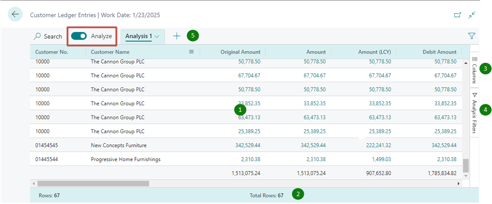
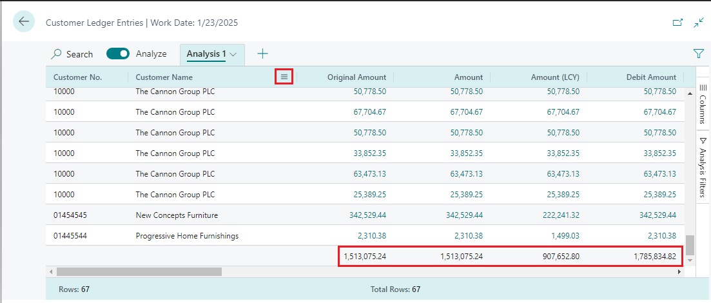
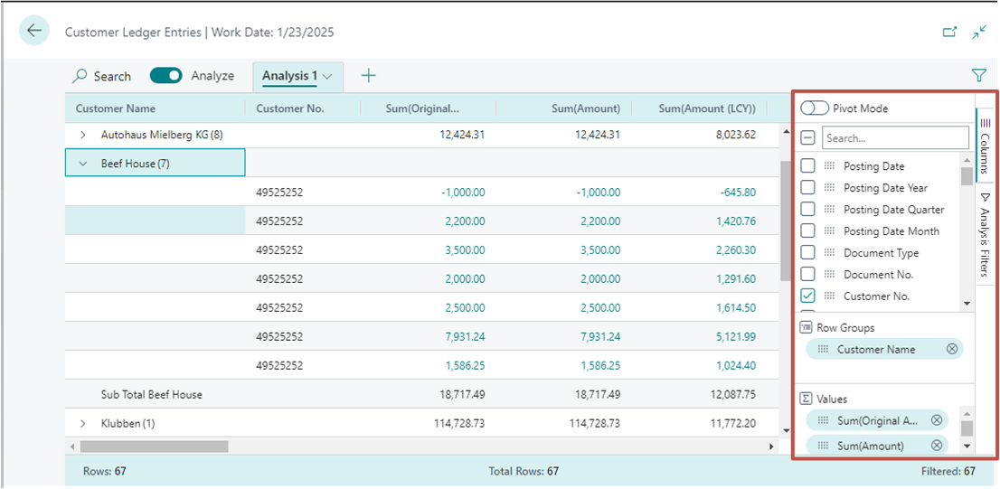
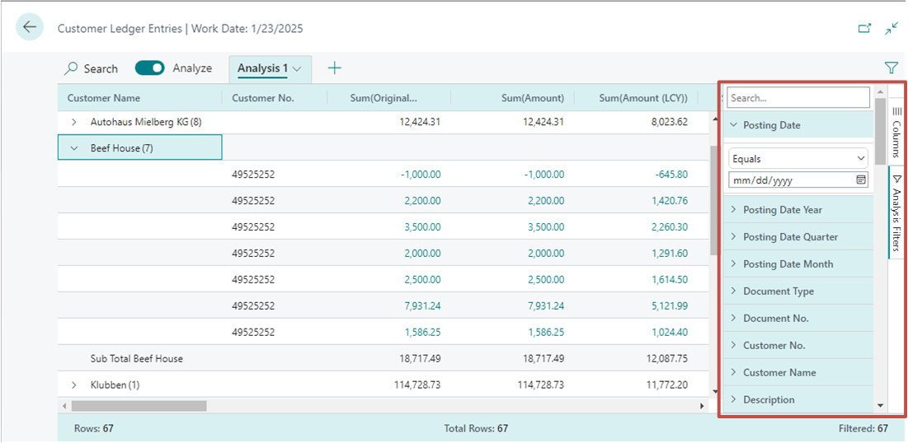
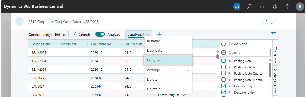
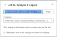

# Analyze list page and query data using data analysis mode

> **APPLIES TO:** Public preview in Business Central 2023 release wave 1 and later for analyzing list pages; Generally available in Business Central 2023 release wave 2 for analyzing data from list pages and queries.

In this article, you learn how to analyze data from list pages and queries using the *data analysis mode*. The data analysis mode enables you to analyze data directly from the page, without having to run a report or switch another application like Excel. It provides an interactive and versatile way to calculate, summarize, and examine data. Instead of running reports using different options and filters, you can add multiple tabs that represent different tasks or views on the data. Examples could be "My customers", "Follow up items", "Recently added vendors", "Sales statistics", or any other view you can imagine.

> [!TIP]
> A good thing about the data analysis mode is that it doesn't change any of the underlying data of list page or query, or the layout of the page or query when it's not in data analysis mode. So the best way to learn about what you can do in the data analysis mode is to try things out.

## Prerequisites 

- If you're using Business Central version 22, the data analysis mode is in preview. So, an admin must enable it before you can use it. To enable it, go to the **Feature Management** page and switch on **Feature Update: Analysis mode, quickly analyze data directly in Business Central**. [Learn more about Feature Management](/dynamics365/business-central/dev-itpro/administration/feature-management).
- In version 23 and later, your account must be assigned the **DATA ANALYSIS - EXEC** permission set or include execute permission on the system object **9640 Allow Data Analysis mode**. As an admin, you can exclude these permissions on users who you don't want to have access to the analysis mode.

> [!NOTE]
> You may notice some list pages that don't include the **Analyze** switch for changing to the analysis mode. The reason is that developers can disable analysis mode on specific pages by using the [AnalysisModeEnabled property](/dynamics365/business-central/dev-itpro/developer/properties/devenv-analysismodeenabled-property) in AL.

## Get started

1. Open the list page or query.

   For example, to work with **Customer Ledger Entries** page, select the  icon (<kbd>Alt</kbd>+<kbd>Q</kbd>), enter *customer ledger entries*, and then choose the related link. 

2. In the action bar at the top of the page, turn on the **Analyze** toggle switch.

    Data analysis mode opens the data in an experience that's optimized for data analysis.  While in data analysis mode, the normal action bar is replaced with a special data analysis mode bar. The following figure illustrates the different areas of a page in the data analysis mode.

   

   Each area is explained in the sections that follow.

3. Use the different areas to manipulate, summarize and analyze data. See the sections that follow for details.

4. When you want to exit the analyze mode, turn off the **Analyze** toggle switch.

   The analysis tabs that you've added remain until you delete them. So if you return to the data analysis mode again, you see them exactly as you left them.

> [!NOTE]
> The data shown in analysis mode is controlled by the filters or views set on the list page. This allows you to pre-filter data before entering analysis mode.

## Work with data analysis mode

In the data analysis mode, the page is divided into two areas:

- The main area, which consists of the data area (1), summary bar (2), and tabs bar (5)
- The data manipulation area, which consists of two panes: columns (3) and analysis filters (4).

### Data area (1)

The data area is where the rows and columns of the list page query are shown and data is summarized. The data area provides a versatile way to control of the layout of columns and a quick way to get a summary of the data. For columns that contain numeric values, the sum of all values in the column is shown in a last row, unless you've defined row groups. In this case, the sums appear as a subtotal for the groups.  

- To move a column, select it and drag it to where they make the most sense in your analysis.
- To sort on a column, select the column header. To sort on multiple columns, select and hold <kbd>Shift</kbd> key while selecting the column headers want to sort on.
- Right-click the column or hover over it and select the menu icon  to access several actions that you can do on columns. For example:

  - To pin a column to the left or right of the data area so that it doesn't move off the screen when you scroll, select  > **Pin column** > **Pin left** the column part.
  - Define data filters directly on the column definition instead of going to the **Analysis Filters** panes. You can still peek in on details about related data and for each line, and open the card to learn more about a given entity.
- Use the data area to interact with the data. For columns that contain numeric, summable values, you can get descriptive statistics on a set of fields by marking them. The statistics appear in the status bar (2) along the bottom of the page.
- Export data in Excel or csv format. Right-click on the data area or a selection of cells to export.

### Summary bar (2)

The summary bar is along the bottom of the page and displays statistics about the data in the list page or query. As you interact with columns whose values can be summed, like selecting multiple rows in a column that displays amounts, the data updates.

The following table describes the different numbers that are shown in the totals area:

|Number|Description|
|-|-|
|Rows|The number of selected rows as a part of the total number of available rows. |
|Total rows|The numbers of rows in the unfiltered list or query.|
|Filtered|The number of rows displayed as a result of the filters applied to the list or query.|
|Average|The average value in all the selected summable fields.|
|Count|The number of selected rows.|
|Min|The minimum value in all the selected summable fields.|
|Max|The maximum value in all the selected summable fields.|
|Sum|The sum total of all the values in the selected summable fields.|

### Columns (3)

The **Columns** is one of two panes that work together to define your analysis. The other area is the **Analysis filters** pane. The **Columns** pane is used to summarize the data. Use the **Columns** pane to define which columns should be included in the analysis.

|Areas|Description|
|-|-|
|Search/check or clear all boxes|Search for columns. Select the check box to select/clear all columns.|
|Check boxes|This area includes a check box for each field in the list's or query's source table. Use this area to change what columns are shown. Select a check box to show column for the field on the page; clear the check box to hide the column. |
|Row groups|Use this area to group and sum data by one or more fields. You can only include non-numeric fields, like text, date and time fields. Row groups are used often in pivot mode.|
|Values|Use this area to specify fields that you want a sum total for. You can only include fields that contain numbers that can be added together; for example, not text, date, or time fields.|

To move a field from one area to another, select the grab icon  next to the column in the list and drag into the target area. You're prevented from moving a field into an area where's it's not allowed.

### Analysis filters (4)

The **Analysis filters** pane lets you set further data filters on columns to limit the entries in the list. Set filters on columns to limit the entries in the list and subsequent sums to only those entries you're interested in based on a criteria you define. For example, suppose you're only interested in data for a specific customer or sales orders that exceed a specific amount. To set a filter, select the column, choose the comparison operation from the list (like **Equals** or **Starts with**), then enter the value.

> [!NOTE]
> The additional filters only apply to the current analysis tab. This allows you to define exactly the extra data filters that are needed for a specific analysis.

### Tabs (5)

The tabs area at the top lets you create different configurations (columns and analysis filters) on separate tabs, where you can manipulate data on the tabs independently of each other. There's always at least one tab, called **Analysis 1** by default. Adding more tabs is beneficial for saving frequently used analysis configurations on a dataset. For example, you might have tabs for analyzing data in the pivot mode, and other tabs that filter to a subset of rows. Some tabs might show a detailed view with many columns, and others only display a few key columns.

Here's some pointers on working with multiple analysis tabs:

- To add a new tab, select the large **+** sign next to the last analysis tab.
- Select the down arrowhead on a tab to access a list of actions you can do on a tab, like rename, duplicate, delete, and move.

   - **Delete** deletes the tab you currently have open. **Delete All** deletes all tabs that you've added, except the default **Analysis 1** tab.
- You can't completely remove the **Analysis 1**, but you can rename it by using the **Rename** action and clear the changes you've made by using **Delete** or **Delete All**.  

- The analysis tabs that you've added and configured remain until you delete them. So if you return to the data analysis mode again, you see them exactly as you left them.

   > [!TIP]
   > The tabs that you set up are only visible to you. Other users will only see tabs they've set up.
- You can copy analysis tabs. Copying can be useful if you want to experiment with changing a tab without changing the original, or if you want to create different variations of the same analysis.

## Date hierarchies

In analysis mode, date fields of the dataset are generated in a Year-Quarter-Month hierarchy of three separate fields. This hierarchy is based on the normal calendar, not any fiscal calendars defined in Business Central.

The extra fields are named _\<field name\> Year_, _\<field name\> Quarter_, and _\<field name\> Month_. For example, if the dataset includes a field called _Posting Date_, then the corresponding date hierarchy consists of fields called _Posting Date Year_, _Posting Date Quarter_, and _Posting Date Month_.

> [!NOTE]
> The date hierarchy currently only applies to fields of type date, not for fields of type datetime.

## Pivot mode

You can use pivot mode to analyze large amount of numerical data, subtotaling data by categories and subcategories. The pivot mode is like [pivot tables in Microsoft Excel](https://support.microsoft.com/office/create-a-pivottable-to-analyze-worksheet-data-a9a84538-bfe9-40a9-a8e9-f99134456576).

To turn the pivot mode on and off, slide the **Pivot mode** switch in the **Columns** pane (3). When you turn on the pivot mode, the **Column labels** area appears in the pane. Use the **Column labels** area to group sum totals for rows into categories. Fields that you add to the **Column labels** area show as columns in the data area (1).

Building out the data analysis in pivot mode involves moving fields into the three areas: **Row groups**, **Columns labels**, and **Values**. The following figure illustrates where the fields map to the data area (1), where `sum` is the calculated data, and optionally **Values**.

<table>
<tr><th></th><th>Column label</th><th></th><th>Column label</th><th></th></tr>
<tr><th>Row group</th><th>Value</th><th>Value</th><th>Value</th><th>Value</th></tr>
<tr><td>row</td><td>sum</td><td>sum</td><td>sum</td><td>sum</td></tr>
<tr><td>row</td><td>sum</td><td>sum</td><td>sum</td><td>sum</td></tr>
<tr><td>row</td><td>sum</td><td>sum</td><td>sum</td><td>sum</td></tr>
<tr><td>row</td><td>sum</td><td>sum</td><td>sum</td><td>sum</td></tr>
</table>

> [!TIP]
> Columns that only have a few possible values are the best candidates for using in column **Values**.

## Analyze large amounts of data

If the dataset you want to analyze exceeds 100,000 rows, you're suggested to enter an analysis mode that's optimized for large datasets. There are currently two limitations if you switch to this mode: 

- Formatting of fields of the following four data types might change: 

   - currency 
   - decimals (always shown with two decimals) 
   - dates (always shown in the format YYYY-MM-DD)
   - timezones
- Fields that are used in pivot mode and added to column labels must have a low number of distinct values.

   If you enable pivot mode and drag a field into **Column labels** area, where the underlying data for that field has too many distinct values, then the browser tab might become unresponsive and will eventually close, requiring you to start over in a new session. In this case, either don't pivot on that field or set a filter on the field prior to adding it to the **Column labels** area.

## Share data analysis

After you’ve prepared an analysis on a tab, you can share it as a link with coworkers and others in your organization directly from the client. Only recipients that have permission to the company and the data can use the link.

1. On the analysis tab, select the down arrowhead, and then select **Copy link**.

   

   The **Link to \<tab name\>** dialog opens.

1. By default, the analysis you share will link to the page or query in the company you're currently working in, which is indicated by `company=<company_name>` in the URL field next to the **Copy** button. If you want to send a link to an analysis that's not associated with a specific company, set the **Company:** field to **Do not link to a specific company**.

   

1. Select **Copy**.

1. Paste the link into the communication media of your choice, like Word, Outlook, Teams, OneNote, and so one. 

2. Once received, recipients can then select the link and open the analysis for the page or query in Business Central. They're prompted to specify a name for the new analysis tab that will be created.  

## Limitations in 2023 release wave 1 (preview)

The public preview of this feature has the following limitations:

- The analysis mode view has a limit of 100,000 rows. If you exceed this limit, you'll get a message telling you so. To work around this limitation, the set filters on the page before you switch to analysis mode, if it's possible. For example, maybe you want to analyze a certain group of customers or only want data from the current year. You can also choose a predefined view if it would work for your analysis.
- The share data analysis feature isn't available.
- The ability to save preferred data analysis choices on list pages and save analysis menus per analysis tab are currently not available.

## See also

[Ad-hoc Data Analysis](reports-adhoc-analysis.md)  
[View and Edit in Excel](across-work-with-excel.md)  
