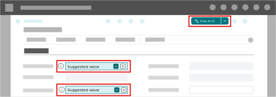

# Autofill fields with Copilot (preview)

[!INCLUDE [preview-banner](~/../shared-content/shared/preview-includes/preview-banner.md)]

Copilot's autofill feature assists you by automatically filling in editable blank fields on your page. Use autofill when creating or modifying a record to get suggestions for field values that you can choose to keep or discard. These suggestions can be based on your Business Central data, AI-generated, or based on information from the web.

When Copilot generates suggestions, it only accesses the business data you can access. Copilot never saves suggestions automatically but presents them for you to decide what to keep. Copilot uses AI, and suggestions might not be correct.

[!INCLUDE [preview-note](~/../shared-content/shared/preview-includes/production-ready-preview-dynamics365.md)]

<!-- [!INCLUDE [preview-note](~/../shared-content/shared/preview-includes/preview-note-d365.md)]-->

## Prerequisites

- Autofill is activated, and you have the required permissions to use it. Learn more in [Configure Copilot and agent capabilities](enable-ai.md).
- To enhance suggestions with results from the web, turn on **Enable Bing Search** in the **Copilot and agent capabilities** page. Learn more in [Searching the web with Copilot](ai-search-web-copilot.md).

## Supported languages

[!INCLUDE[copilot-language-support-en-only](includes/copilot-language-support-en-only.md)]

## Availability

### Where the autofill feature is available

The autofill feature is available on card and document pages, like a **Customer card** or a **Sales Order**, and only on editable fields in FastTabs on these pages, except for the fields listed in the following section.

> [!NOTE]  
> Autofill works on editable fields in FastTabs added to card and document pages by add-on apps (extensions).

### Where the autofill feature isn't available

The autofill feature isn't available on these types of pages:

- List pages like **Customers** and **Sales Orders**.
- Worksheet pages like the **Put-away Worksheet**.
- Setup pages, like **Company information** and **General Ledger Setup**, and assisted setup pages, like **Set up sales tax** and **Set up outgoing email**.
- Task dialogs.

The autofill feature isn't available on these fields regardless of the page type:

- Noneditable fields.
- Fields in the FactBox pane.
- Fields in rows and columns.
- Multiline text fields.
- Masked fields like passwords and secrets.
- Date and time fields.
- Currency code fields.
- Fields that uniquely identify a record like IDs and numbers from a series.
- Certain fields depending on your Business Central environment settings. For example, Copilot can't make suggestions for address fields until your admin enables Bing Search with Copilot.
- Toggle switches.

## Use autofill on fields

Open the page for editing, select a field, and then select the  **Suggest a value for this field and related fields** icon or press <kbd>Alt</kbd>+<kbd>I</kbd>. If the icon doesn't appear, autofill isn't available for the field, so try another field.

Suggestions are generated only for fields in the FastTab that you are on. When Copilot finds suggestions, they're automatically entered in the fields in italics along with the  **Show details** icon. Fields remain unchanged if suggestions aren't found or they don't support the autofill feature.

When you hover over or select a field that includes a suggestion, the  **Accept the suggestion** and  **Discard the suggestion** buttons appear.

### Review suggestions

Review the suggestion for each field and take appropriate action. Suggestions aren't saved until you accept them.

- To learn more about a suggestion, select the  **Show details** icon next to the field, or press <kbd>Alt</kbd>+<kbd>Up arrow</kbd>. The details include the source of the suggestion, like the most frequently or recently used value. Use the thumbs-up and thumbs-down icons to give feedback.

  Suggestions that originate from searching the web include a reference link to the source website where the suggested field information was found. This link opens the source website in a new browser tab.
- To keep a suggestion, select  **Accept the suggestion** or press <kbd>Enter</kbd>.
- To reject a suggestion and keep the original value, select  **Discard the suggestion** or press <kbd>Delete</kbd>.
- To change a suggestion, select **Change** in the details or press <kbd>F2</kbd>.

You can also use the **Keep all** button in the upper right corner of the page to accept or discard suggestions on all fields.

When you leave the page while there are unaccepted suggestions, Copilot asks you to accept or discard suggestions first.

<!--The first time you use Copilot, you're asked to accept the terms to continue.-->

## How Copilot provides suggestions

[!INCLUDE[autofill-suggestions-source](includes/autofill-suggestions-source.md)]

## About web search

> [!IMPORTANT]
> Copilot can autofill with suggestions from the web from update 26.4 onwards, initially in Sandbox environments only.

When Copilot searches the web on your behalf, it looks for publicly available information that could be used to fill out certain fields, saving you time and the need for app-switching. This process is similar to what you do manually: open a new browser tab, navigate to your favorite search engine, search for key terms, browse the top resulting websites, and finally copy the relevant information into Business Central. Copilot performs these steps automatically, but only for fields that might typically contain public domain information, and always indicates the source website where it found that information. 

For example, when you enter information in Business Central about a vendor, Copilot might suggest the full address, phone number, website, and registration number for that vendor.

> [!TIP]
> To try out or demonstrate Copilot's ability to search the web in an evaluation company, create a new vendor or customer record named "Adventure Works". Set the record's **Country/Region Code** field to **US**. Asking Copilot to autofill the address and contact details should result in Copilot suggesting field values from [www.adventure-works.com](https://www.adventure-works.com), a Microsoft-owned website with demonstration data for a fictitious company.

## Autofill behavior with other data-entry features

Business Central offers many other features that reduce data entry, such as customer templates and business process settings that default values. On some pages, for example, when you specify the value for a field, Business Central validates and automatically sets related fields, like zip code, and country/region. Unlike Copilot, these features don't use AI, and values are saved immediately.

If both Copilot and another feature set a value for the same field, the other feature's value overrides and discards Copilot's suggestion.

## Related information

[Responsible AI FAQ for autofill (preview)](faqs-autofill.md)  
[Configure Copilot and agent capabilities](enable-ai.md)  
[Troubleshoot Copilot and agent capabilities](ai-copilot-troubleshooting.md)  
[Searching the web with Copilot](ai-search-web-copilot.md)  
[Keyboard shortcuts](keyboard-shortcuts.md)
