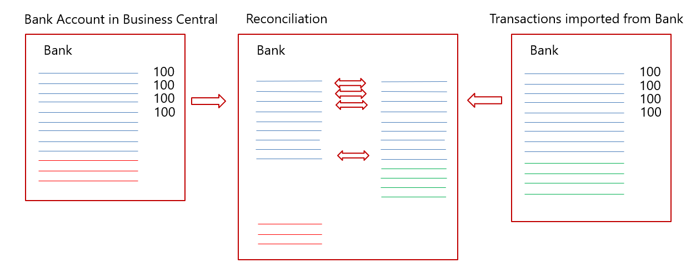
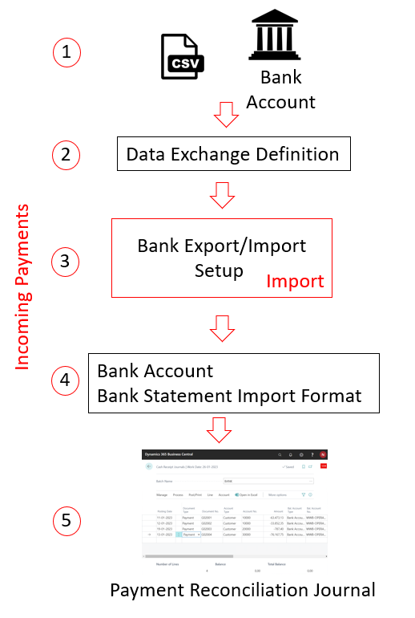
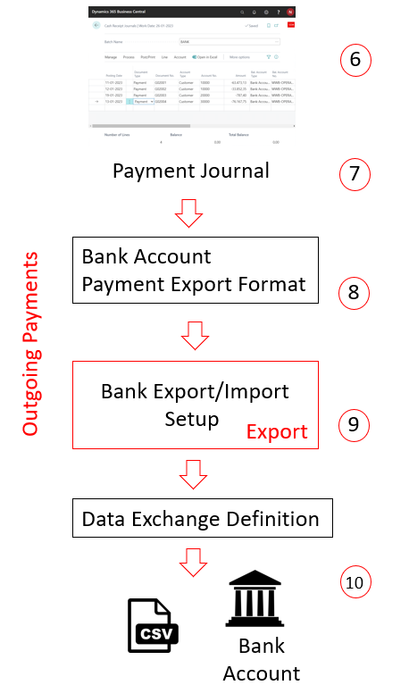

# Set up bank accounts

Use bank accounts in [!INCLUDE[prod_short](includes/prod_short.md)] to keep track of your banking transactions. Accounts can be denominated in your local currency or a foreign currency. After you set up bank accounts, you can also print checks. Bank accounts also offer features for [payment reconciliation](receivables-apply-payments-auto-reconcile-bank-accounts.md), [bank reconciliation](bank-how-reconcile-bank-accounts-separately.md), and the import and export of bank files.

You can include bank accounts in transactions in general journal. Each bank account links to an account in the chart of accounts through the assigned bank account posting group. Using a bank account in a payment transaction automatically creates an entry in both the bank account and the connected general ledger (G/L) account.  

Bank accounts work differently depending on whether a currency code is specified:

- If a currency code isn't specified, all transactions in the bank account are in the local currency (LCY) for the current company. If you make a transaction for the account in another currency, the amounts post to the account in LCY based on the currency exchange rate. Any checks issued from this account must be in LCY. If the bank account is used in a journal, the journal line automatically uses the blank currency code.  
  
- If a currency code is specified, all transactions made to this account, and all checks issued from it, must use the same currency as the account.

You can save time on data entry by making a bank account the default account to use for the currency specified for the account. If you do, the account is assigned to sales and service documents that use the currency. To make the account the default for sales and service documents, on the **Bank Account Card** page, turn on the **Use as Default for Currency** toggle. If needed, you can choose a different account when you're working on a document.

A bank account is an integral part of [!INCLUDE[prod_short](includes/prod_short.md)] and plays a role in many other capabilities. The following illustration shows the most important relations:

Creating a bank account makes it available in all the places shown in the illustration, and are mirrored in the G/L account and on the **Company Information** page.

Bank accounts are often monitored daily to ensure new payments from customers are registered as quickly as possible. Registering payments quickly helps ensure a customer's actual status is reflected in [!INCLUDE[prod_short](includes/prod_short.md)]. Keeping the status of customer payments current helps sales people, accountants, and other employees making unnecessary calls regarding overdue invoices or delays in shipments.  

Another task is to import vendor currency payments with the realized currency rates to make sure that the actual status of the vendors is up-to-date. Using the [payment reconciliation](receivables-apply-payments-auto-reconcile-bank-accounts.md) capability is the easiest way to do that. In the **Payment Reconciliation Journal**, you can import bank transactions directly from an online bank application and post them more or less automatically. The journal automatically identifies and posts the following transactions:  

- Direct debit payments from customers.  
- Customer payments of single invoices.  
- Lump-sum payments from customers.  
- Customer payments in foreign currencies.  
- Vendor payments.  
- Vendor payments in foreign currency.  
- Vendor payments and subscriptions that are recurring.  
- Bank charges and interests.  

Payment reconciliation provides significant time savings in posting incoming and outgoing payments. However, the transactions on the bank account in [!INCLUDE[prod_short](includes/prod_short.md)] aren't considered 100% correct until you run a bank reconciliation.  

Bank reconciliation is how you make sure that the bank account in [!INCLUDE[prod_short](includes/prod_short.md)] matches the external account at the bank.  

 

In the illustration, the left side represents the bank account in [!INCLUDE[prod_short](includes/prod_short.md)], and the rightmost side represents transactions imported from the bank through the online bank application. The diagram in the middle shows the transactions from both sides that make up the bank reconciliation.

From the bank account in [!INCLUDE[prod_short](includes/prod_short.md)], most transactions should be known to the physical bank. The few exceptions include the following cases:  

- Corrections posted in [!INCLUDE[prod_short](includes/prod_short.md)].  
- Checks issued that aren't cashed.
- Vendor payments not yet approved by the bank.  

From the physical account at the bank, transactions not identified in the payment reconciliation journal arrive all the time, such as the following transactions:  

- New vendor subscriptions  
- Customer payments without description
- Bank interest
- Bank charges
- Credit card charges not yet reported

The better you are at mapping information in the payment reconciliation journal, the more transactions are posted automatically and the easier periodic bank reconciliation becomes.

The following video shows the basic steps to set up a bank account in [!INCLUDE[prod_short](includes/prod_short.md)].

  

> [!Video https://learn-video.azurefd.net/vod/player?id=047a5a25-1f7d-423d-b96d-c4ea45042779]

> [!WARNING]
> Some fields may contain sensitive data, such as the **Bank Branch No.**, **Bank Account No.**, **SWIFT Code**, and **IBAN Code** fields. Learn more at [Monitor Sensitive Fields](across-log-changes.md#monitor-sensitive-fields).

## To set up bank accounts

1. Choose the  icon, enter **Bank Accounts**, then choose the related link.
2. On the **Bank Accounts** page, choose the **New** action.
3. Fill in the fields as necessary. [!INCLUDE[tooltip-inline-tip](includes/tooltip-inline-tip_md.md)]

    An example would be the **Bank Acc. Posting Group** field that connects the bank account to the underlying G/L account in the balance sheet. Learn more at [Set Up Posting Groups](finance-posting-groups.md).

> [!TIP]
> Some fields are hidden until you choose the **Show more** action, typically because they are rarely used. Others must be added through personalization. Learn more at [Personalize Your Workspace](ui-personalization-user.md).

You can create as many bank accounts as you need for your business. For each bank account, you must specify information that makes the bank account uniquely identifiable. This information includes the bank's geographical address; number series for different types of transactions, such as direct debit and credit transfers; the currency amounts are specified in; and information used for importing bank statements. [!INCLUDE[tooltip-inline-tip](includes/tooltip-inline-tip_md.md)]
<!--
The following table explains key fields.

|Field|Description|  
|---------------------------------|---------------------------------------|  
|**General FastTab**||
|No.|Specifies the number of the bank account, according to the specified number series. If the number series allow manual numbering, any alphanumeric code up to 20 characters can be used.|
|Name|The Name of the bank holding the account.|
|Bank Branch No.|Typically used to identify the bank branch in domestic payments, it's very often considered a sensitive field. Learn more at [Monitoring Sensitive Fields](across-log-changes.md#monitoring-sensitive-fields).|
|Bank Account No.|Typically used to identify the bank account number in domestic payments, it's very often considered a sensitive field. Learn more at [Monitoring Sensitive Fields](across-log-changes.md#monitoring-sensitive-fields).|
|Balance|Shows the bank account balance in the account currency.|
|Balance (LCY)|Shows the bank account balance in the local currency (LCY).|
|Our Contact Code|Specifies a code to identify the employee responsible for this bank account. The employee must be created in the **Salesperson/Purchaser** table.|
|Blocked|Specifies the related record is blocked from being posted in transactions, for example the account is obsolete after a bank change.|
|SEPA Direct Debit Exp. Format|Specifies the single euro payments area (SEPA) format of the bank file to be exported when you choose **Create Direct Debit File** on the **Direct Debit Collect. Entries** page. Learn more at [SEPA Direct Debit in Business Central](finance-collect-payments-with-sepa-direct-debit.md).|
|Credit Transfer Msg. Nos.|Specifies the number series for bank instruction messages created with the export file you create from the **Direct Debit Collect. Entries** page. Learn more at [SEPA Direct Debit in Business Central](finance-collect-payments-with-sepa-direct-debit.md).|
|Direct Debit Msg. Nos.|Specifies the number series to be used on the direct debit file you export for a direct debit collection entry on the **Direct Debit Collect. Entries** page. Learn more at [SEPA Direct Debit in Business Central](finance-collect-payments-with-sepa-direct-debit.md).|
|Creditor No.|Specifies your company as the creditor in connection with payment collection from customers using SEPA direct debit. Learn more at [SEPA Direct Debit in Business Central](finance-collect-payments-with-sepa-direct-debit.md).|
|Bank Clearing Standard|The national bank names register used for the sender bank account.|
|Bank Clearing Code|Specifies the code for bank clearing required according to the format standard you selected in the **Bank Clearing Standard** field. The bank clearing code can be used as an alternative to SWIFT and IBAN to identify your bank as the sender of a bank transfer.|
|Last Date Modified|Date of the latest modification of the bank account.|
|**Payment Matching**||
|Disable Automatic Payment Matching|Specifies whether or not to disable automatic payment matching after importing bank transactions for this bank account. Learn more at [Payment Reconciliation](receivables-apply-payments-auto-reconcile-bank-accounts.md).|
|**Payment Match Tolerance**||
|Match Tolerance Type|Specifies the tolerance the automatic payment application function will use to apply the *Amount Incl. Tolerance Matched* rule for this bank account. Read more in [Payment Reconciliation](receivables-apply-payments-auto-reconcile-bank-accounts.md).|
|Match Tolerance Value|Specifies if the automatic payment application function will apply the *Amount Incl. Tolerance Matched* rule by percentage or amount. Learn more at [Payment Reconciliation](receivables-apply-payments-auto-reconcile-bank-accounts.md).|
|**Hidden Fields**||
|Search Name|Specifies an alternate name you can use to search for the record in question when you can't remember the value in the **Name** field.|
|Min. Balance|Specifies a minimum balance for the bank account. This field is for information purposes only.|
|Positive Pay Export Code|Specifies a code for the data exchange definition managing the export of positive-pay files. Learn more at [Export Positive Pay Files](finance-how-positive-pay.md).|
|**Communication FastTab**||
|Address|The address of the bank branch.|
|Address 2|An additional address field for the bank branch.|
|Post Code|The post code of the bank branch.|
|City|The city of the bank branch.|
|Country/Region Code|The country/region code of the bank branch.|
|Phone No.|The phone number of the bank branch.|
|Mobile Phone No.|The mobile phone number of the bank branch.|
|Contact|The main contact in the bank branch. Additional contacts can be created in the **Contacts** module.|
|Fax No.|The fax number of the bank branch.|
|Email|The email address of the bank branch.|
|Home Page|The home page address of the bank branch website.|
|**Posting FastTab**||
|Currency Code|Specifies the relevant currency code for the bank account. Applying a currency code to a bank account limits all transactions to only using the applied currency code. Leaving the currency code blank allows transactions in all currencies, however, the amount will eventually be converted to the LCY using the applied currency rate. Checks issued from this account follow the same rules.|
|Last Check No.|The number of the latest check issued from this account.|
|Transit No.|Specifies a bank identification number of your own choice.|
|Last Statement No.|The number of the latest bank reconciliation posted to this account. Learn more at [Reconcile Bank Accounts](bank-how-reconcile-bank-accounts-separately.md).|
|Last Payment Statement No.|The number of the latest payment reconciliation posted to this account. Learn more at [Payment Reconciliation](receivables-apply-payments-auto-reconcile-bank-accounts.md).|
|Last Bank Statement|The ending balance of the last bank statement. Learn more at [Reconcile Bank Accounts](bank-how-reconcile-bank-accounts-separately.md).|
|Bank Acc. Posting Group|Specifies a code for the bank account's posting group. The **Bank Acc. Posting Group** connects the bank account to the G/L account in the balance sheet.|
|**Transfer**||
|Transit No.|Specifies a bank identification number of your own choice.|
|SWIFT Code|Specifies the international bank identifier (SWIFT) code of the bank in which you have account. The SWIFT code is very often considered a sensitive field. Learn more at [Monitoring Sensitive Fields](across-log-changes.md#monitoring-sensitive-fields).|
|IBAN|Specifies the bank account's international bank account number (IBAN). The IBAN code is very often considered a sensitive field. Learn more at [Monitoring Sensitive Fields](across-log-changes.md#monitoring-sensitive-fields).|
|Bank Statement Import Format|Specifies the format of the bank statement file imported into this bank account. This format is used in both the payment reconciliation journals and bank account reconciliations.|
|Payment Export Format|Specifies the format of the bank file that is exported when you choose **Export Payments to File** on the **Payment Journal** page.|
-->

## To enter an opening balance

To fill in the **Balance** field with an opening balance, you must post a bank account ledger entry with the amount in question. You post the entry through a bank account reconciliation. Learn more at [Reconcile Bank Accounts](bank-how-reconcile-bank-accounts-separately.md).  
>
> Alternatively, you can implement the opening balance as part of general data creation in new companies using the **Migrate Business Data** assisted setup guide. Learn more at [Getting Ready for Doing Business](ui-get-ready-business.md).  

> [!IMPORTANT]
> Don't post the opening balance directly to the general ledger. Entries in the G/L account that were posted directly to it typically prevent you from reconciling the bank account. With foreign currency bank accounts, direct posting results in differences that accumulate as you post more bank reconciliations. Usually, you post the opening bank balance directly to the bank account, and the amount ends up in the G/L account. Alternatively, later you can reverse it out of the G/L account you use to balance the opening general ledger balance. In either case, you must balance any direct posting to the G/L account before you start your first bank reconciliation&mdash;especially if the bank account is in a foreign currency.

## To set up your bank account for import or export of bank files

The fields related to the import and export of bank feeds and files are on the **Transfer** FastTab on the **Bank Account Card** page. Learn more at [Using the AMC Banking 365 Fundamentals Extension](ui-extensions-amc-banking.md) and [Set Up the Envestnet Yodlee Bank Feeds Service](bank-how-setup-bank-statement-service.md).

1. Choose the  icon, enter **Bank Accounts**, then choose the related link.
2. Open the card for the bank account to export or import bank files for.
3. On the **Transfer** FastTab, fill in the fields as necessary. [!INCLUDE[tooltip-inline-tip](includes/tooltip-inline-tip_md.md)]

> [!NOTE]  
> Different file export services and their formats require different setup values on the **Bank Account Card** page. You'll be informed of wrong or missing setup values when you export the file. Read the short descriptions of the fields carefully or refer to the related procedure topics. For example, exporting a payment file for North American electronic funds transfer (EFT) requires that both the **Last Remittance Advice No.** and the **Transit No.** fields be filled in. Learn more at [Export Payments to a Bank File](finance-make-payments-with-bank-data-conversion-service-or-sepa-credit-transfer.md#exporting-payments-to-a-bank-file).

The fields on the **Transit** FastTab on the bank account serve different purposes, depending on whether the payment is inbound or outbound.

The following illustration shows the route of inbound payments. The numbers in the description correspond with the numbers in the illustration.

:::row:::
    :::column:::

1. The transactions are exported from the bank account in either a human-readable .csv format or the bank's own format.
2. The data exchange definition maps the information in the file to the fields in [!INCLUDE[prod_short](includes/prod_short.md)]. Learn more at [Set Up Data Exchange](across-set-up-data-exchange.md)
3. The data export/import setup defines the export or import, and links to the data exchange definition.
4. The bank statements import format links the import setup to the bank account.
5. The payments are imported through the **Payment Reconciliation Journal** or the **Bank Account Reconciliation** page.

  :::column-end:::
  :::column:::

        

  :::column-end:::
:::row-end:::

Incoming payments are always imported through the **Payment Reconciliation Journal** or directly into the **Bank Account Reconciliation** page. In contrast, outgoing payments can originate from any payment journal. The only prerequisite is that the **Allow Payment Export** field in the relevant payment journal batch must be selected.

The following illustration shows the route of outbound payments. The numbers in the description correspond with the numbers in the illustration.

:::row:::
    :::column:::

6. The transactions populate in a payment journal that was prepared for exporting payments to file.
7. The bank statements import format links the import setup to the bank account.
8. The data export/import setup defines the export or import, and links to the data exchange definition.
9. The data exchange definition maps the information in the file to the fields in [!INCLUDE[prod_short](includes/prod_short.md)]. Learn more at [Set Up Data Exchange](across-set-up-data-exchange.md)
10. The payments are exported from the payment journal and imported into the bank account.

  :::column-end:::
  :::column:::

        

  :::column-end:::
:::row-end:::

## To set up vendor bank accounts for export of bank files

Fields on the **Transfer** FastTab on the **Vendor Bank Account Card** page are related to the export of bank feeds and files. Learn more at [Use the AMC Banking 365 Fundamentals extension](ui-extensions-amc-banking.md) and [Export Payments to a Bank File](finance-make-payments-with-bank-data-conversion-service-or-sepa-credit-transfer.md#exporting-payments-to-a-bank-file).

[!INCLUDE[purchase-vendor-bank-account](includes/purchase-vendor-bank-account.md)]

## Changing your bank account

To use a different bank account for your business, you must create the new bank account in [!INCLUDE[prod_short](includes/prod_short.md)]. We recommend that you don't just replace the information about the account you're currently using because that can cause incorrect data. For example, your opening balance might be incorrect or your bank feed might stop working correctly. It's important that you keep the current and new accounts separate.

After you create the new bank account, you should also create a new bank posting group and assign it to a new general ledger account. You can reuse an existing bank posting group, and bank transactions are posted to the same general ledger accounts as other bank accounts sharing that bank posting group. However, we recommend that you create a new bank posting group and general ledger account so that reconciliations are easier to do.

> [!NOTE]
> Remember that the bank account information on open sales invoices still shows the original bank account. Accordingly, payments are likely to still be posted to that account. We recommend that you keep both accounts active for a period of time after the change.

To get a more condensed view of your cash accounts in financial reporting, use the **Begin-Total** and **End-Total** accounts in your chart of accounts, the **Totaling** rows in financial reports, or G/L account categories. Learn more at [Business Intelligence and Financial Reporting](bi.md) section.

## Related information

[Setting Up Banking](bank-setup-banking.md)  
[Setting Up Posting Groups](finance-posting-groups.md)  
[Reconciling Bank Accounts](bank-manage-bank-accounts.md)  
[Set Up the Envestnet Yodlee Bank Feeds Service](bank-how-setup-bank-statement-service.md)  
[SEPA Direct Debit in Business Central](finance-collect-payments-with-sepa-direct-debit.md)  
[To set up your bank account for SEPA direct debit](finance-collect-payments-with-sepa-direct-debit.md#to-set-up-your-bank-account-for-sepa-direct-debit)  
[To set up a bank account for SEPA Credit Transfer](finance-make-payments-with-bank-data-conversion-service-or-sepa-credit-transfer.md#to-set-up-a-bank-account-for-sepa-credit-transfer)  
[Make Payments with the AMC Banking 365 Fundamentals Extension or SEPA Credit Transfer](finance-make-payments-with-bank-data-conversion-service-or-sepa-credit-transfer.md)  
[Payment Reconciliation](receivables-apply-payments-auto-reconcile-bank-accounts.md)  
[Understanding the General Ledger and the COA](finance-general-ledger.md)  
[Work with [!INCLUDE[prod_short](includes/prod_short.md)]](ui-work-product.md)

[!INCLUDE[footer-include](includes/footer-banner.md)]
