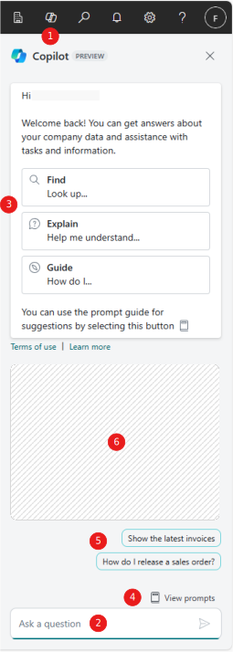
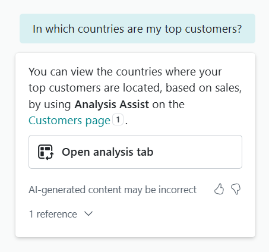

# Chat with Copilot (preview)

[!INCLUDE [preview-banner](~/../shared-content/shared/preview-includes/preview-banner.md)]

This article explains how to chat with Copilot to get answers about your company data and assistance with tasks and subject matters related to Business Central.​

[!INCLUDE [preview-note](~/../shared-content/shared/preview-includes/production-ready-preview-dynamics365.md)]

## About chat with Copilot

Microsoft Copilot is an AI-powered assistant that helps spark creativity, boost productivity, and eliminate tedious tasks. By chatting with Copilot in Business Central, you can ask questions and find business data using natural language. Here's what you can do:

- Find business data for your company in Business Central. Use chat to look up and open data about entities or records related to business processes, such as customers, vendors, sales orders, and items. For example, ask: "Show me the latest sales order for Adatum".

  Copilot can also organize data for you. Just ask it to group records or do calculations like adding or averaging, and it generates an analysis tab, displaying the results. Learn more about prompting in [Prompting for aggregating data on analysis tabs](#prompting-for-aggregating-data-on-analysis-tabs).

- Get explanations or step-by-step guidance on various tasks. For example, ask: "Help me understand dimensions" or "How do I post a sales order?". You can also ask for explanations about the apps installed in your Business Central. For example, you can ask “how do I cancel hotel reservations?” if you installed a hotel management app.
- Know the purpose and use of each field. When you choose **Ask Copilot** in a tooltip for a field, chat opens with an Explain prompt for the field name and Copilot provides information about it. Copilot links to the articles it referenced, so it's easy to verify the description.
  
Using chat with Copilot streamlines your workflow by bypassing traditional navigation and product help. To learn more, watch [Work smarter with Copilot in Microsoft Dynamics 365 Business Central](https://go.microsoft.com/fwlink/?linkid=2250609).

Copilot's responses are generated from the official [Microsoft Dynamics 365 Business Central documentation](/dynamics365/business-central/) site or the documentation that accompanies the apps installed to Business Central.

## Prerequisites

- The **Chat** capability must be activated by an administrator. Learn more in [Configuring Copilot and agent capabilities](enable-ai.md).
- To get answers to questions about installed add-on apps, the **Enable Bing Search** option must be turned on in **Copilot and agent capabilities**. Learn more in [Searching the web with Copilot](ai-search-web-copilot.md).

## Get started using chat with Copilot

1. In the upper-right corner of the screen, select the  **Copilot** icon .

   The **Copilot** pane appears as shown in the image:

    

1. In the **Ask a question** box at the bottom , enter your question, and then select the arrowhead or press <kbd>Enter</kbd> to get an answer.

   Your input, known as a *prompt*, can be a question, statement, or command.

   > [!TIP]
   > Copilot includes a couple of features that can help you write questions:
   > - To help formulate questions, select one of the prompt guides&mdash;**Find**, **Explain**, or **Guide**&mdash;available at the top of the pane  or from the  **View Prompts**  icon above **Ask a question** box . Prompt guides are predefined short phrases that begin a question or prompt. They save you time, guide Copilot's responses toward a category of answers, and help you learn how to phrase questions to get the best responses.
   > - Select the prompt suggestions above the **View prompts** button  to automatically ask a predefined question to see how the questions and answers work. Prompt suggestions are only available when you're using the CRONUS demonstration company.

1. Review the answers displayed in the Copilot pane .

   The answers you receive depend on your question—it could include text, links to pages in Business Central, or helpful articles from Microsoft Learn.

   To assist you better, Chat might ask for more details about your prompt and give you a few options to choose from. In some instances, Chat follows an answer with related prompt suggestions for you to choose from .

1. Ask another question to refine the answer.

   Chat remembers the context, which means that you don't have to repeat key points from the original question.

## Clear chat to start over

To switch to a different topic with Copilot, select the  **Start a new Copilot chat session**  icon at the bottom of the Copilot pane, just above the question box. This clears Copilot's memory of your last few messages. Starting over is often helpful after a lengthy conversation and it can help Copilot deliver more accurate answers.

The chat also clears if you close or sign out of Business Central.

## Tips for better questions

### Basic techniques to improve the answers

Here are some ways you can improve the answers you get from Copilot:

- Ask clear and specific questions.
- Be concise and avoid long sentences or multiple sentences.
- Ask one question at a time. <!--Avoid asking about multiple questions in one message.-->
- Use natural language, expressing the questions in a friendly and conversational manner.
- Use keywords, phrases, and terms that you know are used in Business Central, either in the app or documentation.
- Ask follow-up questions or rephrase the last question if the initial response doesn't fully answer your questions.
- Clear the current chat session to start over if you're asking a question on a different subject matter than the previous question.

### Prompting for aggregating data on analysis tabs

If you prompt using phrases related to data aggregation, chat creates an analysis tab that you can open from a link it replies with in the Copilot pane. For example, the following figure illustrates an answer you could get for the prompt: "In which countries are my top customer?":

To generate this type of response, use common words and phrases related to data aggregation and analysis, like "group", "pivot", "sum", "average", "most", and "least", in different variations. For example:

`show me customers grouped by their country and zipcode`  
`which customers got most discounts`  
`group the current records by name and location`  

Learn more about analysis tabs in [Analyze data in lists with help from Copilot](analysis-assist.md).

### Example prompts

Your questions to Copilot vary depending on your role, current task, the processes that your organization follows, and how you express yourself in words. Here are some examples to show different ways to ask questions in the chat pane to help inspire you to write your own based on your situation.

Prompt: `Find the Item with Description 'ATHENS Desk'`

In this example, you give clear instructions for Copilot to locate a single record. For example, you hint that the record is found in the Item list. You indicate the field 'Description' must be a specific text that you typed using quotes and with correct capitalization. Copilot usually responds accurately when given a few precise hints, but you can also use more casual language as in the next example.

Prompt: `Give me the latest invoice for adatum`

In this example, you ask Copilot to locate a record, but the question is less precise and might result in a less accurate answer. Copilot can often understand, or guess, that the invoice you're looking for isn't a purchase invoice but a sales invoice from the Posted Sales Invoice list. Copilot would also need to match `adatum` with `Adatum Corporation` that is the full and precise name for the sell-to Customer name associated with the invoice.

Prompt: `Show me customer ledger entries for Adatum from about three weeks ago`

In this example, you ask Copilot to solve a common date puzzle that typically requires you to open a calendar for reference, or to use advanced date range filters. Copilot can usually understand common expressions and business terms.

Prompt: `How does I save my filterrings for later?`

In this example, you ask Copilot for guidance on how to perform some task in Business Central. Copilot can usually understand the intent of your question, even if there are a few grammatical errors, spelling mistakes or abbreviations.

Prompt: `How do I cancel a hotel reservation?`

In this example, you ask Copilot for guidance about custom functionality that happens to be provided by an add-on app or custom extension to Business Central. Copilot is often able to answer questions about customizations that you installed, including questions about fields, issues, pages, and business processes. For some domains, Copilot might interpret your question as unrelated to Business Central. You can improve the quality of the responses by including the name of the add-on app in your prompt, especially if you have multiple apps installed.

## Provide feedback on answers

You can rate the answers you get from Copilot by using the like (thumbs up) button for good rating or the dislike (thumbs down) button for a poor rating. When you select the dislike button, you can choose a reason, including inaccurate, inappropriate, or other. This information can help us improve suggestions.

## Related information

[Chat with Copilot FAQ](chat-with-copilot-faq.md)  
[Analyze data in lists with help from Copilot](analysis-assist.md)  
[Troubleshoot Copilot and agent capabilities](ai-copilot-troubleshooting.md)  
[Configure Copilot and agent capabilities](enable-ai.md)  
[Responsible AI FAQ for chat with Copilot](faqs-chat-with-copilot.md)  
[Resources for help in Business Central](product-help-and-support.md)  
[Changing the language](ui-change-basic-settings.md#language)  
