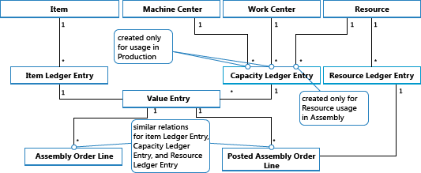

# Design Details: Assembly Order Posting
Assembly order posting is based on the same principles as when posting the similar activities of sales orders and production consumption/output. However, the principles are combined in that assembly orders have their own posting UI, like that for sales orders, while the actual entry posting happens in the background as direct item and resource journal postings, like that for production consumption, output, and capacity.  

Similarly to production order posting, the consumed components and the used resources are converted and output as the assembly item when the assembly order is posted. For more information, see [Design Details: Production Order Posting](design-details-production-order-posting.md). However, the cost flow for assembly orders is less complex, especially because assembly cost posting only occurs once and therefore does not generate work-in-process inventory.  

The following journal postings occur during assembly order posting:  

-   The item journal posts positive item ledger entries, representing output of the assembly item, from the assembly order header  
-   The item journal posts negative item ledger entries, representing consumption of assembly components, from the assembly order lines.  
-   The resource journal posts usage of assembly resources (time units), from the assembly order lines.  
-   The capacity journal posts value entries relating to the resource usage, from the assembly order lines.  

The following diagram shows the structure of item and resource ledger entries that result from assembly order posting.  

  

> [!NOTE]  
>  Machine and work centers are included to illustrate that capacity ledger entries are created from both production and assembly.  

The following diagram shows how assembly data flows into ledger entries during posting:  

  

## Posting Sequence  
The posting of an assembly order occurs in the following order:  

1.  The assembly order lines are posted.  
2.  The assembly order header is posted.  

The following table outlines the sequence of actions.  

|Action|Description|  
|------------|-----------------|  
|Initialize Posting|1.  Make preliminary checks. 2.  Add posting number and modify the assembly order header. 3.  Release the assembly order.|  
|Post|<ol><li>Create the posted assembly order header.</li><li>Copy comment lines.</li><li>Post assembly order lines (consumption):   <ol><li>Create a status page to calculate assembly consumption.</li><li>Get the remaining quantity on which the item journal line will be based.</li><li>Reset the consumed and remaining quantities.</li><li>For assembly order lines of type Item:   <ol><li>Populate fields on the item journal line.</li><li>Transfer reservations to the item journal line.</li><li>Post the item journal line to create the item ledger entries.</li><li>Create warehouse journal lines and post them.</li></ol></li><li>For assembly order lines of type Resource:   <ol><li>Populate fields on the item journal line.</li><li>Post the item journal line. This creates capacity ledger entries.</li><li>Create and post resource journal line.</li></ol></li><li>Transfer field values from the assembly order line into a newly created posted assembly order line.</li></ol></li><li>Post the assembly order header (output):   <ol><li>Populate fields on the item journal line.</li><li>Transfer reservations to the item journal line.</li><li>Post the item journal line to create the item ledger entries.</li><li>Create warehouse journal lines and post them.</li><li>Reset the assembly quantities and remaining quantities.</li></ol></li></ol>|  

> [!IMPORTANT]  
>  Unlike for production output, which is posted at expected cost, assembly output is posted at actual cost.  

## Cost Adjustment  
 Once an assembly order is posted, meaning that components (material) and resources are assembled into a new item, then it should be possible to determine the actual cost of that assembly item, and the actual inventory cost of the components involved. This is achieved by forwarding costs from the posted entries of the source (the components and resources) to the posted entries of the destination (the assembly item). The forwarding of costs is done by calculating and generating new entries, called adjustment entries that become associated with the destination entries.  

 The assembly costs to be forwarded are detected with the Order Level detection mechanism. For information about other adjustment detection mechanisms, see [Design Details: Cost Adjustment](design-details-cost-adjustment.md).  

### Detecting the Adjustment  
The order Level detection function is used in conversion scenarios, production and assembly. The function works as follows:  

-   Cost adjustment is detected by marking the order whenever a material/resource is posted as consumed/used.  
-   Cost is forwarding by applying the costs from material/resource to the output entries associated with the same order.  

The following graphic shows the adjustment entry structure and how assembly costs are adjusted.  

  

### Performing the Adjustment  
The spreading of detected adjustments from material and resource costs onto the assembly output entries is performed by the **Adjust Cost – Item Entries** batch job. It contains the Make Multilevel Adjustment function, which consists of the following two elements:  

-   Make Assembly Order Adjustment – which forwards cost from material and resource usage to the assembly output entry. Lines 5 and 6 in the algorithm below are responsible for that.  
-   Make Single Level Adjustments – which forwards costs for individual items using their costing method. Lines 9 and 10 in the algorithm below are responsible for that.  

  

> [!NOTE]  
>  The Make WIP Adjustments element, in lines 7 and 8, is responsible for forwarding production material and capacity usage to the output of unfinished production orders. This is not used when adjusting assembly order costs as the concept of WIP does not apply to assembly.  

For information about how costs from assembly and production are posted to the general ledger, see [Design Details: Inventory Posting](design-details-inventory-posting.md).  

## Assembly Costs are Always Actual  
 The concept of work in process (WIP) does not apply in assembly order posting. Assembly costs are only posted as actual cost, never as expected cost. For more information, see [Design Details: Expected Cost Posting](design-details-expected-cost-posting.md).  

This is enabled by the following data structure.  

-   In the **Type** field on item journal lines, in the **Capacity Ledger Entry** and **Value Entry** tables, *Resource* is used to identify assembly resource entries.  
-   In the **Item Ledger Entry Type** field on item journal lines, in the **Capacity Ledger Entry** and **Value Entry** tables, *Assembly Output* and *Assembly Consumption* are used to identify the output assembly item entries and the consumed assembly component entries respectively.  

In addition, posting group fields on the assembly order header and assembly order lines are populated by default as follows.  

|Entity|Type|Posting Group|Gen. Prod. Posting Group|  
|------------|----------|-------------------|------------------------------|  
|Assembly Order Header|Item|Inventory Posting Group|Gen. Prod. Posting Group|  
|Assembly Order Line|Item|Inventory Posting Group|Gen. Prod. Posting Group|  
|Assembly Order Line|Resource||Gen. Prod. Posting Group|  

Accordingly, only actual costs are posted to the general ledger, and no interim accounts are populated from assembly order posting. For more information, see [Design Details: Accounts in the General Ledger](design-details-accounts-in-the-general-ledger.md)  

## Assemble to Order  
The item ledger entry that results from posting an assemble-to-order sale is fixed applied to the related item ledger entry for the assembly output. Accordingly, the cost of an assemble-to-order sale is derived from the assembly order that it was linked to.  

Item ledger entries of type Sale that result from posting assemble-to-order quantities are marked with **Yes** in the **Assemble to Order** field.  

Posting sales order lines where a part is inventory quantity and another part is assemble-to-order quantity results in separate item ledger entries, one for the inventory quantity and one for the assemble-to-order quantity.  

## See Also  
 [Design Details: Inventory Costing](design-details-inventory-costing.md)   
 [Design Details: Production Order Posting](design-details-production-order-posting.md)   
 [Design Details: Costing Methods](design-details-costing-methods.md)  
 [Managing Inventory Costs](finance-manage-inventory-costs.md)  
 [Finance](finance.md)  
 [Working with [!INCLUDE[d365fin](includes/d365fin_md.md)]](ui-work-product.md)  
