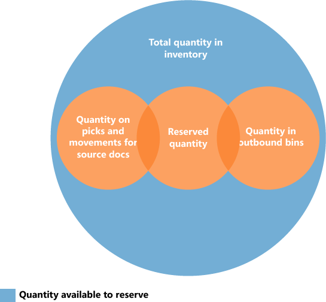

# Design Details: Availability in the Warehouse
The system must keep a constant control of item availability in the warehouse, so that outbound orders can flow efficiently and provide optimal deliveries.  

Availability varies depending on allocations at the bin level when warehouse activities such as picks and movements occur and when the inventory reservation system imposes restrictions to comply with. A rather complex algorithm verifies that all conditions are met before allocating quantities to picks for outbound flows.

If one or more conditions are not met, different error messages can be shown, including the generic "Nothing to handle." message. The "Nothing to handle." message can occur for many different reasons, both in outbound and inbound flows, where a directly or indirectly involved document line contains the **Qty. to Handle** field.

> [!NOTE]
> Information will soon be published here about possible reasons and solutions for the "Nothing to handle." message.

## Bin Content and Reservations  
 In any installation of warehouse management, item quantities exist both as warehouse entries, in the Warehouse application area, and as item ledger entries, in the Inventory application area. These two entry types contain different information about where items exist and whether they are available. Warehouse entries define an item’s availability by bin and bin type, which is called bin content. Item ledger entries define an item’s availability by its reservation to outbound documents.  

 Special functionality in the picking algorithm exists to calculate the quantity that is available to pick when bin content is coupled with reservations.  

## Quantity Available to Pick  
 If, for example, the picking algorithm does not consider item quantities that are reserved for a pending sales order shipment, then those items might be picked for another sales order that is shipped earlier, which prevents the first sales from being fulfilled. To avoid this situation, the picking algorithm subtracts quantities that are reserved for other outbound documents, quantities on existing pick documents, and quantities that are picked but not yet shipped or consumed.  

 The result is displayed in the **Available Qty. to Pick** field on the **Pick Worksheet** page, where the field is calculated dynamically. The value is also calculated when users create warehouse picks directly for outbound documents. Such outbound documents could be sales orders, production consumption, or outbound transfers, where the result is reflected in the related quantity fields, such as **Qty. to Handle**.  

> [!NOTE]  
>  Concerning the priority of reservations, the quantity to reserve is subtracted from the quantity available to pick. For example, if the quantity available in pick bins is 5 units, but 100 units are in put-away bins, then when you try to reserve more than 5 units for another order, an error message is displayed because the additional quantity must be available in pick bins.  

### Calculating the Quantity Available to Pick  
 The quantity available to pick is calculated as follows:  

 quantity available to pick = quantity in pick bins - quantity on picks and movements – (reserved quantity in pick bins + reserved quantity on picks and movements)  

 The following diagram shows the different elements of the calculation.  

   

## Quantity Available to Reserve  
 Because the concepts of bin content and reservation co-exist, the quantity of items that are available to reserve must be aligned with allocations to outbound warehouse documents.  

 It should be possible to reserve all items in inventory, except those that have started outbound processing. Accordingly, the quantity that is available to reserve is defined as the quantity on all documents and all bin types, except the following outbound quantities:  

-   Quantity on unregistered pick documents  
-   Quantity in shipment bins  
-   Quantity in to-production bins  
-   Quantity in open shop floor bins  
-   Quantity in to-assembly bins  
-   Quantity in adjustment bins  

 The result is displayed in the **Total Available Quantity** field on the **Reservation** page.  

 On a reservation line, the quantity that cannot be reserved, because it is allocated in the warehouse, is displayed in the **Qty. Allocated in Warehouse** field on the **Reservation** page.  

### Calculating the Quantity Available to Reserve  
 The quantity available to reserve is calculated as follows:  

 quantity available to reserve = total quantity in inventory - quantity on picks and movements for source documents - reserved quantity - quantity in outbound bins  

 The following diagram shows the different elements of the calculation.  

   

## See Also  
 [Design Details: Warehouse Management](design-details-warehouse-management.md)  
 [View the Availability of Items](inventory-how-availability-overview.md)
