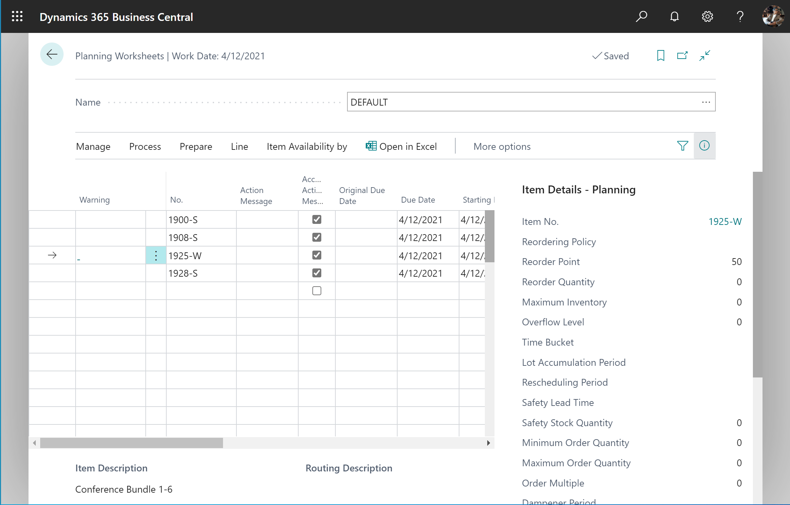

# Design Details: Central Concepts of the Planning System

The planning functions are contained in a batch project that first selects the relevant items and period to plan for. Then, according to each item's low-level code (BOM position), the batch job calls a code unit that calculates a supply plan. The code unit balances supply-demand sets and suggests actions for the user to take. The suggested actions appear as lines in the planning worksheet or the requisition worksheet.  

  

The planner of a company, such as a purchaser or a production planner, is presumed to be the user of the planning system. The planning system assists the user by performing the extensive but rather straightforward calculations of a plan. The user can then concentrate on solving the more difficult problems, such as when things differ from normal.  

The planning system is driven by anticipated and actual customer demand, such as forecast and sales orders. Planning calculations suggest actions you can take regarding supply from vendors, assembly or production, or transfers from other warehouses. An example of a suggested action could be to create new supply orders, such as purchase or production orders. If supply orders already exist, the suggested actions could be to increase or expedite orders to meet changes in demand.  

Another goal of the planning system is to ensure that the inventory does not grow unnecessarily. If demand decreases, the planning system will suggest that the user postpones, decreases quantity, or cancels existing supply orders.  

A code unit contains the planning logic and the following functions:

* MRP and MPS
* Calculate Net Change Plan
* Calculate Regenerative Plan

However, the supply plan calculation involves different sub-systems.  

The planning system doesn't include dedicated logic for capacity leveling or fine scheduling. Those types of scheduling work are done separately. The lack of direct integration between the two areas also means that substantial capacity or schedule changes will require you to rerun planning.  

## Planning parameters

The planning parameters that you set for an item or a group of items control which actions the planning system will suggest in various situations. Define planning parameters for each item to control when, how much, and how to replenish.  

You can also define planning parameters for any combination of item, variant, and location by setting up a stock-keeping unit (SKU) for each combination, and then specifying individual parameters. Learn more at [Design Details: Handling Reordering Policies](design-details-handling-reordering-policies.md) and [Design Details: Planning Parameters](design-details-planning-parameters.md).  

## Planning starting date

The planning system helps you avoid having open orders in the past and suggested actions that aren't possible. Planning treats all dates before the starting date as a frozen zone. The following rule applies to the frozen zone:  

* All supply and demand before the starting date of the planning period is considered part of inventory or shipped. In other words, it assumes that the plan for the past runs according to the given plan. Learn more at [Process orders before the planning start date](design-details-balancing-demand-and-supply.md#process-orders-before-the-planning-start-date).  

## Dynamic order tracking (pegging)

Dynamic order tracking and its simultaneous creation of action messages in the planning worksheet isn't a part of the supply planning system. When a demand or supply is created or changed, dynamic order tracking links the demand and the quantities to cover it in real time.  

For example, if you enter or change a sales order, dynamic order tracking instantly searches for supply to cover the demand. The supply could be from inventory or from an expected supply order (such as a purchase order or a production order). When it finds a supply source, [!INCLUDE [prod_short](includes/prod_short.md)] links the demand and supply. You access the link on view-only pages from the document lines. When supply can't be found, the dynamic order tracking system creates action messages in the planning worksheet with supply plan suggestions.  

Dynamic order tracking helps you assess whether to accept supply order suggestions. From the supply side, it shows the demand that created the supply. From the demand side, it identifies the supply that should cover the demand.  

:::image type="content" source="media/nav_app_supply_planning_1_dynamic_order_tracking.png" alt-text="Example of dynamic order tracking.":::

Learn more at [Design Details: Reservation, Order Tracking, and Action Messaging](design-details-reservation-order-tracking-and-action-messaging.md).  

In companies with a low item flow and less advanced product structures, it might be enough to use dynamic order tracking for supply planning. However, in busier environments, the planning system should be used to ensure a properly balanced supply plan.  

### Dynamic order tracking versus the planning system

It might be hard to differentiate between the planning system and dynamic order tracking. Both features display output in the planning worksheet by suggesting actions that the planner should take. However, the way this output is produced differs.  

The planning system deals with the entire supply and demand pattern of an item. It considers all levels of the BOM hierarchy along the timeline. Dynamic order tracking only addresses the situation of the order that activated it. When balancing demand and supply, the planning system creates links in a user-activated batch mode. Dynamic order tracking creates the links automatically when you enter a demand or a supply. For example, when you create a sales or purchase order.  

Dynamic order tracking links demand and supply on a first-come-first-served basis when you enter data. This basis can lead to disorder in priorities. For example, a sales order entered first with a due date next month might be linked to the supply in inventory. The next sales order due tomorrow may cause an action message to create a new purchase order to cover it. The following image shows this scenario.  

:::image type="content" source="media/nav_app_supply_planning_1_dynamic_order_tracking_graph.png" alt-text="Example of order tracking in supply planning 1.":::

The planning system deals with demand and supply for items in a prioritized order. The order is prioritized according to due dates and order types. That is, on a first-needed-first-served basis. It deletes all order tracking links that were created dynamically and re-establishes them according to due date priority. When the planning system has run, it has solved all imbalances between demand and supply, as illustrated below for the same data.

:::image type="content" source="media/nav_app_supply_planning_1_planning_graph.png" alt-text="Example of order tracking in supply planning 2.":::  

After you run planning, the Action Message Entry table doesn't contain any action messages. Those messages are replaced by the actions suggested in the planning worksheet. Learn more at [Order Tracking Links during Planning](design-details-balancing-demand-and-supply.md#serial-and-lot-numbers-are-loaded-by-specification-level).  

## Sequence and priority in planning

The sequence of the calculations in your plan is important for getting the project done in a reasonable amount of time. The prioritization of requirements and resources also plays an important role in getting the best results.  

The planning system is demand-driven. High-level items should be planned before low-level items because they might generate demand for lower-level items. For example, plan retail locations before distribution centers because the retail location might include demand from the distribution center. On a detailed balancing level, if a released supply order can cover a sales order the system shouldn't create a new supply order. A supply with a specific lot number shouldn't be allocated to cover a generic demand if another demand requires this specific lot.  

### Item priority / low-level code

In a manufacturing environment, the demand for a finished, sellable item will result in derived demand for components that comprise the finished item. The bill-of-material structure controls the component structure and can cover several levels of semi-finished items. Planning an item at one level will cause derived demand for components at the next level. This hierarchy will eventually result in derived demand for purchased items. The planning system plans for items in order of their ranking in the total BOM hierarchy. The system starts with finished sellable items at the top level and continues down the product structure to the lower-level items (according to the low-level code).  

The following image shows the sequence in which [!INCLUDE [prod_short](includes/prod_short.md)] suggests supply orders at the top level. It assumes the suggestions were accepted and shows lower-level items as well.

:::image type="content" source="media/nav_app_supply_planning_1_bom_planning.png" alt-text="Planning for bills of material.":::

To learn more about manufacturing considerations, go to [Load inventory profiles](design-details-balancing-demand-and-supply.md#load-inventory-profiles).  

#### Optimizing performance for low-level calculations

Low-level code calculations can affect system performance. To reduce the effect, you can turn off the **Dynamic low-level code calculation** toggle on the **Manufacturing Setup** page. When you do, [!INCLUDE[prod_short](includes/prod_short.md)] suggests that you create a recurrent job queue entry to update low-level codes daily. You can ensure that the job will run outside working hours by specifying a start time in the **Earliest Start Date/Time** field.

You can also speed up low-level code calculations by turning on the **Optimize low-level code calculation** toggle on the **Manufacturing Setup** page.

> [!IMPORTANT]
> If you choose to optimize performance, [!INCLUDE[prod_short](includes/prod_short.md)] will use new calculation methods to determine low-level codes. If you have an extension that relies on the events used by the old calculations, the extension might stop working.

### Locations / transfer-level priority

Companies with more than one location might need to plan for each location individually. For example, an item's safety stock level and its reordering policy might differ from one location to another. You must specify the planning parameters per item and location.  

You can use SKUs to specify individual planning parameters. An SKU can be regarded as an item at a specific location. If you haven't defined a SKU for that location, [!INCLUDE [prod_short](includes/prod_short.md)] will use the parameters set on the item card. [!INCLUDE [prod_short](includes/prod_short.md)] calculates a plan for active locations only, where there's demand or supply for a given item.  

Any item can be handled at any location, but [!INCLUDE [prod_short](includes/prod_short.md)] has a strict approach to the concept of locations. For example, a sales order for an item at one location can't be fulfilled by stock from another location. The quantity on stock must first be transferred to the location specified on the sales order.

:::image type="content" source="media/nav_app_supply_planning_1_sku_planning.png" alt-text="Planning for stock-keeping units.":::

Learn more at [Design Details: Transfers in Planning](design-details-transfers-in-planning.md).  

### Order priority

Within a given SKU, the requested or available date represents the highest priority; the demand of today should be dealt with before the demand of the coming days. But apart from this kind of priority, the different demand and supply types are sorted according to business importance to decide which demand should be satisfied first. On the supply side, the order priority determines the source of supply to apply first. Learn more at [Prioritize orders](design-details-balancing-demand-and-supply.md#prioritize-orders).  

## Demand forecasts and blanket orders

Forecasts and blanket orders both represent anticipated demand. The blanket order, which covers a customer's intended purchases over a specific period of time, acts to lessen the uncertainty of the overall forecast. The blanket order is a customer-specific forecast on top of the unspecified forecast, as illustrated in the following image.  

:::image type="content" source="media/nav_app_supply_planning_1_forecast_and_blanket.png" alt-text="Planning with forecasts.":::

Learn more at [Forecast Demand is Reduced by Sales Orders](design-details-balancing-demand-and-supply.md#forecast-demand-is-reduced-by-sales-orders).  

## Planning assignment

All items should be replanned for when the demand or supply pattern has changed since the last time a plan was calculated. For example, if you enter a new sales order or change an existing one, recalculate the plan. Other reasons for replanning include a change in forecast or safety stock quantity. Changing a bill-of-material by adding or removing a component would most likely also indicate a change, but for the component item only.  

The planning system monitors such events and assigns the appropriate items for planning.  

For multiple locations, the assignment happens at the item level per location combination. If a sales order has been created at only one location, [!INCLUDE [prod_short](includes/prod_short.md)] assigns the item at that location for planning.  

The reason for selecting items for planning is a matter of system performance. If an item's demand-supply pattern hasn't changed, the planning system won't suggest any actions to take. Without the planning assignment, the system would have to perform the calculations for all items to find out what to plan for. To learn more about the reasons to assign items for planning, go to [Design Details: Planning Assignment Table](design-details-planning-assignment-table.md).  

The following are the planning options that are available:  

* **Calculate Regenerative Plan** calculates all selected items, whether it's necessary or not.  
* **Calculate Net Change Plan** calculates only the items that have had a change in their demand and supply pattern and, therefore, have been assigned for planning.  

Some people believe that net change planning should be performed on the fly, for example, when sales orders are entered. However, planning on the fly could be confusing because dynamic order tracking and action messaging are also calculated on the fly. [!INCLUDE[prod_short](includes/prod_short.md)] offers real-time available-to-promise control. It provides pop–up warnings when you enter sales orders and the current supply plan can't fulfill the demand.  

The planning system only plans for the items that you've prepared with appropriate planning parameters. Otherwise, it assumes that you'll plan the items manually or semi-automatically by using the Order Planning feature. To learn more about the automatic planning procedures, go to [Design Details: Balancing Demand and Supply](design-details-balancing-demand-and-supply.md).  

## Item dimensions

Demand and supply can carry variant codes and location codes that must be respected when the planning system balances demand and supply.  

[!INCLUDE [prod_short](includes/prod_short.md)] treats variant and location codes as item dimensions on a sales order line, inventory ledger entry, and so on. Accordingly, it calculates a plan for each combination of variant and location as if the combination were a separate item number.  

Instead of calculating theoretical combinations of variant and location, [!INCLUDE [prod_short](includes/prod_short.md)] calculates only the combinations that actually exist in the database. To learn more about how the planning system deals with location codes on demand, go to [Design Details: Demand at Blank Location](design-details-balancing-demand-and-supply.md).  

## Item attributes

Items often have general attributes, such as an item number, variant code, location code, and type of order. However, each demand and supply event can have other specifications, such as serial or lot numbers. The planning system plans these attributes in certain ways depending on their level of specification.  

An order-to-order link between demand and supply is another type of attribute that affects the planning system. Learn more at [Order-to-order links](#order-to-order-links).

### Specific attributes

Some demand attributes are specific and a supply must match them exactly.

* Serial or lot numbers that require specific application (These attributes are required if you turn on the **SN Specific Tracking** or **Lot Specific Tracking** toggle on the **Item Tracking Code Card** page for the item tracking code that is used by the item.)  
* Links to supply orders created manually or automatically for a specific demand (order-to-order links).  

The planning system applies the following rules to these attributes:  

* Demand with specific attributes can only be fulfilled by supply with matching attributes.  
* Supply with specific attributes can also satisfy demand that doesn't specifically require those attributes.  

If inventory or projected supplies can't meet a demand for specific attributes, the planning system suggests a new supply order without regarding planning parameters.  

### Non-specific attributes

Serial or lot-numbered items without a specific item tracking setup might have non-specific serial or lot numbers. These types of numbers can be applied to any serial or lot number. The planning system has more freedom to match, for example, a serialized demand with a serialized supply, typically in inventory.  

Demand-supply with serial or lot numbers, specific or non-specific, are high priority and are exempt from the frozen zone. They'll be part of planning even if they're due before the planning starting date. Learn more at [Serial and lot numbers are loaded by specification level](design-details-balancing-demand-and-supply.md#serial-and-lot-numbers-are-loaded-by-specification-level).

To learn more about how the planning system balances attributes, go to [Serial and lot numbers and order-to-order links are exempt from the previous period](design-details-balancing-demand-and-supply.md#serial-and-lot-numbers-and-order-to-order-links-are-exempt-from-the-previous-period).  

## Order-to-order links

Order-to-order means that you purchase, assemble, or produce an item for a specific demand. There are several reasons to choose this policy:

* The demand is infrequent.
* The lead-time is insignificant.
* The required attributes vary.  

Another case that uses order-to-order links is when an assembly order is linked to a sales order in an assemble-to-order scenario.  

Order-to-order links are applied between demand and supply in four ways:  

* When the planned item uses the **Order** reordering policy  
* When you use the make-to-order manufacturing policy to create multi-level or project-type production orders (producing components on the same production order)  
* When you create production orders for sales orders with the sales order planning feature  
* When you assemble an item to a sales order (**Assembly Policy** is set to **Assemble-to-Order**)  

The planning system suggests that you only order the required quantity. The purchase, production, or assembly order continues to match the demand. For example, if a sales order is changed in time or quantity, the planning system suggests that you change the supply order accordingly.  

When order-to-order links exist, the planning system doesn't involve linked supply or inventory in the balancing procedure. Planners can decide whether to use the linked supply or a new demand. In the latter case, they can delete the supply order or manually reserve the linked supply.  

Reservations and order tracking links break if a situation becomes impossible. For example, when moving the demand to a date that's earlier than the supply. Order-to-order links adapt to changes in the demand or supply and never break.  

## Reservations

The planning system doesn't include reserved quantities in calculations. For example, if a quantity for a sales order is fully or partially reserved, you can't use the quantity to cover other demand.

The planning system does include reserved quantities in the projected inventory profile. It must consider all quantities to determine when the reorder point has passed and how many to reorder to reach the maximum inventory level. Unnecessary reservations can increase the risk that inventory levels run low because the planning logic doesn't detect reserved quantities.  

The following image shows how reservations can hinder planning.  

:::image type="content" source="media/nav_app_supply_planning_1_reservations.png" alt-text="Planning with reservations.":::

Learn more at [Design Details: Reservation, Order Tracking, and Action Messaging](design-details-reservation-order-tracking-and-action-messaging.md).  

## Warnings

The first column in the planning worksheet is for the warning fields. A warning icon displays when you create a planning line for an unusual situation.  

Supply on planning lines with warnings typically won't be modified according to planning parameters. Instead, the planning system suggests a supply to cover the exact quantity of the demand. However, the system can be set up to respect planning parameters for planning lines with certain warnings. The warning information is shown on the **Untracked Planning Elements** page, which also shows order tracking links to non-order network entities. There are three types of warnings:  

* Emergency  
* Exception  
* Attention  

:::image type="content" source="media/nav_app_supply_planning_1_warnings.png" alt-text="Warnings in the planning worksheet.":::

### Emergency

The emergency warning displays in two situations:  

* When the inventory is negative on the planning starting date  
* When back-dated supply or demand events exist  

If an item's inventory is negative on the planning starting date, the planning system suggests an emergency supply for the negative quantity to arrive on the planning starting date. The warning text states the starting date and the quantity of the emergency order. Learn more at [Handling Projected Negative Inventory](design-details-handling-reordering-policies.md#handling-projected-negative-inventory).  

Document lines with due dates before the planning starting date are consolidated into an emergency supply order. The order is planned to arrive on the planning starting date.  

### Exception

The exception warning is displayed if the projected available inventory drops below the safety stock quantity. The planning system will suggest a supply order to meet the demand on its due date. The warning text states the item's safety stock quantity and the date on which it is violated.  

Violating the safety stock level is an exception. It shouldn't happen if the reorder point is set correctly. Learn more at [The Role of the Reorder Point](design-details-handling-reordering-policies.md#the-role-of-the-reorder-point).  

Exception order proposals help ensure that the projected available inventory is never lower than the safety stock level. The proposed quantity covers the safety stock, without considering planning parameters. However, in some scenarios, order modifiers will be considered.  

> [!NOTE]  
> The planning system may have consumed the safety stock intentionally and will then replenish it straight away. Learn more at [Consume safety stock](design-details-balancing-demand-and-supply.md#consume-safety-stock).

### Attention

The attention warning is displayed in three situations:  

* The planning starting date is earlier than the work date.  
* The planning line suggests changing a released purchase or production order.  
* The projected inventory exceeds the overflow level on the due date. Learn more at [Stay below the overflow level](design-details-handling-reordering-policies.md#stay-below-the-overflow-level).  

> [!NOTE]  
> In planning lines with warnings, the **Accept Action Message** field is not selected because the planner is expected to investigate the lines before carrying out the plan.  

## Error logs

On the **Calculate Plan** request page, you can select the **Stop and Show First Error** field to have the planning run stop when it encounters the first error. A message is displayed with information about the error. If an error exists, the planning worksheet will show only the planning lines that were successfully made before the error happened.  

If the field isn't selected, the **Calculate Plan** batch job will continue until it has completed. Errors won't interrupt the batch job. If there are errors, a message states how many items were affected. The **Planning Error Log** page provides more details about the error and links to the affected documents or setups.  

:::image type="content" source="media/nav_app_supply_planning_1_error_log.png" alt-text="Error messages in the planning worksheet.":::

## Planning flexibility

It isn't always practical to plan an existing supply order. For example, when production has started or you hire extra people on a specific day to do the project. To indicate whether the planning system can change an order, all supply order lines have a **Planning Flexibility** field with two options: **Unlimited** or **None**. If the field is set to **None**, the planning system won't try to change the supply order line.  

You can manually choose an option in the field, however, in some cases it'll be set automatically by [!INCLUDE [prod_short](includes/prod_short.md)]. The fact that you can manually set planning flexibility is important because it makes it easy to adapt the use of the feature to different workflows and business cases. To learn more about how this field is used, go to [Design Details: Transfers in Planning](design-details-transfers-in-planning.md).  

## Order planning

The basic supply planning tool represented by the **Order Planning** page is designed for manual decision making. It doesn't consider any planning parameters and is therefore not discussed further in this article. Learn more at [Plan for New Demand Order by Order](production-how-to-plan-for-new-demand.md).  

> [!NOTE]  
> We recommend that you don't use order planning if your company already uses the planning or requisition worksheets. Supply orders created through the **Order Planning** page may be changed or deleted during the automated planning runs. These changes happen because the automated planning run uses planning parameters that you might not have considered when you manually made the plan in the Order Planning page.  

## Finite loading

[!INCLUDE[prod_short](includes/prod_short.md)] provides a rough-cut schedule to plan reasonable use of resources. It doesn't automatically create and maintain detailed schedules based on priorities or optimization rules.  

The intended use of the capacity-constrained resource feature is as follows:

* To avoid overloading resources
* To ensure that capacity isn't left unallocated if it could decrease the turn-around time of a production order

When planning with capacity-constrained resources, [!INCLUDE [prod_short](includes/prod_short.md)] ensures that resources aren't loaded above their capacity (critical load). It assigns each operation to the nearest available time slot. If the time slot isn't large enough to complete the operation, it splits the operation into two or more parts in the nearest available time slots.  

> [!NOTE]  
> In case of operation splitting, the set-up time is only assigned one time because it's assumed that some manual adjustment is done to optimize the schedule.  

You can add dampener time to resources to minimize operation splitting. This time lets [!INCLUDE [prod_short](includes/prod_short.md)] schedule the load on the last possible day by slightly exceeding the critical load percent.  

## Related information

[Design Details: Transfers in Planning](design-details-transfers-in-planning.md)  
[Design Details: Planning Parameters](design-details-planning-parameters.md)  
[Design Details: Planning Assignment Table](design-details-planning-assignment-table.md)  
[Design Details: Handling Reordering Policies](design-details-handling-reordering-policies.md)  
[Design Details: Balancing Demand and Supply](design-details-balancing-demand-and-supply.md)  

[!INCLUDE[footer-include](includes/footer-banner.md)]
