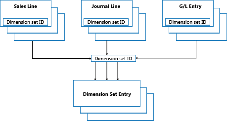

# Dimension Set Entries Overview
This topic describes how dimension set entries are stored and posted in [!INCLUDE[prod_short](includes/prod_short.md)].  

## Dimension Sets  
A dimension set is a unique combination of dimension values. It is stored as dimension set entries in the database. Each dimension set entry represents a single dimension value. The dimension set is identified by a common dimension set ID that is assigned to each dimension set entry that belongs to the dimension set.  

The following example shows a dimension set that has three dimension set entries. The dimension set is identified by a dimension set ID, which is 108.  

|Dimension Set ID|Dimension Code|Dimension Value Code|Dimension Value Name|  
|----------------------|--------------------|--------------------------|--------------------------|  
|108|AREA|70|America North|  
|108|BUSINESSGROUP|HOME|Home|  
|108|DEPARTMENT|SALES|Sales|  

## Dimension Set Entries  
Dimension sets are stored in the **Dimension Set Entry** table as dimension set entries with the same dimension set ID.  

  

When you create a new journal line, document header, or document line, you can specify a combination of dimension values. Instead of explicitly storing each dimension value in the database, a dimension set ID is assigned to the journal line, document header, or document line to specify the dimension set.  

When you edit and close the **Edit Dimension Set Entries** page, a check is performed to see whether the combination of dimension values exists as a dimension set in the table. If the combination occurs in the table, then the corresponding dimension set ID is assigned to the journal line, document header, or document line. Otherwise, a new dimension set is added to the table, and the new dimension set ID is assigned to the journal line, document header, or document line.

## Codeunit 408 Dimension Management
Codeunit 408, Dimension Management, is a function library that handles common tasks that are related to dimensions, such as copying from one table to another or from one document to another.

## Performance Improvement  
By storing dimension sets once in the database, database space is preserved and overall performance is improved.  

## Related information
[Design Details: Searching for Dimension Combinations](design-details-searching-for-dimension-combinations.md)   
[Design Details: Table Structure](design-details-table-structure.md)   
[Design Details: Dimension Set Entries](/dynamics365/business-central/design-details-dimension-set-entries-overview)   

[!INCLUDE[footer-include](includes/footer-banner.md)]