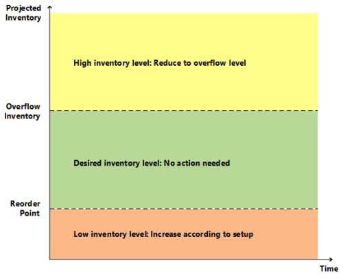
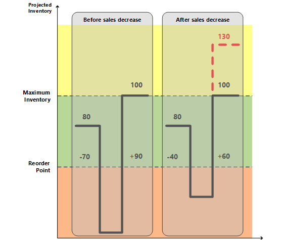
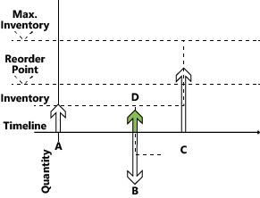

# Design Details: Handling Reordering Policies
For an item to participate in supply planning, a reorder policy must be defined. The following four reordering policies exist:  

* Fixed Reorder Qty.  
* Maximum Qty.  
* Order  
* Lot-for-Lot  

Fixed Reorder Qty. and Maximum Qty. policies relate to inventory planning. Although inventory planning is technically simpler than the balancing procedure, these policies must coexist with the step-by-step balancing of supply and order tracking. To control the integration between the two, and to provide visibility into the involved planning logic, strict principles govern how reordering policies are handled.  

## The Role of the Reorder Point
In addition to the general balancing of supply and demand, the planning system must also monitor inventory levels for the affected items to respect the defined reordering policies.  

A reorder point represents demand during lead time. When the projected inventory passes below the inventory level defined by the reorder point, it is time to order more quantity. Meanwhile, the inventory is expected to decrease gradually and possibly reach zero (or the safety stock level), until the replenishment arrives.  

Accordingly, the planning system will suggest a forward-scheduled supply order at the point when the projected inventory passes below the reorder point.  

The reorder point reflects a certain inventory level. However, inventory levels can move significantly during the time bucket and, therefore, the planning system must constantly monitor the projected available inventory.

## Monitoring the Projected Inventory Level and the Reorder Point
Inventory is a type of supply, but for inventory planning, the planning system distinguishes between two inventory levels:  

* Projected inventory  
* Projected available inventory  

### Projected Inventory  
Initially, projected inventory is the quantity of gross inventory, including supply and demand in the past even if not posted, when starting the planning process. In the future, this becomes a moving projected inventory level that is maintained by gross quantities from future supply and demand because those are introduced along the time line (whether reserved or in other ways allocated).  

The projected inventory is used by the planning system to monitor the reorder point and to determine the reorder quantity when using the Maximum Qty. reordering policy.  

### Projected Available Inventory  
The projected available inventory is the part of the projected inventory that at a given point in time is available to fulfill demand. The projected available inventory is used by the planning engine when monitoring the safety stock level.  

The projected available inventory is used by the planning system to monitor the safety stock level, since the safety stock must always be available to serve unexpected demand.  

### Time Buckets  
Having a tight control of the projected inventory is crucial to detect when the reorder point is reached or crossed and to calculate the right order quantity when using the Maximum Qty. reordering policy.  

As stated earlier, the projected inventory level is calculated at the start of the planning period. It is a gross level that does not consider reservations and similar allocations. To monitor this inventory level during the planning sequence, the system monitors the aggregated changes over a period of time, a time bucket. The system ensures that the time bucket is at least one day since it is the most precise unit of time for a demand or supply event.  

### Determining the Projected Inventory Level  
The following sequence describes how the projected inventory level is determined:  

* When a supply event, such as a purchase order has been totally planned, it will increase the projected inventory on its due date.  
* When a demand event has been fully satisfied, it will not decrease the projected inventory right away. Instead, it posts a decrease reminder, which is an internal record that holds the date and quantity of the contribution to the projected inventory.  
* When a subsequent supply event is planned and placed on the time line, the posted decrease reminders are investigated one by one up until the planned date of the supply while updating the projected inventory. During this process, the reorder point level of the internal increase reminder may be reached or crossed.  
* If a new supply order is introduced, the system checks if it is entered before the current supply. If it is, the new supply becomes current supply and the balancing procedure starts over.  

The following shows a graphical illustration of this principle:  

  

1. Supply **Sa** of 4 (fixed) closes Demand **Da** of -3.  
2. CloseDemand: Create a decrease reminder of -3 (not shown).  
3. Supply **Sa** is closed with a surplus of 1 (no more demand exists).  

     This increases the projected inventory level to +4, while the projected **available** inventory becomes -1.  

4. The next supply **Sb** of 2 (another order) has already been placed on the timeline.  
5. System checks if there is any decrease reminder preceding **Sb** (there is not, so no action is taken).  
6. System closes supply **Sb** (no more demand exists)—either A: by reducing it to 0 (cancel) or B: by leaving as is.  

     This increases the projected inventory level (A: +0 => +4 or B: +2 = +6).  

7. System makes a final check: Is there any decrease reminder? Yes, there is one on the date of **Da**.  
8. System adds the decrease reminder of -3 reminder to the projected inventory level, either A: +4 -3 = 1 or B: +6 -3 = +3.  
9. In case of A, the system creates a forward-scheduled order starting on date **Da**.  

     In case of B, the reorder point is reached and a new order is created.

## The Role of the Time Bucket
The purpose of the time bucket is to collect demand events within the time page in order to make a joint supply order.  

For reordering policies that use a reorder point, you can define a time bucket. This ensures that demand within the same time period is accumulated before checking the impact on the projected inventory and whether the reorder point has been passed. If the reorder point is passed, a new supply order is scheduled forward from the end of the period defined by the time bucket. The time buckets begin on the planning starting date.  

The time-bucketed concept reflects the manual process of checking the inventory level on a frequent basis rather than for each transaction. The user needs to define the frequency (the time bucket). For example, the user gathers all item needs from one vendor to place a weekly order.  

  

The time bucket is generally used to avoid a cascade effect. For example, a balanced row of demand and supply where an early demand is canceled, or a new one is created. The result would be that every supply order (except the last one) is rescheduled.

## Staying under the Overflow Level
When using the Maximum Qty. and Fixed Reorder Qty. policies, the planning system focuses on the projected inventory in the given time-bucket only. This means that the planning system may suggest superfluous supply when negative demand or positive supply changes occur outside of the given time bucket. If, for this reason, a superfluous supply is suggested, the planning system calculates which quantity the supply should be decreased to (or deleted) to avoid the superfluous supply. This quantity is called the “overflow level.” The overflow is communicated as a planning line with a **Change Qty. (Decrease)** or **Cancel** action and the following warning message:  

*Attention: The projected inventory [xx] is higher than the overflow level [xx] on the Due Date [xx].*  

  

###  Calculating the Overflow Level  
The overflow level is calculated in different ways depending on planning setup.  

#### Maximum Qty. reordering policy  
Overflow level = Maximum Inventory  

> [!NOTE]  
>  If a minimum order quantity exists, then it will be added as follows: Overflow level = Maximum Inventory + Minimum Order Quantity.  

#### Fixed Reorder Qty. reordering policy  
Overflow level = Reorder Quantity + Reorder Point  

> [!NOTE]  
>  If the minimum order quantity is higher than the reorder point, then it will replace as follows: Overflow Level = Reorder Quantity + Minimum Order Quantity  

#### Order Multiple  
If an order multiple exists, then it will adjust the overflow level for both Maximum Qty. and Fixed Reorder Qty. reordering policies.  

###  Creating the Planning Line with Overflow Warning  
When an existing supply causes the projected inventory to be higher than the overflow level at the end of a time bucket, a planning line is created. To warn about the potential superfluous supply, the planning line has a warning message, the **Accept Action Message** field is not selected, and the action message is either Cancel or Change Qty.  

#### Calculating the Planning Line Quantity  
Planning Line Quantity = Current Supply Quantity – (Projected Inventory – Overflow Level)  

> [!NOTE]  
>  As with all warning lines, any maximum/minimum order quantity or order multiple will be ignored.  

#### Defining the Action Message Type  

-   If the planning line quantity is higher than 0, then the action message is Change Qty.  
-   If the planning line quantity is equal to or lower than 0, then the action message is Cancel  

#### Composing the Warning Message  
In case of overflow, the **Untracked Planning Elements** page displays a warning message with the following information:  

-   The projected inventory level that triggered the warning  
-   The calculated overflow level  
-   The due date of the supply event.  

Example: “The projected inventory 120 is higher than the overflow level 60 on 28-01-11”  

### Scenario  
In this scenario, a customer changes a sales order from 70 to 40 pieces between two planning runs. The overflow feature sets in to reduce the purchase that was suggested for the initial sales quantity.  

#### Item Setup  

|Reordering Policy|Maximum Qty.|  
|-----------------------|------------------|  
|Maximum Order Quantity|100|  
|Reorder Point|50|  
|Inventory|80|  

#### Situation Before Sales Decrease  

|Event|Change Qty.|Projected Inventory|  
|-----------|-----------------|-------------------------|  
|Day one|None|80|  
|Sale|-70|10|  
|End of time bucket|None|10|  
|Suggest new purchase order|+90|100|  

#### Situation After Sales Ddecrease  

|Change|Change Qty.|Projected Inventory|  
|------------|-----------------|-------------------------|  
|Day one|None|80|  
|Sale|-40|40|  
|Purchase|+90|130|  
|End of time bucket|None|130|  
|Suggest to decrease purchase   order from 90 to 60|-30|100|  

#### Resulting Planning Lines  
 One planning line (warning) is created to reduce the purchase with 30 from 90 to 60 to keep the projected inventory on 100 according to the overflow level.  

  

> [!NOTE]  
>  Without the Overflow feature, no warning is created if the projected inventory level is above maximum inventory. This could cause a superfluous supply of 30.

## Handling Projected Negative Inventory
The reorder point expresses the anticipated demand during the lead time of the item. When the reorder point is passed, it is time to order more. But the projected inventory must be large enough to cover the demand until the new order is received. Meanwhile, the safety stock should take care of fluctuations in demand up to a targeted service level.  

 Consequently, the planning system considers it an emergency if a future demand cannot be served from the projected inventory, or expressed in another way, that the projected inventory goes negative. The system deals with such an exception by suggesting a new supply order to meet the part of the demand that cannot be met by inventory or other supply. The order size of the new supply order will not take the maximum inventory or the reorder quantity into consideration, nor will it take into consideration the order modifiers Maximum Order Quantity, Minimum Order Quantity, and Order Multiple. Instead, it will reflect the exact deficiency.  

 The planning line for this type of supply order will display an Emergency warning icon, and additional information will be provided upon lookup to inform the user of the situation.  

 In the following illustration, supply D represents an emergency order to adjust for negative inventory.  

   

1.  Supply **A**, initial projected inventory, is below reorder point.  
2.  A new forward-scheduled supply is created (**C**).  

     (Quantity = Maximum Inventory – Projected Inventory Level)  
3.  Supply **A** is closed by demand **B**, which is not fully covered.  

     (Demand **B** could try to schedule Supply C in but that will not happen according to the time-bucket concept.)  
4.  New supply (**D**) is created to cover the remaining quantity on Demand **B**.  
5.  Demand **B** is closed (creating a reminder to the projected inventory).  
6.  The new supply **D** is closed.  
7.  Projected Inventory is checked; reorder point has not been crossed.  
8.  Supply **C** is closed (no more demand exists).  
9. Final check: No outstanding inventory level reminders exist.  

> [!NOTE]  
>  Step 4 reflects how the system reacts in versions earlier than Microsoft Dynamics NAV 2009 SP1.  

This concludes the description of central principles relating to inventory planning based on reordering policies. The following section describes the characteristics of the four supported reordering policies.

## Reordering Policies
Reordering policies define how much to order when the item needs to be replenished. Four different reordering policies exist.  

### Fixed Reorder Qty.
The Fixed Reorder Qty. policy is related to inventory planning of typical C-items (low inventory cost, low risk of obsolescence, and/or many items). This policy is usually used in connection with a reorder point reflecting the anticipated demand during the lead time of the item.  

#### Calculated per Time Bucket  
If the planning system detects that the reorder point has been reached or crossed in a given time bucket (reorder cycle) – above or on the reorder point at the start of the period and below or on the reorder point at the end of the period – it will suggest to create a new supply order of the specified reorder quantity and forward schedule it from the first date after the end of the time bucket.  

The bucketed reorder point concept reduces the number of supply suggestions. This reflects a manual process of frequently walking through the warehouse to check the actual contents in the various bins.  

#### Creates only Necessary Supply  
Before suggesting a new supply order to meet a reorder point, the planning system checks if supply has already been ordered to be received within the item’s lead time. If an existing supply order will solve the problem by bringing the projected inventory to or above the reorder point within the lead time, the system will not suggest a new supply order.  

Supply orders that are created specifically to meet a reorder point is excluded from ordinary supply balancing, and will not in any way be changed afterwards. Consequently, if an item using reorder point is to be phased out (not replenished), it is advisable to review outstanding supply orders manually or change the reordering policy to Lot-for-Lot, whereby the system will reduce or cancel superfluous supply.  

#### Combines with Order Modifiers  
The order modifiers, Minimum Order Quantity, Maximum Order Quantity, and Order Multiple, should not play a big role when the fixed reorder quantity policy is used. However, the planning system still takes these modifiers into account and will decrease the quantity to the specified maximum order quantity (and create two or more supplies in order to reach the total order quantity), increase the order to the specified minimum order quantity, or round the order quantity up to meet a specified order multiple.  

#### Combines with Calendars  
Before suggesting a new supply order to meet a reorder point, the planning system checks if the order is scheduled for a non-working day, according to any calendars that are defined in the **Base Calendar Code** field in the **Company Information** and **Location Card** pages.  

If the scheduled date is a non-working day, the planning system moves the order forward to the nearest working date. This may result in an order that meets a reorder point but does not meet some specific demand. For such unbalanced demand, the planning system creates an extra supply.  

#### Should Not be Used with Forecast  
Because the anticipated demand is already expressed in the reorder point level it is not necessary to include a forecast in the planning of an item using a reorder point. If it is relevant to base the plan on a forecast, use the lot-for-lot policy.  

#### Must Not be Used with Reservations  
If the user has reserved a quantity, for instance a quantity in inventory, for some distant demand, the planning foundation will be disturbed. Even if the projected inventory level is acceptable in relation to the reorder point, the quantities might not be available. The system may try to compensate for that by creating exception orders; however, it is recommended that the Reserve field is set to Never on items that are planned using a reorder point.

### Maximum Qty.
The Maximum Quantity policy is a way to maintain inventory using a reorder point.  

Everything regarding the Fixed Reorder Qty. policy also applies to this policy. The only difference is the quantity of the suggested supply. When using the maximum quantity policy, the reorder quantity will be defined dynamically based on the projected inventory level and will therefore usually differ from order to order.  

#### Calculated per Time Bucket  
The reorder quantity is determined at the point of time (the end of a time bucket) when the planning system detects that the reorder point has been crossed. At this time, the system measures the gap from the current projected inventory level up to the specified maximum inventory. This constitutes the quantity that should be reordered. The system then checks if supply has already been ordered elsewhere to be received within the lead time and, if so, reduces the quantity of the new supply order by already ordered quantities.  

The system will ensure that the projected inventory at least reaches the reorder point level – in case the user has forgotten to specify a maximum inventory quantity.  

#### Combines with Order Modifiers  
Depending on the setup, it may be best to combine the Maximum Quantity policy with order modifiers to ensure a minimum order quantity or round it to an integer number of purchase units of measure, or split it into more lots as defined by the maximum order quantity.  

### Combines with Calendars  
Before suggesting a new supply order to meet a reorder point, the planning system checks if the order is scheduled for a non-working day, according to any calendars that are  defined in the **Base Calendar Code** field in the **Company Information** and **Location Card** pages.  

If the scheduled date is a non-working day, the planning system moves the order forward to the nearest working date. This may result in an order that meets a reorder point but does not meet some specific demand. For such unbalanced demand, the planning system creates an extra supply.

### Order
In a make-to-order environment, an item is purchased or produced to exclusively cover a specific demand. Typically it relates to A-items, and the motivation for choosing the order reordering policy can be that the demand is infrequent, the lead-time is insignificant, or the required attributes vary.  

The application creates an order-to-order link, which acts as a preliminary connection between the supply, a supply order or inventory, and the demand that it is going to fulfill.  

Apart from using the Order policy, the order-to-order link can be applied during planning in the following ways:  

* When using the Make-to-Order manufacturing policy to create multi-level or project type production orders (producing needed components on the same production order).  
* When using the Sales Order Planning feature to create a production order from a sales order.  

Even if a manufacturing company considers itself as a make-to-order environment, it might be best to use a Lot-for-Lot reordering policy if the items are pure standard without variation in attributes. As a result, the system will use unplanned inventory and only accumulates sales orders with the same shipment date or within a defined time bucket.  

#### Order-to-Order Links and Past Due Dates  
Unlike most supply-demand sets, linked orders with due dates before the planning starting date are fully planned for by the system. The business reason for this exception is that specific demand-supply sets must be synchronized through to execution. For more information about the frozen zone that applies to most demand-supply types, see [Dealing with Orders Before the Planning Starting Date](design-details-balancing-demand-and-supply.md#dealing-with-orders-before-the-planning-starting-date).

### Lot-for-Lot
The lot-for-lot policy is the most flexible because the system only reacts on actual demand, plus it acts on anticipated demand from forecast and blanket orders and then settles the order quantity based on the demand. The lot-for-lot policy is aimed at A- and B-items where inventory can be accepted but should be avoided.  

In some ways, the lot-for-lot policy looks like the Order policy, but it has a generic approach to items; it can accept quantities in inventory, and it bundles demand and corresponding supply in time buckets defined by the user.  

The time bucket is defined in the **Time Bucket** field. The system works with a minimum time bucket of one day, since this is the smallest time unit of measure on demand and supply events in the system (although, in practice, the time unit of measure on production orders and component needs can be seconds).  

The time bucket also sets limits on when an existing supply order should be rescheduled to meet a given demand. If the supply lies within the time bucket, it will be rescheduled in or out to meet the demand. Otherwise, if it lies earlier, it will cause unnecessary build-up of inventory and should be canceled. If it lies later, a new supply order will be created instead.  

With this policy, it is also possible to define a safety stock in order to compensate for possible fluctuations in supply, or to meet sudden demand.  

Because the supply order quantity is based on the actual demand it can make sense to use the order modifiers: round the order quantity up to meet a specified order multiple (or purchase unit of measure), increase the order to a specified minimum order quantity, or decrease the quantity to the specified maximum quantity (and thus create two or more supplies to reach the total needed quantity).

## See Also  
[Design Details: Planning Parameters](design-details-planning-parameters.md)   
[Design Details: Planning Assignment Table](design-details-planning-assignment-table.md)   
[Design Details: Central Concepts of the Planning System](design-details-central-concepts-of-the-planning-system.md)   
[Design Details: Balancing Demand and Supply](design-details-balancing-demand-and-supply.md)   
[Design Details: Supply Planning](design-details-supply-planning.md)
