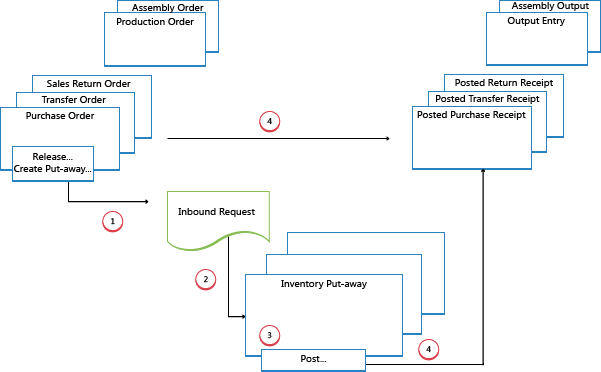
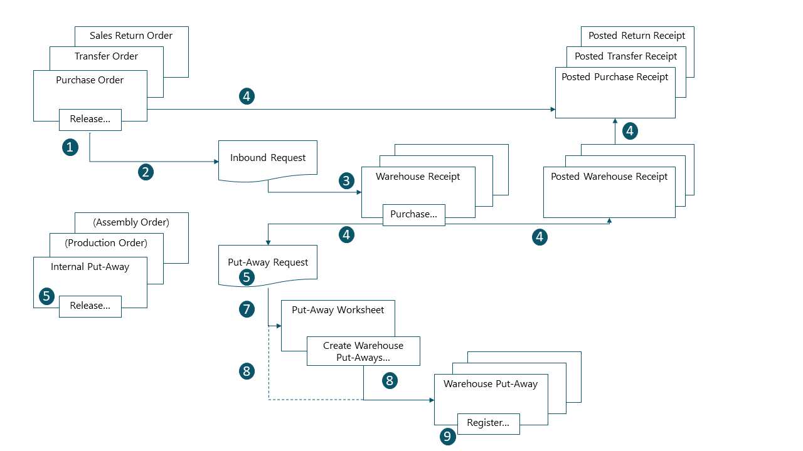

# Design Details: Inbound Warehouse Flow
The inbound flow in a warehouse begins when items arrive in the warehouse of the company location, either received from external sources or from another company location. An employee registers the items, typically by scanning a bar code. From the receiving dock, warehouse activities are performed at different complexity levels to bring the items into the storage area.  

 Each item is identified and matched to a corresponding inbound source document. The following inbound source documents exist:  

- Purchase order  
- Inbound transfer order  
- Sales return order  

In addition, the following internal source documents exist that function like inbound sources:  

- Production order with output posting  
- Assembly order with output posting  

The last two represent inbound flows to the warehouse from internal operation areas. For more information about warehouse handling for internal inbound and outbound processes, see [Design Details: Internal Warehouse Flows](design-details-internal-warehouse-flows.md).  

Processes and UI documents in inbound warehouse flows are different for basic and advanced warehouse configurations. The main difference is that activities are performed order-by-order in basic warehouse configurations, and they are consolidated for multiple orders in advanced warehouse configurations. For more information about different warehouse complexity levels, see [Design Details: Warehouse Overview](design-details-warehouse-setup.md).  

In [!INCLUDE[d365fin](includes/d365fin_md.md)], the inbound processes of receiving and putting away can be performed in four ways using different functionalities depending on the warehouse complexity level.  

|Method|Inbound Process|Bins|Receipts|Put-aways|Complexity Level (See [Design Details: Warehouse Setup](design-details-warehouse-setup.md))|  
|------------|---------------------|----------|--------------|----------------|--------------------------------------------------------------------------------------------------------------------|  
|A|Post receipt and put-away from the order line|X|||2|  
|B|Post receipt and put-away from an inventory put-away document|||X|3|  
|C|Post receipt and put-away from a warehouse receipt document||X||4/5/6|  
|D|Post receipt from a warehouse receipt document and post put-away from a warehouse put-away document||X|X|4/5/6|  

Selecting an approach depends on the company's accepted practices and the level of their organizational complexity. In an order-by-order warehouse environment, where most of the warehouse staff works directly with order documents, a company might decide to use method A. An order-by-order warehouse that has a more complex put-away process, or where there are dedicated warehouse staff to perform warehousing functions, might decide to separate their put-away functions from the order document, method B. Additionally, companies that need to plan the handling of multiple orders may find it helpful to use warehouse receipt documents, methods C and D.  

In methods A, B, and C, the actions of receiving and putting away are combined in one step when posting the corresponding documents as received. In method D, the receipt is posted first to recognize the increase of inventory and that items are available for sale. The warehouse worker then registers the put-away to make items available to pick.  

## Basic Warehouse Configurations  
The following diagram illustrates the inbound warehouse flows by document type in basic warehouse configurations. The numbers in the diagram correspond with the steps in the sections following the diagram.  

  

### 1: Release Source Document / Create Inventory Put-Away  
When items are received in the warehouse, the user who is responsible for receiving releases the source document, such as a purchase order or an inbound transfer order, to signal to warehouse workers that the received items can be put away in inventory. Alternatively, the user creates inventory put-away documents for individual order lines, in a push fashion, based on specified bins and quantities to handle.  

### 2: Create Inbound Request  
When the inbound source document is released, an inbound warehouse request is created automatically. It contains references to the source document type and number and is not visible to the user.  

### 3: Create Inventory Put-Away  
On the **Inventory Put-away** page, the warehouse worker retrieves, in a pull fashion, the pending source document lines based on inbound warehouse requests. Alternatively, the inventory put-away lines are already created, in a push fashion, by the user who is responsible for the source document.  

### 4: Post Inventory Put-Away  
On each line for items that have been put away, partially or fully, the warehouse worker fills in the **Quantity** field, and then posts the inventory put-away. Source documents that are related to the inventory put-away are posted as received.  

Positive item ledger entries are created, warehouse entries are created, and the put-away request is deleted, if fully handled. For example, the **Quantity Received** field on the inbound source document line is updated. A posted receipt document is created that reflects the purchase order, for example, and the received items.  

## Advanced warehouse configurations  
The following diagram illustrates the inbound warehouse flow by document type in advanced warehouse configurations. The numbers in the diagram correspond with the steps in the sections following the diagram.  

  

### 1: Release Source Document  
When items are received in the warehouse, the user who is responsible for receiving releases the source document, such as a purchase order or an inbound transfer order, to signal to warehouse workers that the received items can be put away in inventory.  

### 2: Create Inbound Request  
When the inbound source document is released, an inbound warehouse request is created automatically. It contains references to the source document type and number and is not visible to the user.  

### 3: Create Warehouse Receipt  
On the **Warehouse Receipt** page, the user who is responsible for receiving items retrieves the pending source document lines based on the inbound warehouse request. Several source document lines can be combined in one warehouse receipt document.  

The user fills in the **Qty. to Handle** field and selects the receiving zone and bin, if required.  

### 4: Post Warehouse Receipt  
The user posts the warehouse receipt. Positive item ledger entries are created. For example, the **Quantity Received** field on the inbound source document line is updated.  

### 5: Create Warehouse Internal Put-Away  
The user who is responsible for putting away from internal operations creates a warehouse internal put-away for items that have to be put away in the warehouse, such as production or assembly output. The user specifies quantity, zone, and bin from where the items should be put away, potentially with the **Get Bin Content** function. The user releases the warehouse internal put-away, which creates an inbound warehouse request so that the task can be retrieved in warehouse put-away documents or in the put-away worksheet.  

### 6: Create Put-away Request  
When the inbound source document is posted, a warehouse put-away request is created automatically. It contains references to the source document type and number and is not visible to the user. Depending on the setup, output from a production order also creates a put-away request to put the finished items away in inventory.  

### 7: Generate Put-away Worksheet Lines (Optional)  
The user who is responsible for coordinating put-aways retrieves warehouse put-away lines in the **Put-away Worksheet** based on posted warehouse receipts or internal operations with output. The user selects the lines to be put-away and prepares the put-aways by specifying which bins to take from, which bins to place in, and how many units to handle. The bins may be predefined by the setup of the warehouse location or operation resource.  

When all put-aways are planned and assigned to warehouse workers, the user generates the warehouse put-away documents. Fully assigned put-aways lines are deleted from the **Put-away Worksheet**.  

> [!NOTE]  
>  If the **Use Put-away Worksheet** field is not selected on the location card, then warehouse put-away documents are created directly based on posted warehouse receipts. In that case, step 7 is omitted.  

### 8: Create Warehouse Put-away Document  
The warehouse worker who performs put-aways creates a warehouse put-away document in a pull fashion, based on the posted warehouse receipt. Alternatively, the warehouse put-away document is created and assigned to a warehouse worker in a push fashion.  

### 9: Register Warehouse Put-Away  
On each line for items that have been put away, partially or fully, the warehouse worker fills in the **Quantity** field on the **Warehouse Put-away** page, and then registers the warehouse put-away.  

Warehouse entries are created, and the warehouse put-away lines are deleted, if fully handled. The warehouse put-away document remains open until the full quantity of the related posted warehouse receipt is registered. The **Qty. Put Away** field on the warehouse receipt order lines is updated.  

## See Also  
[Design Details: Warehouse Management](design-details-warehouse-management.md)
